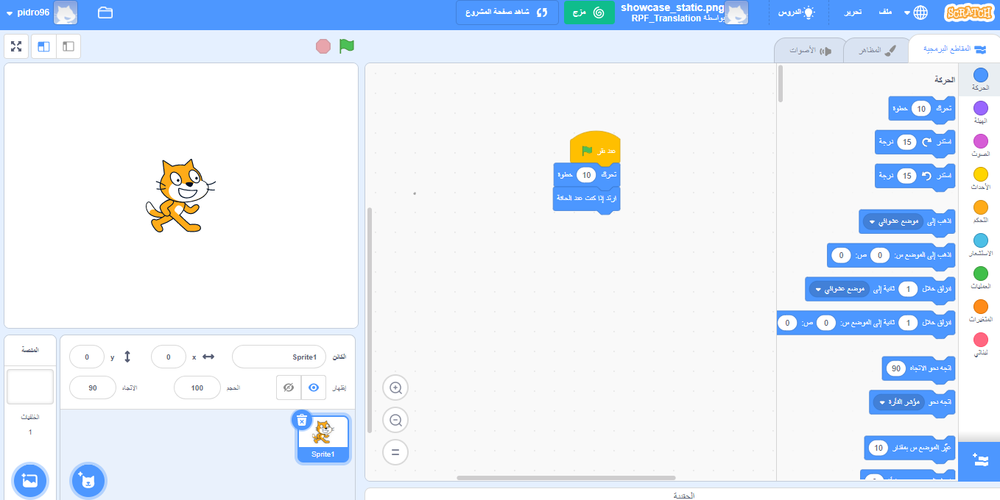

## ما هو Scratch؟
Scratch هو لغة برمجة رسومية، طورت من طرف مجموعة Lifelong Kindergarten في مخبر الوسائط معهد ماساتشوستس للتكنولوجيا (MIT). In Scratch, you can drag and combine code blocks to make a range of programs, including animations, stories, musical instruments, and games. It's a bit like the programming equivalent of building blocks!

Scratch is used in many schools as part of the curriculum. It is free, and young people can use it at home as well as in clubs.

Scratch allows young people to learn coding concepts and create interactive projects without needing to learn a text-based programming language. You will not need to be able to type quickly or remember complex code to use Scratch.

### How to use this reference guide
If you have not used Scratch before, then this guide will help you to set up and create your first project.

You can return to this guide and use it to look up information that you need when you are making your own projects in Scratch.

At the end of the guide you will find links to paths of Scratch projects, from beginner through to advanced, where you can learn coding by making fun and interesting apps, games, stories, animations, art and music.

--- collapse ---
---
title: What you will need
---
### Hardware

+ A computer or tablet capable of running Scratch 3

### Software

+ This guide will explain how to get started with Scratch 3 (either [online](https://scratch.mit.edu/){:target="_blank"} or [offline](https://scratch.mit.edu/download){:target="_blank"})

--- /collapse ---
