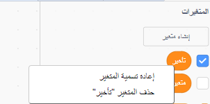

## المتغيرات

`المتغير`{:class="block3variables"} هو وسيلة لتخزين الأرقام و/أو النصوص.

يمكنك انشاء المتغيرات الخاصة بك واختيار ما إذا كانت ستظهر على المنصة:

[[[generic-scratch3-add-variable]]]

يجب أن تفكر فيما إذا كنت بحاجة إلى تعيين قيمة بداية عند إنشاء متغير:

[[[scratch3-create-set-variable]]]

يمكنك إعادة تسمية متغير إذا غيرت رأيك:

--- collapse ---
---
title: إعادة تسمية متغير
---

أحيانًا تفكر في اسم أفضل للمتغير.

يمكنك تسمية متغير باسم جديد: انتقل إلى `المتغيرات`{:class="block3variables"}، انقر بزر الماوس الأيمن (أو اذا كنت على جهاز لوحي، انقر مع الاستمرار) على `المتغير`{:class="block3variables"}، واختر **إعادة تسمية المتغير**.



سيؤدي هذا إلى تغيير اسم المتغير في جميع الكتل التي استخدمته فيها.

--- /collapse ---

**نصيحة:** تأكد من أنك تعرف الفرق بين `اجعل`{:class="block3variables"} و `غيّر`{:class="block3variables"}. `اجعل`{:class="block3variables"} ستحل محل القيمة المخزنة في المتغير. كتلة `غيّر بمقدار`{:class="block3variables"} ستغير قيمة متغير رقمي بالمقدار الذي تختاره، `غيّر بمقدار`{:class="block3variables"}`1` ستضيف واحدًا إلى المتغير. `غيّر بمقدار`{:class="block3variables"}`-1` سينقص أو يأخذ واحدًا من المتغير.


**نصيحة:** المتغيرات الموجودة على المسرح دائمًا في طبقة أعلى من كل الكائنات. إذا كان لديك كائن متحرك، فسيكون الكائن أسفل أي متغيرات موجودة على المنصة.

يمكنك استخدام شريط التمرير للتحكم في قيمة المتغير.

[[[scratch3-slider-variable]]]

المزيد من الأفكار لاستخدام المتغيرات:

[[[generic-scratch3-high-score]]]

[[[scratch3-join-text]]]

[[[scratch3-set-variable-with-button]]]

[[[scratch3-change-variable-in-loop]]]


--- collapse ---
---
title: التحكم في تأثيرات الرسوم باستخدام شريط تمرير متغير
---

فيما يلي بعض الأمثلة عن كيفية استخدام شريط التمرير للمتغير:


يغير هذا المثال التأثيرات الصورية بالمؤثر `الشبح`{:class="block3looks"} حتى تتمكن من الرؤية من خلال قوس قزح.

**قوس قزح شفاف**: [انظر في الداخل](https://scratch.mit.edu/projects/451544795/editor){:target="_blank"}

<div class="scratch-preview">
  <iframe allowtransparency="true" width="485" height="402" src="https://scratch.mit.edu/projects/embed/451544795/?autostart=false" frameborder="0"></iframe>
</div>

يمكنك استخدام متغير `شفاف`{:class="block3variables"} للتحكم في تأثير `الشبح`{:class="block3looks"} على الكائن الموجود في `الامام`{:class="block3looks"}، واستخدامه لكشف أو إخفاء الكائنات المتحركة في الطبقات السفلية.

```blocks3
when flag clicked
go to [front v] layer
```

```blocks3
when flag clicked
forever
set [ghost v] effect to (transparent)
```

جرب استخدام نفس الأسلوب مع التأثيرات الرسومية الأخرى مثل `شدة الاضاءة`{:class="block3looks"} أو `اللون`{:class="block3looks"}.

--- /collapse ---

--- collapse ---
---
title: التحكم في سرعة الحركة مع متغير
---

**خنفساء على الحائط**: [انظر في الداخل](https://scratch.mit.edu/projects/451545341/editor){:target="_blank"}

<div class="scratch-preview">
  <iframe allowtransparency="true" width="485" height="402" src="https://scratch.mit.edu/projects/embed/451545341/?autostart=false" frameborder="0"></iframe>
</div>

استخدم المتغير `سرعة`{:class="block3variables"} كمدخل إلى كتلة `تحرك`{:class="block3motion"}:

```blocks3
when flag clicked
forever
move (speed) steps
if on edge, bounce
```
قم بتعيين القيم الدنيا والحد الأقصى لنطاق شريط التمرير ليناسب مشروعك.

--- /collapse ---

--- collapse ---
---
title: التحكم في سرعة الدوران مع متغير
---

**كلب الفضاء**:[انظر في الداخل](https://scratch.mit.edu/projects/451543041/editor){:target="_blank"}

<div class="scratch-preview">
  <iframe allowtransparency="true" width="485" height="402" src="https://scratch.mit.edu/projects/embed/451543041/?autostart=false" frameborder="0"></iframe>
</div>

استخدم متغير `زاوية`{:class="block3variables"} كمدخل إلى كتلة `انعطف يمينًا`{:class="block3motion"}:

```blocks3
when flag clicked
forever
turn right (angle) degrees
```

--- /collapse ---

--- collapse ---
---
title: تغيير التأخير في كتلة انتظر
---

**رقصة الهيكل العظمي**: [انظر في الداخل](https://scratch.mit.edu/projects/451536565/editor){:target="_blank"}

<div class="scratch-preview">
  <iframe allowtransparency="true" width="485" height="402" src="https://scratch.mit.edu/projects/embed/451536565/?autostart=false" frameborder="0"></iframe>
</div>

استخدم المتغير `تأخير`{:class="block3variables"} كمدخل إلى كتلة `انتظر`{:class="block3control"}:

```blocks3
when flag clicked
forever
wait (delay) seconds
next costume
```

التأخير لأكثر من ثانية هو وقت طويل جدا. إذا قمت بتضمين رقم عشري في نطاق شريط التمرير، فيمكنك تغيير القيمة بمقدار 100 جزء من الثانية في كل مرة.

يسمح لك النطاق من `0.00` إلى `1.00` باختيار تأخير بين `0` ثوانٍ (بدون تأخير) و `1` ثانية.


قم بتغيير الأرقام للحصول على الحد الأدنى والحد الأقصى للقيم التي تريد أن يتمكن المستخدمون من استخدامها في مشروعك.

--- /collapse ---

--- collapse ---
---
title: تغيير المؤثرات الصوتية
---

**طبقة طبل**: [انظر في الداخل](https://scratch.mit.edu/projects/451547017/editor){:target="_blank"}

<div class="scratch-preview">
  <iframe allowtransparency="true" width="485" height="402" src="https://scratch.mit.edu/projects/embed/451547017/?autostart=false" frameborder="0"></iframe>
</div>

يمكنك استخدام `متغير`{:class="block3variables"} في كتلة `اجعل مؤثر الصوت مساوياً`{:class="block3sound"}. إذا قمت بزيادة حدة الصوت، فسترتفع النغمات ويزداد الصوت.

```blocks3
when flag clicked
forever
set [pitch v] effect to (beat) :: sound
```

قم بتشغيل الصوت في كتلة حلقة `كرر باستمرار`{:class="block3control"} منفصلة، بحيث تتغير درجة الصوت على الفور ، بدلاً من الانتظار حتى انتهاء تشغيل الصوت:

```blocks3
when flag clicked
forever
play sound [Dance Head Nod v] until done
```

يمكنك أيضًا استخدام `متغير`{:class="block3variables"} لتغيير مستوى الصوت وتأثير التدوير (الإمالة).

--- /collapse ---


