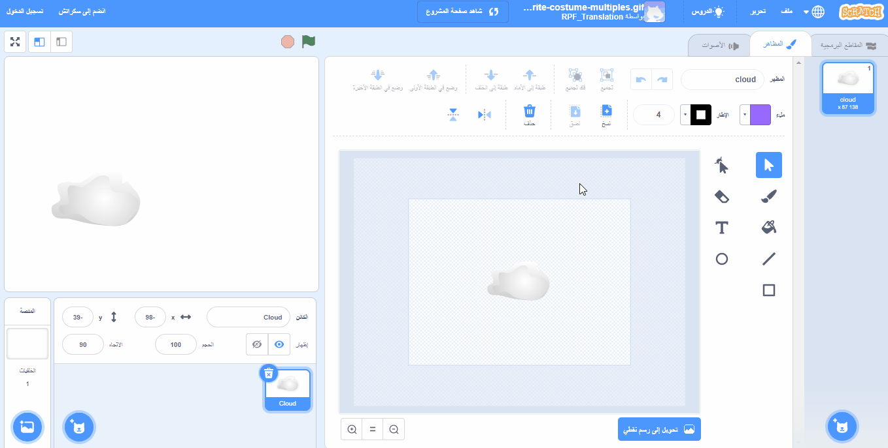

## محرر الرسام

استخدم محرر الرسام لإنشاء الخلفيات والأزياء الخاصة بك ، ولتعديل الخلفيات والأزياء الموجودة.

{:width="600px"}

[[[scratch3-paint-a-new-backdrop-extended]]]

[[[scratch3-backdrops-and-sprites-using-shapes]]]

[[[scratch3-use-text-tool]]]

[[[scratch3-add-costumes-to-a-sprite]]]

[[[scratch-crosshair]]]

[[[scratch3-copy-parts-between-sprite-costumes]]]

--- collapse ---
---
title: قم بتكرار وتعديل الزي لاستخدامه في الرسوم المتحركة
---

تحتوي بعض الكائنات في Scratch على زي واحد فقط ، أو لها عدة أزياء لا تعمل كرسوم متحركة. إذا اخترت زيًا واحدًا ، ثم قمت بتكرار ذلك (قم بعمل نسخة منه) وقمت بإجراء تغيير بسيط ، فيمكنك إنشاء تأثير متحرك.

**صورة متحركة للروبوت**: [انظر من الداخل](https://scratch.mit.edu/projects/436260207/editor){:target="_blank"}

  <iframe allowtransparency="true" width="485" height="402" src="https://scratch.mit.edu/projects/embed/436260207/?autostart=false" frameborder="0"></iframe>

قم بالتبديل إلى علامة التبويب **أزياء** للكائن الخاص بك.

اختر الزي الذي تريد استخدامه ، واحذف الأزياء الأخرى ، لأنك لن تحتاجها في الرسوم المتحركة الخاصة بك. على سبيل المثال ، يأتي الكائن **Robot** مع أزياء لثلاثة روبوتات مختلفة ، لذلك يجب عليك اختيار أحد الأزياء وحذف الأزياء الأخرى.

للقيام بذلك، انقر بزر الماوس الأيمن (أو على جهاز لوحي، انقر مع الاستمرار) على المظهر او الزي واختر **تكرار**.

قم بإجراء تغييرات صغيرة على نسخة المظهر او الزي. على سبيل المثال ، يمكنك نقل المظهر او الزي أو تدويره أو تغييره بالكامل أو جزء منه. يمكنك أيضًا إضافة خطوط الحركة.

إذا كان زيك او المظهر الخاص بالكائن يستخدم رسومات متجهة ، فيمكنك تحديد أجزاء من زي وتغيير كل جزء على حدة.

يمكنك تكرار الزي مرة أخرى وإجراء المزيد من التغييرات لإضافة المزيد من الإطارات إلى الرسوم المتحركة الخاصة بك.

يمكنك الآن استخدام الأزياء الخاصة بك في رسم متحرك بسيط للرموز المتحركة.

--- /collapse ---

--- collapse ---
---
title: استخدم أداة Fill (ملء) لتغيير الألوان في مظهر او زياَ ما
---

يمكنك تغيير لون الكائن الخاص بك. أولاً ، حدد الكائن الخاص بك في قائمة الكائنات الموجودة أسفل منصة التنفيذ ، ثم انقر فوق علامة التبويب **الأزياء**.

استخدم أداة السهم **Select** (Arrow) لتمييز جزء الزي الذي تريد تغيير لونه.

{:width="200px"}

{:width="300px"}

انتقل إلى منتقي الألوان **Fill** وحدد لونًا. سيقوم تلقائيًا بملء الشكل الذي حددته.

{:width="300px"}

كرر الخطوات المذكورة أعلاه لأي جزء فاتك من الزي ، أو لأي جزء آخر من الزي الذي تريد تغيير لونه.

{:width="300px"}

{:width="300px"}

{:width="300px"}

--- /collapse ---

استخدم النصائح أدناه لمساعدتك في إنشاء تصميماتك الخاصة للكائنات في محرر الرسام.

--- collapse ---
---
title: إنشاء مشهد (منظر) ككائنات
---

**هيل كشخصية**: [انظر من الداخل](https://scratch.mit.edu/projects/452582516/editor){:target="_blank"}

{:width="400px"}

لإنشاء كائن **Hill** الخاص بك ، كما هو موضح في المثال أعلاه ، يمكنك استخدام الأدوات **Circle** و **Rectangle** في محرر الرسام:

+ اذهب إلى **اختر Sprite** وحدد **Paint** لإنشاء زي كائن جديد.

{:width="400px"}

+ اختر لون **Fill**. انقر فوق **Outline** وقم بإلغاء تحديده (للقيام بذلك ، انقر فوق المربع الذي يحتوي على الخط القطري في الزاوية اليسرى السفلية من القائمة). الآن ، استخدم أداة **الدائرة** لرسم شكل بيضاوي. ثم حدد أداة **Rectangle** وارسم مستطيلاً أسفل الشكل البيضاوي.

+ إذا كنت تستخدم ألوانًا مختلفة للأشكال ، فقد تحتاج إلى استخدام أدوات **Front** و **Back** في محرر الرسام لتحريك الأشكال للأمام أو للخلف بحيث يتم وضعها بشكل صحيح داخل خلفيتك.

+ يمكنك تحديد كل الأشكال و **تجميعهم** معًا بحيث يمكنك تعديلها أو نقلها كشكل واحد.

{:width="400px"}

الآن ، اصنع كائنات أخرى لمشهدك ، إذا كان هذا يتناسب مع فكرة مشروعك.

تذكر تسمية الكائنات الخاصة بك.

--- /collapse ---

--- collapse ---
---
title: استخدم أداة الخط لإنشاء مثلث
---

يمكنك إنشاء مضلعات ، مثل المثلث ، واستخدام هذه الأشكال لإنشاء أسقف أو جبال.

اذهب إلى **اختر كائن** وحدد **الرسام** لإنشاء زي كائن جديد. في هذا المثال ، ستصنع منازل.

**منزل**: [انظر من الداخل](https://scratch.mit.edu/projects/453595663/editor){:target="_blank"}

{:width="400px"}

إذا اتبعت الإرشادات أدناه ، فيمكنك استخدام أداة **الخط** لإنشاء أي شكل:
+ اختر لون **Fill**. لاختيار اللون الأسود ، قم بتقليل **درجة السطوع** إلى صفر (`0`).

{:width="150px"}

+ حدد **بلا حدود خارجية**.

{:width="200x"}

+ استخدم أداة **Rectangle** لرسم مستطيل.
+ استخدم أداة **الخط** لرسم مثلث. تأكد من إكمال المثلث ، وإلا فلن يمتلئ باللون.
+ حرك الشكلين معًا.
+ حدد أداة **Fill** (Bucket) واملأ المثلث باللون.
+ استخدم أداة **Rectangle** لرسم مستطيل آخر للمدخنة.
+ يمكنك استخدام أدوات **Front** و **Back** في محرر الرسام لتحريك الأشكال للأمام أو للخلف بحيث يتم وضعها بشكل صحيح. في هذا المثال ، لن تحتاج إلى القيام بذلك ، لأن الأشكال سوداء لتكوين صورة ظلية.
+ يمكنك تحديد كل الأشكال و **تجميعهم** معًا بحيث يمكنك تعديلها أو نقلها كشكل واحد.

لإنشاء أشكال مكررة لمنزلك (على سبيل المثال ، لإنشاء أفق) ، اتبع النصائح الموجودة ضمن **أشكال مكررة لإنشاء زي مشهد** أدناه.

--- /collapse ---

--- collapse ---
---
title: أشكال مكررة لإنشاء زي او مظهر بشكل مشهد
---

قد ترغب في تكرار الأشكال داخل الزي بحيث يبدو المشهد أكثر انشغالًا أو ازدحامًا.

**سحابات متعددة**: [انظر من الداخل](https://scratch.mit.edu/projects/447278432/editor){:target="_blank"}

{:width="400px"}

يستخدم الرسامون المحترفون تأثير مضاعفة الأشكال لخلق انطباع بأنماط الطقس ، مثل المطر أو السحب ؛ مجموعة من الأشياء ، مثل المباني أو الخشب ؛ أو حشد من الناس في مشهد.

--- no-print ---

--- /no-print ---

لمضاعفة أي نوع من الأشكال:
+ اذهب إلى **اختر كائن** وحدد ، في هذا المثال ، **Cloud** الكائن
+ في علامة التبويب **أزياء** ، استخدم أداة **حدد** لتمييز الشكل بالكامل
+ استخدم أدوات **Copy** و **Paste** لإنشاء نسخ مكررة من الشكل
+ استخدم أداة **Select** لتحريك الشكل داخل محرر الرسام
+ يمكنك تنويع حجم الأشكال للمساعدة في خلق إحساس أكبر بالتأثيرات ثلاثية الأبعاد ، على سبيل المثال
+ يمكنك تحديد كل الأشكال و **تجميعهم** معًا بحيث يمكنك تعديلها أو نقلها كشكل واحد

--- /collapse ---

--- collapse ---
---
title: استخدم التشبع والسطوع لإنشاء العمق
---

في العالم الحقيقي ، تبدو الكائنات البعيدة أفتح في درجة اللون. لتحقيق مشهد ثلاثي الأبعاد أكثر واقعية ، يمكنك **إنقاص** اللون **التشبع** و / أو **السطوع** لكل كائن بحيث تظهر أبعد وأبعد.

{:width="400px"}

--- /collapse ---

--- collapse ---
---
title: قم بإنشاء كائن به فجوات يمكنك رؤيتها من خلالها
---

العنوان: قم بإنشاء كائن به فجوات يمكنك رؤيتها من خلالها. إذا تم وضعه كطبقة أمامية وكان حجم المنصة ، فيمكن أن يظهر كعرض من خلال أشرطة قفص أو نافذة.

--- no-print ---

**أسد محبوس**: [انظر من الداخل](https://scratch.mit.edu/projects/445680159/editor){:target="_blank"}

--- /no-print ---

لإنشاء نوع من الكائنات المخفية:
+ اذهب إلى **اختر كائن** وحدد ،**الرسام**
+ اختر لون **Fill** بدون **الحدود الخارجية** وارسم مستطيلاً عمودياً
+ استخدم أدوات **Copy** و **Paste** لتكرار هذا الشكل
+ استخدم أداة **Select** لتحريك الأشكال حولها
+ أثناء قيامك بوضع الأشكال الخاصة بك ، تأكد من أنها تلامس حافة المنصة لتتلاءم مع فكرة مشروعك

--- /collapse ---

**نصيحة:** إذا وجدت صعوبة في إدارة الكائنات المتحركة الموجودة على منصتك ، مثل امتلاك كائن كبير يستمر في تغطية واحدة أصغر بكثير ، يمكنك النقر فوق **إخفاء** حتى لا ترى كائنًا أو كائنات. ثم ، عند الانتهاء ، انقر فوق **إظهار** مرة أخرى.

{:width="300px"}
