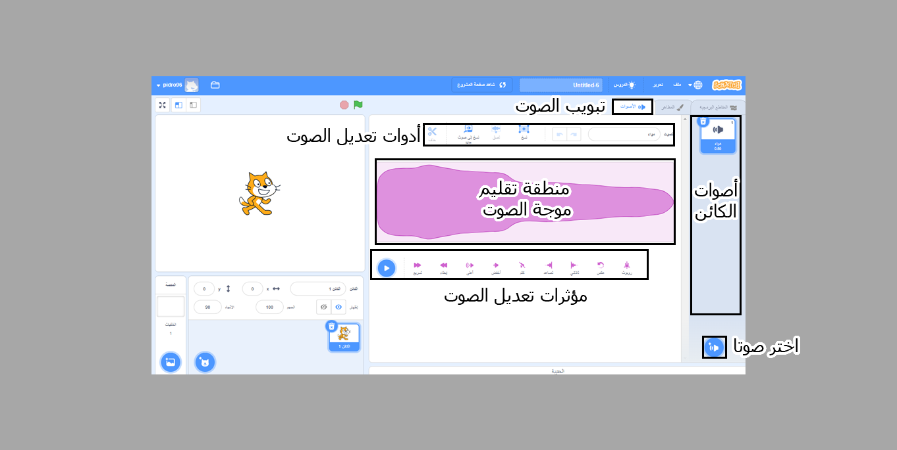

## محرر الصوت

استخدم محرر الصوت لإضافة و تعديل الأصوات الموجودة, و لتسجيل أصواتك الخاصة.

{:width="600px"}

### إنشاء الأصوات

\[[[scratch3-add-sound]]\] \[[[scratch3-record-sound\]]]

### تحرير الأصوات

تحرير أصوات كاملة أو أجزاء منها.

\[[[scratch3-reverse-sound]]\] \[[[scratch3-crop-sound\]]] [[[scratch3-sound-effects]]]
