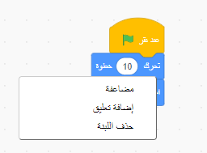
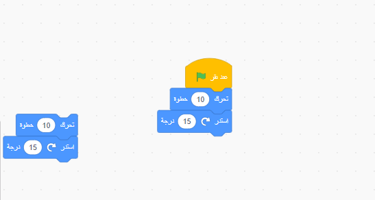
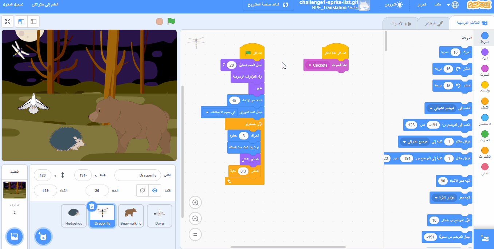

## نصائح التحرير
من المفيد معرفة كيفية نسخ وحذف كتل التعليمات البرمجية ومضاعفة الكائنات.

**نصيحة:** يمكنك استخدام الازرار الموجودة على لوحة المفاتيح في جهاز حاسوبك <kbd>Ctrl-z</kbd> (اضغط باستمرار على مفتاح Ctrl في لوحة المفاتيح واضغط على "z") للتراجع عن الكثير من الإجراءات في Scratch. إذا قمت بحذف كائن أو عنصر آخر عن طريق الخطأ، فيمكنك استخدام **استعادة** من قائمة **تحرير** لاستعادته.

يمكنك حذف مجموعات التعليمات البرمجية التي لم تعد بحاجة إليها:

[[[scratch-delete]]]

يمكن أن يوفر لك تكرار الكود أو نسخه الوقت عند إنشاء مشروع.

--- collapse ---
---
title: تكرار التعليمات البرمجية
---

لتكرار الكتل أو مجموعات الكتل واعادة استخدامها في برنامج الكائن:

* انقر على تبويب **المقاطع البرمجية**.
* انقر بزر الماوس الأيمن (أو اذا كنت على جهاز لوحي، انقر مع الاستمرار) على أول كتلة تريد نسخها. هذا سيقوم بتحديد جميع الكتل الموجودة تحته أيضًا.
* اختار **مضاعفة** من القائمة المنسدلة. {:width="300px"}
* اسحب الكتل المكررة إلى المكان الذي تريده. {:width="300px"}
* احذف أي كتل لا تحتاجها.

--- /collapse ---

[[[scratch3-duplicate-sprite]]]

أنشئ كائنًا جديدًا وانسخ له كل أو بعض التعليمات البرمجية من الكائن الأول.

--- collapse ---
---
title: نسخ كود الكائن
---

في الركن الايسر السفلي من قائمة الكائنات، انقر فوق **اختيار كائن** وحدد الكائن الذي تريد إضافته.

انقر فوق الكائن الأول وانتقل إلى علامة التبويب **المقاطع البرمجية**. اسحب الكود الموجود في منطقة كود الكائن الأول إلى صورة الكائن الثاني في قائمة الكائنات، ثم اترك الكود لإنهاء نسخه إلى الكائن الثاني. قد يكون لديك برنامج نصي واحد يبدأ بالكتلة `عند نقر العلم الاخضر`{:class="block3events"}، بالإضافة إلى برنامج نصي آخر يبدأ بالكتلة `عند نقر هذا الكائن`{:class="block3events"}. تأكد من نسخ **جميع** نصوص التعليمات البرمجية التي قمت بإنشائها.

{:width="300px"}

الكائن الثاني الخاص بك ستكون له نفس التعليمات البرمجية للكائن الأول بالضبط. لا تقم بتشغيل البرنامج حتى تبدأ في تغيير التعليمات البرمجية للكائن الثاني - فقد لا ترى الكائن الثاني لأنه قد يكون موضوعًا أسفل الكائن الأول.

--- /collapse ---

إذا كنت ترغب في نسخ الأزياء والكائنات والأصوات والبرامج النصية بين المشاريع، فاسحبها إلى **الحقيبة**.

[[[scratch-backpack]]]

من الجدير دائمًا قضاء بعض الوقت في التأكد من اتباعك لأفضل الممارسات حتى يسهل فهم مشروعك.

--- collapse ---
---
title: أفضل الممارسات لمشاريع Scratch
---

- قم بتسمية جميع الكائنات المتحركة والأزياء والأصوات والمتغيرات والرسائل بشكل معقول. من الأسهل بكثير فهم المشاريع التي تستخدم أسماء مفيدة.
- املأ صفحة المشروع بعنوان جيد وإرشادات وملاحظات حتى يعرف المستخدمون كيفية استخدام مشروعك ومن أين حصلت على أفكار.
- أضف تعليقات قصيرة تشرح ما تقوم به التعليمات البرمجية الخاصة بك.
- تأكد من أن البرامج النصية مرتبة في علامة التبويب **المقاطع البرمجية**. يمكنك النقر بزر الماوس الأيمن واختيار **ترتيب اللبنات** أو رتّب البرامج النصية بطريقة تناسبك. حاول وضع النصوص المتشابهة معًا.

--- /collapse ---
