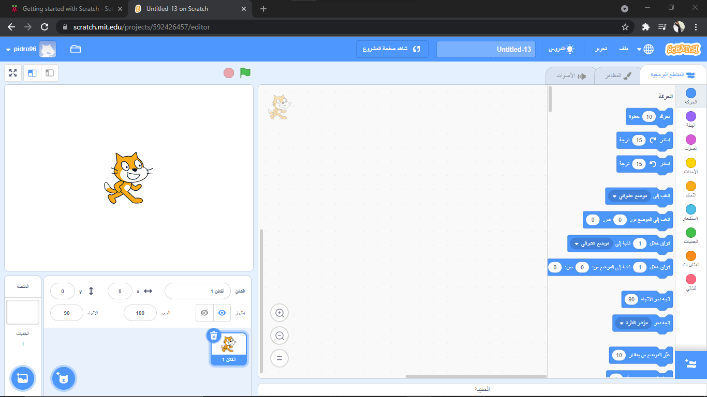
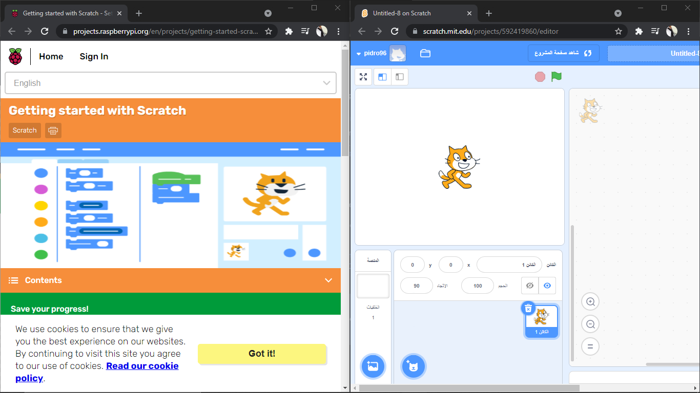
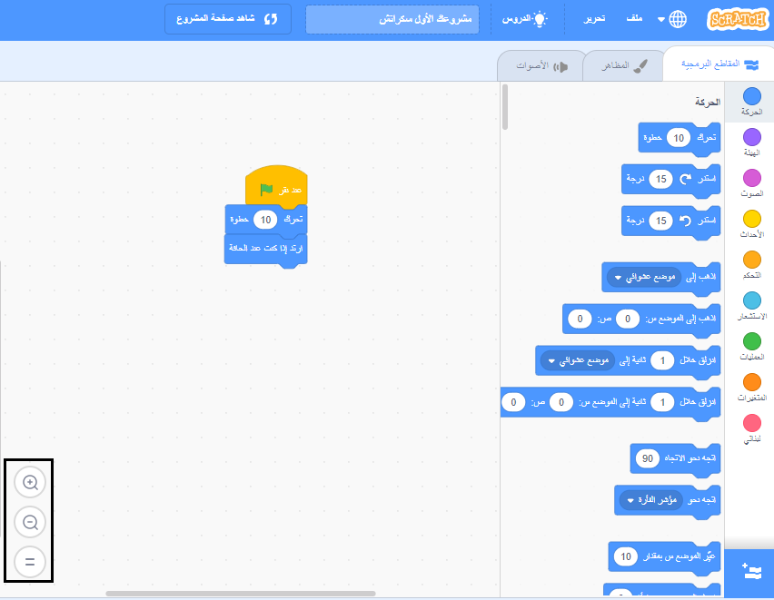

## إعداد سكراتش
يمكنك استخدام سكراتش على حاسوب محمول أو مكتبي, أو على لوحة إلكترونية. يمكنك أيضا استخدام سكراتش على حاسوب رازبيري باي Raspberry Pi.

--- task ---

افتح متصفح ويب على جهاز الكمبيوتر أو الجهاز اللوحي وقم بزيارة [rpf.io/scratch-new](https://rpf.io/scratch-new){: target = "_ blank"} لفتح مشروع جديد في محرر Scratch. سيُفتح سكراتش في تبويب جديد على متصفحك.

**نصيحة** يمكنك أيضا زيارة[scratch.mit.edu](https://scratch.mit.edu/){:target="_blank"} ثم اضغط على **أنشئ**.

--- collapse ---
---
العنوان: العمل منفصلاً دون اتصال بالإنترنت
---

إذا كنت تريد العمل منفصلا (بلا أنترنت), إذا يمكنك [تحميل سكراتش](https://scratch.mit.edu/download){:target="_blank"} و تثبيته على حاسوب.

لا يمكنك العمل منفصلا إذا كنت تستخدم لوحة.

--- /collapse ---

--- collapse ---
---
title: سكراتش على Raspberry Pi
---

إذا كنت تستخدم جهاز كمبيوتر Raspberry Pi ، فقد يكون Scratch مثبتًا بالفعل. انقر على أيقونة**Raspberry Pi رازبيري باي** لفتح القائمة, ثم اضغط على **برمجة**, ثم عين **سكراتش 3**.

إذا احتجت تثبيت سكراتش ، فاتبع ما يلي:
+ انقر على أيقونة Raspberry Pi لفتح القائمة
+ انقر على **مفضلات**
+ انقر على **برنامج موصى به**
+ عين **سكراتش 3**
+ انقر على **موافق**

راجع [Scratch 3 Desktop for Raspberry Pi](https://www.raspberrypi.org/blog/scratch-3-desktop-for-raspbian-on-raspberry-pi/) لمزيد من المعلومات.

--- /collapse ---

--- /task ---

--- task ---

عندما تستخدم سكراتش مع هذا الدليل أو أحد مشاريعنا ، ستحتاج إلى التبديل بين سكراتش وتعليمات المشروع.

--- collapse ---
---
العنوان : التبديل بين علامات التبويب
---

انقر على ( أو على اللوحة, المس) عنوان تبويب المتصفح للتبديل بين محرر سكراتش و تعليمات المشروع.

--- /collapse ---

--- collapse ---
---
العنوان: جنبا لجنب, التعليمات و سكراتش
---

إذا شاشتك كبيرة كفاية، يمكنك رؤية سكراتش بجانب تعليمات المشروع.

إذا كنت تستخدم Microsoft Windows 10 ، فاسحب علامة التبويب Scratch في متصفح الويب الخاص بك بحيث تكون في نافذة منفصلة ، واستمر في السحب حتى يصل المؤشر إلى الحافة اليمنى من شاشتك. من بعد ستتموضع النافذة على جانب يدك اليمنى من الشاشة.

الآن ، اسحب النافذة المحتوية هذا الدليل أو تعليمات مشروعك إلى جهة يدك اليسرى من شاشتك حتى يصل المؤشر إلى الحافة على يدك اليسرى. ستشغل النافذة النصف الأيسر من شاشتك.

يمكنك تغيير حجم النوافذ للحصول عليها بالطريقة التي تريدها.

**نصيحة:** يمكنك أيضًا الضغط باستمرار على مفتاح <kbd>Windows</kbd> والضغط على مفتاح السهم <kbd>Left</kbd> أو مفتاح السهم <kbd>Right</kbd> لوضع نافذة في النصف الأيسر أو الأيمن من شاشتك.

--- /collapse ---

جربه الآن وشاهد كيف تفضل العمل.

--- /task ---

--- task ---

عند استخدام Scratch في متصفح الويب ، يمكنك التكبير أو التصغير لضبط الحجم.

على سبيل المثال ، إذا كنت تستخدم Microsoft Windows وتريد استخدام التكبير</kbd> التصغير على صفحة ويب في Google Chrome أو Microsoft Edge ، فاضغط مع الاستمرار على مفتاح <kbd>Ctrl</kbd> واضغط على مفتاح <kbd>+</kbd> أو مفتاح <kbd>للتكبير أو التصغير.
 

  --- collapse ---

<h2 spaces-before="0">
  العنوان: استخدام التكبير في منطقة الكود
</h2>

  يمكنك أيضًا استخدام عناصر التحكم في التكبير / التصغير في منطقة Code في Scratch لتغيير حجم كتل التعليمات البرمجية في منطقة Code.

  

  --- /collapse ---

  --- /task ---

