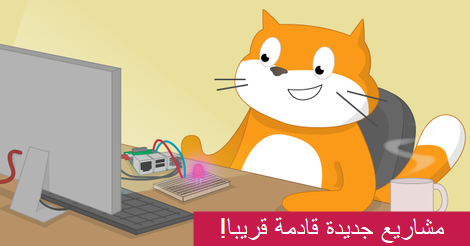

## مشاريعنا للـScratch

تحتوي مسارات Scratch على ستة مشاريع لكل منها، لمساعدتك على تعلم مهارات مختلفة في Scratch، من أجل إنشاء مشاريعك الخاصة بشكل مستقل.

يمكنك العودة إلى هذا الدليل المرجعي، البدء في استخدام Scratch، متى احتجت إلى تذكير نفسك بالمهارات التي تعلمتها.

يمكن إكمال هذه المشاريع على أي جهاز كمبيوتر أو جهاز لوحي يقوم بتشغيل Scratch 3.

### مشاريع Scratch للمبتدئين

إذا كنت جديدًا على Scratch ، فابدأ بمساراتنا للمبتدئين:

[مقدمة الى Scratch: الكائنات والنصوص و التكرار](https://projects.raspberrypi.org/en/pathways/scratch-intro){:target="_blank"} 
في هذه المقدمة للمبتدئين، ستتعلم كيفية اضافة التعليمات البرمجية والازياء والاصوات الى الكائنات اثناء انشاء رسوم متحركة والالعاب والتطبيقات والقصة.

! [] (images / LAY-banner.png)
[اعتني بنفسك] (https://projects.raspberrypi.org/en/pathways/look-after-yourself){:target="_blank"} 
تعلم كيف تعتني بنفسك وبالآخرين بمشاريع Scratch لتجعلك تضحك وتسترخي وتتحكم وتبدع وتتدرب وتركز.

! [] (images / scratch.png)
[Scratch المستوى 1] (https://projects.raspberrypi.org/en/pathways/scratch-module-1){:target="_blank"}

 

### ما وراء أساسيات مشاريع Scratch

إذا كنت تعرف بالفعل عن الكائنات والأزياء والخلفيات والحلقات، فجرب هذه المشاريع:

! [] (images / more-banner.png)
[المزيد من Scratch: البث والقرارات والمتغيرات](https://projects.raspberrypi.org/en/pathways/more-scratch){:target="_blank"} 
يتخطى المزيد من Scratch الأساسيات التي تم تقديمها في مقدمة إلى Scratch. ستقوم بعمل تطبيقات وألعاب ومحاكاة باستخدام بث الرسائل ، إذا.. ثم إذا.. ثم.. قرارات أخرى ، والمتغيرات.

[Scratch المستوى 2](https://projects.raspberrypi.org/en/pathways/scratch-module-2){:target="_blank"} 

 

### مشاريع Scratch متقدمة

إذا كنت تريد التعرف على القوائم، والنسخ، وإنشاء الكتل الخاصة بك، فجرّب هذه المشاريع:

[Scratch أكثر: النسخ, كتلي البرمجية, والمنطق الثنائي](https://projects.raspberrypi.org/en/pathways/further-scratch){:target="_blank"}  Scratch أكثر يتخطى المهارات المقدمة في مسار مقدمة الى Scratch ومسار المزيد من Scratch. ستنشئ تطبيقات وألعاب وفنون تم إنشاؤه بواسطة الكمبيوتر وعمليات محاكاة باستخدام المنطق الثنائي والدوال والاستنساخ والمزيد.

[جماية كوكبنا](https://projects.raspberrypi.org/en/pathways/protect-our-planet){:target="_blank"} 
استخدم Scratch للتعرف على كوكبنا وكيفية حماية البيئة للاجيال القادمة.

[Scratch للمؤسسات المجتمعية](https://projects.raspberrypi.org/en/coderdojo/scratch-for-social-enterprise){:target="_blank"} 

[Scratch المستوى ٣](https://projects.raspberrypi.org/en/pathways/scratch-module-3){:target="_blank"} 

 

### Scratch مع أجهزة GPIO الخاصة بـ Raspberry Pi

إذا كان لديك جهاز كمبيوتر Raspberry Pi ، فيمكنك أيضًا تجربة هذه المشاريع. سوف تحتاج إلى مكونات إلكترونية إضافية.

 

[الحوسبة المادية في مسار Scratch](https://projects.raspberrypi.org/en/pathways/physical-computing-with-scratch-and-the-raspberry-pi){:target="_blank"}

 

[ الحوسبة المادية من خلال مشاريع اضافية في Scratch](https://projects.raspberrypi.org/en/projects?software%5B%5D=scratch&hardware%5B%5D=raspberry-pi){:target="_blank"}

 

هل استمتعت بدليل Scratch؟ هل لاحظت مشكلة؟ الرجاء النقر فوق الزر **إرسال ملاحظات** أدناه وإخبارنا بذلك!
