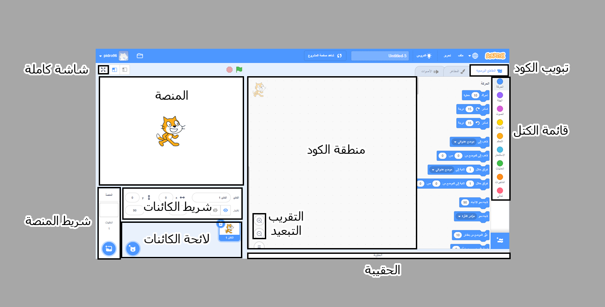

## محرر Scratch

**المنصة** هي المكان الذي يحدث فيه الإجراء في مشروعك. تحتوي المرحلة على صورة خلفية واحدة أو أكثر تسمى **الخلفيات**.

**الكائنات** هي شخصيات واشياء تظهر في **المنصة**. تعطى التعليمات للكائنات باستعمال كتل كود سكراتش. هذا يسمى **البرمجة**.

اسحب **كتل الكود** من **قائمة الكتل** إلى **منطقة الكود** لبرمجة كائناتك و المنصة. كتل الكود قادرة جعل كائن يتحرك جوارا, تغيير مظهره, أو لعب الأصوات.

تمكن الكائنات امتلاك عدة **أزياء**. يمكنك تغيير الزي لتغيير مظهر الكائن. يمكن استخدام هذا للحصول على تأثيرات مثل إعطاء مظهر المشي.

**النص** هو سلسلة كتل مضمومة معا لإعطاء تعليمات للمنصة أو الكائنات. يمكن للمنصة و الكائنات امتلاك نصوص مختلفة. 

