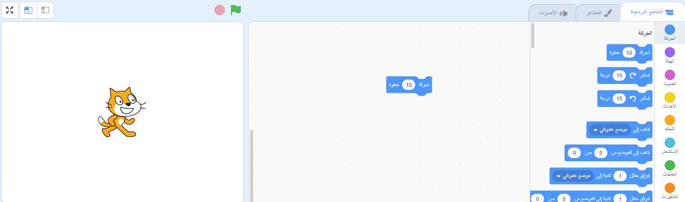

## مشروعك الأول سكراتش


--- task ---

عند إنشاء مشروع Scratch جديد ، فإنه يشتمل على كائن **cat**.

اسحب كتلا من قائمة الكتل إلى منطقة الكود لجعل القط يفعل شيء.

لتجربة مثال ، اسحب كتلة `move`{: class = "block3motion"} من قائمة الكتل `Motion`{: class = "block3motion"}. يتم تمييز الكتل بالألوان لمساعدتك في العثور عليها.



يمكنك النقر فوق الكتل في منطقة التعليمات البرمجية لتشغيلها. انقر على كتلة `تحرك`{:class="block3motion"} و القط سيتحرك.

**نصيحة:** إذا كنت تستخدم سكراتش على لوحة، يمكنك اللمس على عنصر للنقر عليه.

**Hat block** قم بتشغيل الكتل تحتها عندما يقع حدث معين. تعمل الكتلة `عند النقر فوق العلم الأخضر على`{: class = "block3events"} على تشغيل التعليمات البرمجية عند النقر فوق العلم الأخضر أعلى المرحلة لتشغيل مشروعك.

اسحب `عندما ينقر العلم الأخضر على كتلة`{: class = "block3events"} أعلى كتلة `move`{: class = "block3motion"} ليتم محاذاتهما معاً.


يجب أن تبدو التعليمات البرمجية خاصتك بالشكل التالي:

```blocks3
when flag clicked
move (10) steps
```

**نصيحة:** كتل سكراتش مرمزة لونيا،لذا ستجد كتلة `عند نقر العلم الأخضر`{: class = "block3events"} في قائمة الكتل `الأحداث`.

الآن ، انقر على العلم الأخضر أعلى المنصة و سيتحرك القط.

--- /task ---

يمكنك إضافة المزيد من الكائنات لمشروعك، و يمكنك أيضا إضافة خلفية.

--- task ---

--- collapse ---
---
title: اختر كائنا
---

في قائمة Sprite ، انقر فوق **اختر Sprite** لترى مكتبة جميع الكائنات Scratch.


يمكنك البحث عن كائن, أو تصفحها بالصنف أو النمط. انقر على كائن لإضافته لمشروعك.


--- /collapse ---

--- /task ---

--- task ---

--- collapse ---
---
العنوان: اختر خلفية
---

في الركن أسفل يدك اليمنى من إطار المنصة, انقر على **اختر خلفية**.


يمكنك البحث عن خلفية ، أو التصفح حسب الفئة أو الموضوع. انقر فوق خلفية لإضافتها لمشروعك.


--- /collapse ---

--- /task ---

--- task ---

--- collapse ---
---
title: سمِّ و احفظ مشروعك
---

في القائمة, إذهب إلى **ملف**. إذا كان لديك حساب Scratch ، فانقر فوق **حفظ الآن**. إذا لا تملك حساب، انقر على **الحفظ إلى حاسوبك**.

انقر في مربع اسم المشروع وقم بتغيير الاسم ليطابق مشروعك.


إذا شاركت مشروعك ، فسيرى الأشخاص الآخرون هذا الاسم أيضًا ، لذا تأكد من أنه منطقي.

--- /collapse ---

--- /task ---

لقد أنشأت مشروعك الأول سكراتش!

أنت الآن جاهز لتعلم سكراتش. We recommend that you start with our [Introduction to Scratch](https://projects.raspberrypi.org/en/raspberrypi/scratch-intro){:target="_blank"}, [Scratch: Module 1](https://projects.raspberrypi.org/en/raspberrypi/scratch-module-1){:target="_blank"} and/or [Look after yourself](https://projects.raspberrypi.org/en/raspberrypi/look-after-yourself){:target="_blank"} paths, which are designed for beginners.

 يمكنك العودة لهذا الدليل إذا احتجت للمساعدة في استخدام سكراتش عند عملك على مشاريع مسارنا أو على مشاريعك المستقلة. 


