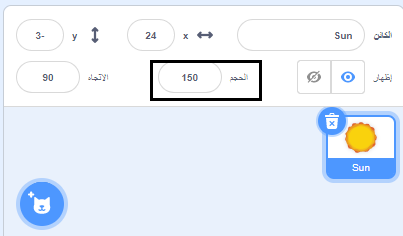

## الهيئة

كتل `الهيئة`{:class="block3looks"} تتحكم بشكل الكائن على المنصة.

تستطيع الكائنات التخاطب باستخدام `الهيئة`{:class="block3looks"}، من خلال فقاعة الكلام `قل`{:class="block3looks"}، فقاعة التفكير `فكّر`{:class="block3looks"}، أو من خلال `المؤثرات الرسومية`{:class="block3looks"}.

### قل وفكر

```blocks3
say () for () seconds

say ()

think () for () seconds

think ()
```

--- collapse ---
---
title: استخدام فقاعة الكلام للتخاطب
---

تستطيع الكائنات أن تتحدث باسخدام `قل`{:class="block3looks"} و تفكر باستخدام `فكّر`{:class="block3looks"} للتخاطب.

تستخدم كتل `قل () لمدة () ثانية`{:class="block3looks"} و`فكّر () لمدة () ثانية`{:class="block3looks"} للحديث او التفكير بشيء ما لمدة محددة من الزمن.

```blocks3
when this sprite clicked
say [Hello!] for [2] seconds // أخف الكلام بعد ثانيتين
```

سيعرض الكائن فقاعة كلام لمدة ثانيتين عند النقر عليه.

**حديث الفضاء**:[انظر في الداخل](https://scratch.mit.edu/projects/485673032/editor){:target="_blank"}

انقر على الكائنات لرؤيتها تتواصل بالكلام والتفكير.

<div class="scratch-preview">
  <iframe allowtransparency="true" width="485" height="402" src="https://scratch.mit.edu/projects/embed/485673032/?autostart=false" frameborder="0"></iframe>
</div>

تستخدم كتل `قل ()`{:class="block3looks"} و`فكّر ()`{:class="block3looks"} للكلام والتفكير بشيء ما، الى ان تأتي كتلة رسالة ثانية او كتلة فارغة من كتل `قل()`{:class="block3looks"} او `فكّر()`{:class="block3looks"} وتستبدلها.

--- /collapse ---

### الحجم

قم بتعيين أو تغيير `الحجم`{:class="block3looks"} للكائنات الخاصة بك.

```blocks3
change size by ()

set size to () %

(size)
```

--- collapse ---
---
title: اضبط حجم الكائن الخاص بك
---

عند إضافة كائن لمشروعك، يتم تعيين حجمها إلى `100` في المئة. قد يكون هذا كبيرًا جدًا أو صغيرًا جدًا بالنسبة لمشروعك.

يمكنك استخدام التعليمات البرمجية لتعيين حجم الكائن. للقيام بذلك، استخدم كتلة `اجعل الحجم مساويا`{:class="block3looks"}:

```blocks3
set size to (50) %
```

إذا قمت بتعيين حجم الكائن على `50` بالمائة، فسيكون نصف طوله ونصف عرضه. إذا قمت بتعيين حجم الكائن على `200` بالمائة، فسيكون ضعف طوله وضعف عرضه.

لتعيين حجم الكائن عند بدء المشروع، ضع كتلة `اجعل الحجم مساوياً`{:class="block3looks"} أسفل كتلة `عند نقر العلم الأخضر`{:class="block3events"}:

```blocks3
when green flag clicked
set size to (50) %
```

يمكنك أيضًا تعيين حجم الكائن بسرعة في **الحجم** في جزء الكائن أسفل المنصة:

{:width="400px"}

--- /collapse ---

### المؤثرات الصورية

قم بتعيين أو تغيير مجموعة التأثيرات المرئية مثل اللون، عين السمكة، الدوامة ، البكسلة، الموزاييك، شدة الاضاءة والشبح.

```blocks3
change [color v] effect by ()

set [color v] effect to ()

clear graphic effects
```

[[[scratch3-graphic-effects]]]

### المظاهر

لإنشاء تأثير الرسوم المتحركة للكائنات الخاصة بك، يمكنك تغيير مظاهرهم.

```blocks3
switch costume to ( v)

next costume

(costume [number v])
```

[[[scratch3-change-costumes-to-show-mood]]]

--- collapse ---
---
title: تغيير الهيئة لإنشاء تأثير حركة
---

**قلبن نابض**: [انظر في الداخل](https://scratch.mit.edu/projects/435725413/editor){:target="_blank"}

<div class="scratch-preview">
  <iframe allowtransparency="true" width="485" height="402" src="https://scratch.mit.edu/projects/embed/435725413/?autostart=false" frameborder="0"></iframe>
</div>

يمكنك استخدام كتلة `اجعل الحجم مساويا`{:class="block3looks"} أو كتلة `غير الحجم بمقدار`{:class="block3looks"} لإنشاء تأثير نابض، مثل ضربات القلب.

**ملاحظة:** كتلة `اجعل الحجم مساويا`{:class="block3looks"} تجعل الحجم بقيمة محددة، بينما كتلة `غيّر الحجم بمقدار`:class="block3looks"} تغير قيمة الحجم عما كان عليه قبل ذلك، على سبيل المثال ، `غيّر الحجم بمقدار`{:class="block3looks"} `10` يضيف ١٠ إلى قيمة الحجم.

```blocks3
when green flag clicked
set size to (160) %
forever
change size by (40)
wait (0.2) seconds
change size by (20)
wait (0.2) seconds
change size by (-20)
wait (0.2) seconds
change size by (-40)
wait (0.2) seconds
end
```

تستخدم هذا التعليمات البرمجية مجموعة من كتل `غيّر الحجم بمقدار`{:class="block3looks"} و كتلة `انتظر`{:class="block3control"} لجعل القلب ينمو ويتقلص. حاول إنشاء كائن ينبض خاص بك.

يمكنك أيضًا استخدام كتلة `غيّر مؤثر اللون بمقدار`{:class="block3looks"} لإنشاء كائن يستمر في تغيير مظهره.

```blocks3
when green flag clicked
change [ghost v] effect by (75)
wait (1) seconds
change [ghost v] effect by (-75)
```

**ملاحظة:** إذا كنت تستخدم تعليمات برمجية لتغيير المؤثرات الصورية ثم تغيّره مرة أخرى، تذكر استخدام كتلة `انتظر`{:class="block3control"} بين `غيّر مؤثر اللون بمقدار`{:class="block3looks"}، وإلا فسيحدث التغيير سريعًا لدرجة أنك لن تراه!

يمكنك استخدام كتلة `أزل المؤثرات الرسومية`{:class="block3looks"} في أي وقت لإعادة تعيين التأثيرات الى ماكانت عليه:

```blocks3
clear graphic effects
```

--- /collapse ---

--- collapse ---
---
title: انقر للتغيير ومن ثم تراجع عن التغيير
---

يمكنك إضافة الإجراءات التي تُحدث تغييراً في الكائن ثم عكسها، مثل النمو والانتظار ثم الانكماش.

**كرة منضغطة عند النقر عليها**: [انظر في الداخل](https://scratch.mit.edu/projects/435723273/editor){:target="_blank"}

<div class="scratch-preview">
  <iframe src="https://scratch.mit.edu/projects/435723273/embed" allowtransparency="true" width="485" height="402" frameborder="0" scrolling="no" allowfullscreen></iframe>
</div>

هذه التعليمات البرمجية ستنمي الكائن، طبّق تأثير `عين السمكة`{:class="block3looks"} لمدة 0.5 ثانية، ثم أعد الكائن إلى مظهره الأولي:

```blocks3
when this sprite clicked
set size to (110)
set [fisheye v] effect to (50)
wait (0.5) seconds
set [fisheye v] effect to (0)
set size to (100)
```

--- /collapse ---

[[[scratch3-animate-movement-costumes]]]

### الخلفيات

يمكنك استخدام تعليمات برمجية لتغيير الخلفية أيضًا.

```blocks3
switch backdrop to ( v)

next backdrop

(backdrop [number v])
```

[[[scratch3-changing-backdrops-pages-levels]]]

### الرؤية

كتل `اظهر`{:class="block3looks"} و`اختف`{:class="block3looks"} تتحكم في رؤية الكائن.

```blocks3
show 

hide
```

[[[scratch3-show-hide-sprites-backdrops]]]

### طبقات

لتغيير كيفية ظهور الكائنات الخاصة بك فيما يتعلق ببعضها البعض، يمكنك استخدام الطبقات.

```blocks3
go to [front v] layer

go [forward v] () layers
```

[[[scratch3-positioning-with-layers]]]

--- collapse ---
---
title: ضع الكائن في طبقات متعددة
---

**خلال النافذة مع شجرة**: [انظر في الداخل](https://scratch.mit.edu/projects/454188775/editor){:target="_blank"}

<div class="scratch-preview">
  <iframe allowtransparency="true" width="485" height="402" src="https://scratch.mit.edu/projects/embed/454188775/?autostart=false" frameborder="0"></iframe>
</div>

في هذا المثال، يظهر الكائن في الامام **Window frame** ويظهر الكائن **Sun** في الخلف. كائن **Avery Walking** و كائن **Tree** كل منها في طبقتها الخاصة بين كائن **Window frame** و كائن **Sun**.

استخدم كتلة `انتقل الى الخلف`{:class="block3looks"} `1` `طبقة`{:class="block3looks"} لوضع الكائن الحالي طبقة واحدة خلف الكائن الموجود حاليا في المقدمة:

``` blocks3
when green flag clicked
go to [front v] layer
+go [backward v] (1) layers
```

غيّر القيمة في كتلة `انتقل الى الخلف`{:class="block3looks"} `1` `طبقة`{:class="block3looks"} لكل كائن، اعتمادًا على المكان الذي تريد وضعه فيه بالنسبة للكائنات الأخرى:

``` blocks3
when green flag clicked
go to [front v] layer
+go [backward v] (2) layers
```

--- /collapse ---

