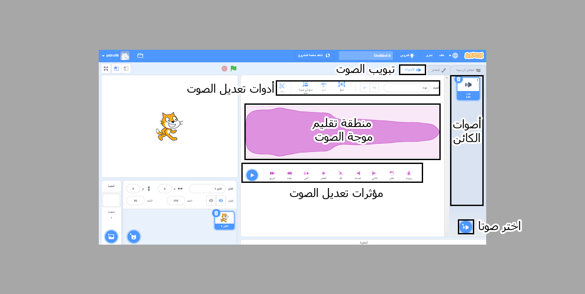
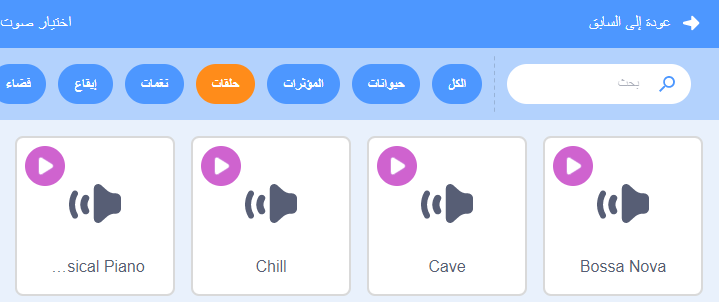

## الصوت

لإضافة صوت لمشروعك, استعمل كتلة `صوت`{:class="block3sound"}. على سبيل المثال ، يمكنك إنشاء مسار صوتي مستمر في الخلفية ، أو إضافة أصوات يتم تشغيلها في فترات منتظمة.

{:width="600px"}

أولاً ، اختر صوتًا من مكتبة الأصوات ، أو سجل الصوت الخاص بك.

[[[scratch3-add-sound]]]

[[[scratch3-record-sound]]]

أضف كودا لتشغيل كتل `الصوت`{:class="block3sound"} حيث تريد صوتا في مشروعك.

--- collapse ---
---
title: أضف صوتًا طويلاً لإنشاء مسار صوتي متواصل
---

انقر على العلم الأخضر لسماع الأصوات.

**مقطع صوت الراديو**: [انظر في الداخل](https://scratch.mit.edu/projects/444581851/editor){:target="_blank"}

<div class="scratch-preview">
 <iframe allowtransparency="true" width="485" height="402" src="https://scratch.mit.edu/projects/embed/444581851/?autostart=false" frameborder="0"></iframe>
</div>

يمكنك استخدام كتلة `شغل الصوت حتى الانتهاء`{:class="block3sound"} داخل حلقة `إلى الأبد`{:class="block3control"}. بمجرد انتهاء الصوت ،حلقة `إلى الأبد`{:class="block3control"} تجعل الصوت يبدأ مجددا من البداية.

هذا الكود يستخدم مقطع صوت واحدا طويلا متكررا كمقطع صوتي:

```blocks3
when green flag clicked
forever
play sound (Dance Snare Beat v) until done
end
```

**ملاحظة:** عند اختيارك لصوت جديد, إذا اخترت فئه **الحلَقات**, سيعرض لك Scratch فقط الأصوات المناسبة لحلقة صوتيه واحد.



--- /collapse ---

--- collapse ---
---
title: أضف سلسلة من الأصوات القصيرة لانشاء مقطع صوتي متواصل
---

انقر على العلم الأخضر لسماع الأصوات.

**أداء البطل**: [انظر في الداخل](https://scratch.mit.edu/projects/444673165/editor){:target="_blank"}

<div class="scratch-preview">
 <iframe allowtransparency="true" width="485" height="402" src="https://scratch.mit.edu/projects/embed/444673165/?autostart=false" frameborder="0"></iframe>
</div>

 استخدم كتلة `إلى الأبد`{:class="block3control"} لإنشاء حلقه صوت. تستطيع:
+ وضع سلسلة من الأصوات القصيرة في تسلسل، أو
+ استخدم ملاحظات تعليماتية و مؤثرات مختلفة

```blocks3
when flag clicked
forever
play sound (Low Boing v) until done
play sound (Low Boing v) until done
play sound (Drum Buzz v) until done
play sound (Pop v) until done
play sound (Bird v) until done
play sound (Bark v) until done
play sound (Glug v) until done
End
```

--- /collapse ---

--- collapse ---
---
title: أضف أصوات تشتغل في فترات منتظمة
---

**اصوات كرة القدم**: [أنظر في الداخل](https://scratch.mit.edu/projects/450870079/editor){:target="_blank"}

انقر على العلم الأخضر لسماع الأصوات.

<div class="scratch-preview">
 <iframe allowtransparency="true" width="485" height="402" src="https://scratch.mit.edu/projects/embed/450870079/?autostart=false" frameborder="0"></iframe>
</div>

 في هذا المشروع, **المنصة** لديها كود لتشغيل الصوت في فترات منتظمة:

 ```blocks3
 when flag clicked
 forever
 wait (3) seconds
 play sound (Cheer v) until done
 end
 ```

يقوم الكائن **Whistle** أيضًا بتشغيل صوت على فترات منتظمة:

 ```blocks3
 when this sprite clicked
 forever
 play sound (Referee Whistle v) until done
 wait (4) seconds
 end
 ```

--- /collapse ---

--- collapse ---
---
title: أضف أصواتا تبدأ في نفس الوقت
---

هناك كتلتان `صوت`{:class="block3sound"} مع اختلاف مهم:

+ عندما `تشغيل الصوت حتى الانتهاء`{:class="block3sound"}, الصوت سوف يشتغل حتى النهاية. السطر التالي من الكود لن يعمل حتى يتوقف الصوت.

+ عندما `تشغيل الصوت`{:class="block3sound"}, الصوت سوف يبداء و الكتله ستبداء معه على الفور ولن تنتظر حتى يتوقف الصوت.

هذا يعني أنه إذا كان لديك سلسلة من كتل `تشغيل الصوت`{:class="block3sound"}, جميع الأصوات ستشتغل بنفس الوقت تقريبا, بعضَها فوق بعض. يمكن للمؤثرات ان تكون مثيره وفي بعض الأحيان فوضويه.

العب بها في وقت ما!

```blocks3
when green flag clicked
start sound (Meow v)
start sound (Alien Creak2 v)
start sound (Boing v)
start sound (Boom Cloud v)
start sound (Baa v)
```

--- /collapse ---

عند ما تختار أصواتك, ربما تود تغيير `مستوى الصوت`{:class="block3sound"}, `النبره`{:class="block3sound"}, أو `التوزيع`{:class="block3sound"} (لتسمع الصوت من السماعة اليساريه أو اليمينيه).

--- collapse ---
---
title: مستوى الصوت, ألنبره, و التوزيع
---

انقر على العلم الأخضر لسماع الأصوات.

**تمرين الفرقة**: [انظر في الداخل](https://scratch.mit.edu/projects/451697380/editor){:target="_blank"}

<div class="scratch-preview">
 <iframe allowtransparency="true" width="485" height="402" src="https://scratch.mit.edu/projects/embed/451697380/?autostart=false" frameborder="0"></iframe>
</div>

كائن **الطبول** يستخدم كتل `ضع الحجم على`{:class="block3sound"}, `ضع تأثير النغمة على`{:class="block3sound"}, و `ضع تأثير التوزيع يسار/يمين على`{:class="block3sound"} لتغيير الصوت:

```blocks3
set volume to (80) %
set [pitch v] effect to (50) :: sound
set [pan left/right v] effect to (-100) :: sound
play sound (Drum Funky v) until done
```

+ يمكنك `وضع الحجم على`{:class="block3sound"} قيمة من `0` (صامت) إلى `100` (الحجم الأقصى). هذا مفيد إذا أردت بعض الأصوات أن تشتغل أصخب من الأخرى, أو إذا أردت كائن أن يظهر بعيدا.

+ تأثير `النغمة`{:class="block3sound"} يتحكم كم أعلى أو أخفض هو الصوت. وضع النغمة على قيمة أعلى أيضا يجعل الصوت أسرع. يمكنك `وضع تأثير النغمة على`{:class="block3sound"} قيم بين `-360` (جد منخفض) و `360` (جد عال).

+ تأثير `التوزيع يسار/يمين`{:class="block3sound"} يخولك التحكم إذا ما الصوت يصدر من سماعة أو مكبر يسارك أو يمينك أو كليهما. يمكنك `وضع تأثير التوزيع يسار/يمين على`{:class="block3sound"} قيمة من `-100` (كل الصوت من اليسار) إلى`100` (كل الصوت من اليمن).

--- /collapse ---

يمكنك أيضا استخدام إمتداد ال`نص إلى كلام`{:class="block3extensions"}:

[[[scratch3-text-to-speech]]]

