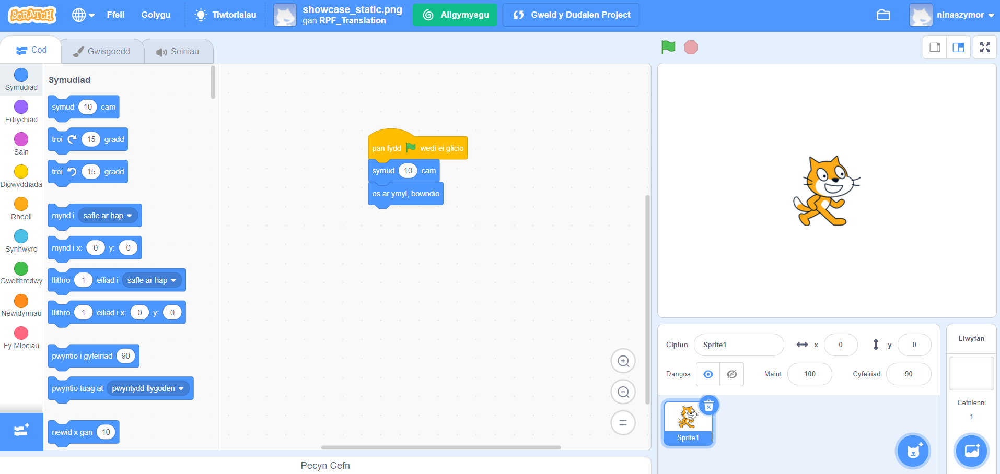

## Beth yw Scratch?
Mae Scratch yn iaith raglennu graffigol a ddatblygwyd gan y grŵp Lifelong Kindergarten yn MIT Media Lab. Yn Scratch, galli di lusgo a chyfuno blociau cod i greu amrywiaeth o raglenni, gan gynnwys animeiddiadau, straeon, offerynnau cerdd, a gemau. Mae bron fel rhaglennu â blociau adeiladu!

Mae Scratch yn cael ei ddefnyddio mewn llawer o ysgolion fel rhan o'r cwricwlwm. Mae'n rhad ac am ddim, a gall pobl ifanc ei ddefnyddio gartref yn ogystal â mewn clybiau.

Mae Scratch yn caniatáu i bobl ifanc ddysgu cysyniadau codio a chreu prosiectau rhyngweithiol heb fod angen iddyn nhw ddysgu iaith raglennu sy'n seiliedig ar destun. Fydd dim angen i ti allu teipio'n gyflym na chofio cod cymhleth i ddefnyddio Scratch.

### Sut i ddefnyddio'r canllaw cyfeirio hwn
Os nad wyt ti wedi defnyddio Scratch o'r blaen, yna bydd y canllaw yma yn dy helpu di i osod a chreu dy brosiect cyntaf.

Galli di ddod yn ôl at y canllaw yma a'i ddefnyddio i chwilio am y wybodaeth sydd ei hangen arnat ti wrth greu dy brosiectau dy hun yn Scratch.

Ar ddiwedd y canllaw fe fyddi di'n gweld dolenni i lwybrau prosiectau Scratch, o lefel dechreuwr hyd at ddefnyddwyr profiadol, lle galli di ddysgu codio drwy greu apiau, gemau, straeon, animeiddiadau, celf a cherddoriaeth hwyliog a diddorol.

--- collapse ---
---
title: Beth fydd ei angen arnat ti
---
### Caledwedd

+ Cyfrifiadur neu dabled sy'n gallu rhedeg Scratch 3

### Meddalwedd

+ Bydd y canllaw yma yn egluro sut i ddechrau arni gyda Scratch 3 (naill ai [ar-lein](https://scratch.mit.edu/){:target="_blank"} neu [all-lein](https://scratch.mit.edu/download){:target="_blank"})

--- /collapse ---
