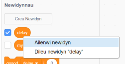
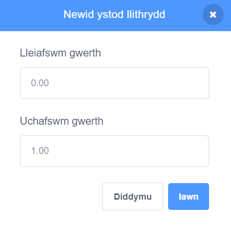

## Newidynnau

Mae `newidyn`{:class="block3variables"} yn ffordd o storio rhifau a/neu destun.

Galli di greu dy newidynnau dy hun a dewis a ydyn nhw'n ymddangos ar y Llwyfan:

[[[generic-scratch3-add-variable]]]

Dylet ti feddwl a oes angen i ti osod gwerth cychwynnol wrth greu newidyn:

[[[scratch3-create-set-variable]]]

Galli di ailenwi newidyn os byddi di'n newid dy meddwl:

--- collapse ---
---
title: Ail-enwi newidyn
---

Weithiau, fyddi di'n meddwl am enw gwell ar gyfer newidyn.

Mae'n bosib rhoi enw newydd i newidyn: cer i'r ddewislen blociau `Newidynnau`{:class="block3variables"} de-glicio (neu daro a dal os wyt ti ar dabled) ar y `newidyn`{:class="block3variables"}, a dewis **Ailenwi newidyn**.



Bydd hyn yn newid enw'r newidyn yn yr holl flociau rwyt ti wedi'i ddefnyddio ynddynt.

--- /collapse ---

**Awgrym:** Gwna'n siŵr dy fod yn gwybod y gwahaniaeth rhwng `gosod`{:class="block3variables"} a `newid gan`{:class="block3variables"}. Bydd `gosod`{:class="block3variables"} yn disodli'r gwerth sy'n cael ei storio mewn newidyn. Bydd `newid gan`{:class="block3variables"} yn newid gwerth newidyn sy'n rhif, gan y swm rwyt ti'n ei ddewis, bydd `newid gan`{:class="block3variables"}`1` yn ychwanegu un at newidyn. Bydd `newid gan`{:class="block3variables"}`-1` yn tynnu un o newidyn.


**Awgrym:** Bydd newidyn ar y Llwyfan bob amser yn ymddangos mewn haen uwchben yr holl gorluniau. Os oes gen ti gorlun sy'n symud, bydd y corlun yn mynd o dan unrhyw newidynnau ar y Llwyfan.

Galli di ddefnyddio llithrydd i reoli'r gwerth mewn newidyn.

[[[scratch3-slider-variable]]]

Mwy o syniadau ar gyfer defnyddio newidynnau:

[[[generic-scratch3-high-score]]]

[[[scratch3-join-text]]]

[[[scratch3-set-variable-with-button]]]

[[[scratch3-change-variable-in-loop]]]


--- collapse ---
---
title: Rheoli effeithiau graffeg gyda llithrydd newidyn
---

Dyma rai enghreifftiau o sut y galli di ddefnyddio dy lithrydd newidyn:


Mae'r enghraifft hon yn newid yr effaith graffeg `ysbryd`{:class="block3looks"} fel dy fod yn gallu gweld drwy'r enfys.

**Enfys tryloyw**: [Gweld tu mewn](https://scratch.mit.edu/projects/451544795/editor){:target="_blank"}

<div class="scratch-preview">
  <iframe allowtransparency="true" width="485" height="402" src="https://scratch.mit.edu/projects/embed/451544795/?autostart=false" frameborder="0"></iframe>
</div>

Galli di ddefnyddio newidyn `tryloyw`{:class="block3variables"} i reoli'r effaith `ysbryd`{:class="block3looks"} ar gorlun yn y `blaen`{:class="block3looks"}, a'i ddefnyddio i ddatgelu neu guddio corluniau yn yr haenau is.

```blocks3
when flag clicked
go to [front v] layer
```

```blocks3
when flag clicked
forever
set [ghost v] effect to (transparent)
```

Rho gynnig ar ddefnyddio'r un dull gyda effeithiau graffeg fel `disgleirdeb`{:class="block3looks"} neu `lliw`{:class="block3looks"}.

--- /collapse ---

--- collapse ---
---
title: Rheoli cyflymder symud gyda newidyn
---

**Buwch goch gota ar wal**: [Gweld tu mewn](https://scratch.mit.edu/projects/451545341/editor){:target="_blank"}

<div class="scratch-preview">
  <iframe allowtransparency="true" width="485" height="402" src="https://scratch.mit.edu/projects/embed/451545341/?autostart=false" frameborder="0"></iframe>
</div>

Defnyddia'r newidyn `cyflymder`{:class="block3variables"} fel mewnbwn ar gyfer bloc `symud`{:class="block3motion"}:

```blocks3
when flag clicked
forever
move (speed) steps
if on edge, bounce
```
Gosoda'r gwerthoedd lleiaf a mwyaf ar gyfer ystod y llithrydd sy'n addas i dy brosiect di.

--- /collapse ---

--- collapse ---
---
title: Rheoli'r cyflymder troi gyda newidyn
---

**Ci gofod**: [Gweld tu mewn](https://scratch.mit.edu/projects/451543041/editor){:target="_blank"}

<div class="scratch-preview">
  <iframe allowtransparency="true" width="485" height="402" src="https://scratch.mit.edu/projects/embed/451543041/?autostart=false" frameborder="0"></iframe>
</div>

Defnyddia newidyn `ongl`{:class="block3variables"} fel mewnbwn i floc `troi i'r dde`{:class="block3motion"}:

```blocks3
when flag clicked
forever
turn right (angle) degrees
```

--- /collapse ---

--- collapse ---
---
title: Newid yr amser oedi mewn bloc aros
---

**Dawns y sgerbwd**: [Gweld tu mewn](https://scratch.mit.edu/projects/451536565/editor){:target="_blank"}

<div class="scratch-preview">
  <iframe allowtransparency="true" width="485" height="402" src="https://scratch.mit.edu/projects/embed/451536565/?autostart=false" frameborder="0"></iframe>
</div>

Defnyddia newidyn `oedi`{:class="block3variables"} fel newidyn ar gyfer bloc `aros`{:class="block3control"}:

```blocks3
when flag clicked
forever
wait (delay) seconds
next costume
```

Mae amser oedi o fwy nag un eiliad yn amser eithaf hir. Os wyt ti'n cynnwys rhif degol yn ystod llithrydd, yna galli di newid y gwerth ganfed eiliad ar y tro.

Mae ystod o `0.00` i `1.00` yn dy alluogi di i ddewis amser oedi rhwng `0` eiliad (heb oedi) ac `1` eiliad.



Newidia'r rhifau i gael y gwerthoedd lleiaf a mwyaf rwyt ti am i ddefnyddwyr allu eu defnyddio yn dy brosiect.

--- /collapse ---

--- collapse ---
---
title: Newid effeithiau sain
---

**Traw drwm**: [Gweld tu mewn](https://scratch.mit.edu/projects/451547017/editor){:target="_blank"}

<div class="scratch-preview">
  <iframe allowtransparency="true" width="485" height="402" src="https://scratch.mit.edu/projects/embed/451547017/?autostart=false" frameborder="0"></iframe>
</div>

Galli di ddefnyddio `newidyn`{:class="block3variables"} mewn bloc `gosod effaith traw i`{:class="block3sound"}. Os wyt ti'n cynyddu traw sain, mae traw'r nodau'n mynd yn uwch ac mae'r sain yn cyflymu.

```blocks3
when flag clicked
forever
set [pitch v] effect to (beat) :: sound
```

Chwaraea'r sain mewn dolen `am byth`{:class="block3control"}, fel bod y traw yn newid yn syth, yn hytrach na disgwyl i'r sain orffen chwarae:

```blocks3
when flag clicked
forever
play sound [Dance Head Nod v] until done
```

Galli di hefyd ddefnyddio `newidyn`{:class="block3variables"} i newid lefel y sain a'r effaith troi (tremio).

--- /collapse ---


