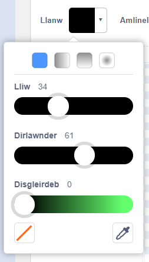
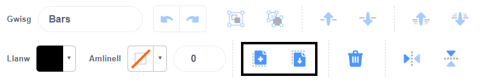

## Golygydd paent

Defnyddia'r golygydd Paint i greu dy gefnlenni a gwisgoedd dy hun, ac i olygu cefnlenni a gwisgoedd sy'n bodoli yn barod.

{:width="600px"}

[[[scratch3-paint-a-new-backdrop-extended]]]

[[[scratch3-backdrops-and-sprites-using-shapes]]]

[[[scratch3-use-text-tool]]]

[[[scratch3-add-costumes-to-a-sprite]]]

[[[scratch-crosshair]]]

[[[scratch3-copy-parts-between-sprite-costumes]]]

--- collapse ---
---
title: Dyblygu a golygu gwisg i'w defnyddio mewn animeiddiad
---

Dim ond un wisg sydd gan rai o gorluniau Scratch, neu weithiau mae ganddyn nhw fwy nag un gwisg sydd ddim yn gweithio fel animeiddiad. Os ddewisi di un wisg, ac wedyn ei dyblygu (gwneud copi ohoni) a gwneud newid bach iddi, gall hyn greu effaith animeiddio.

**Animeiddiad robot**: [Gweld tu mewn](https://scratch.mit.edu/projects/436260207/editor){:target="_blank"}

  <iframe allowtransparency="true" width="485" height="402" src="https://scratch.mit.edu/projects/embed/436260207/?autostart=false" frameborder="0"></iframe>

Newidia i'r tab **Gwisgoedd** ar gyfer dy gorlun.

Dewisa'r wisg rwyt ti am ei defnyddio, a dileu'r gwisgoedd eraill, oherwydd fyddi di ddim yn eu hangen nhw ar gyfer dy animeiddiad. Er enghraifft, mae'r corlun **Robot** yn dod gyda gwisgoedd ar gyfer tri robot gwahanol, felly dylet ti ddewis un o'r gwisgoedd a dileu'r gwisgoedd eraill.

De-glicia (neu ar dabled, taro a dal) ar y wisg a dewis **dyblygu**.

Gwna newidiadau bach i'r copi o'r wisg. Er enghraifft, galli di symud, cylchdroi, neu newid y wisg gyfan neu ran ohoni. Galli di hefyd ychwanegu llinellau symud.

Os ydy dy wisg yn defnyddio graffeg fector, yna galli di ddewis rhannau o wisg a newid pob rhan ar wahân.

Galli di ddyblygu'r wisg eto a gwneud mwy o newidiadau i ychwanegu rhagor o fframiau i dy animeiddiad.

Galli di nawr ddefnyddio dy wisgoedd mewn animeiddiad corlun syml.

--- /collapse ---

--- collapse ---
---
title: Defnyddio'r offeryn Llenwi i newid y lliwiau mewn gwisg
---

Galli di newid lliw dy gorlun. Yn gyntaf, dewisa dy gorlun yn rhestr y Corluniau o dan y Llwyfan ac yna clicio ar y tab **Gwisgoedd**.

Defnyddia'r offeryn **Dewis** (Saeth) i amlygu rhan y wisg rwyt ti am newid ei lliw.

{:width="200px"}

{:width="300px"}

Cer i'r dewiswr lliw **Llenwi** a dewis dy liw. Bydd yn llenwi'r siâp rwyt ti wedi'i ddewis yn awtomatig.

{:width="300px"}

Ailadrodda'r camau uchod ar gyfer unrhyw rannau o'r wisg rwyt ti wedi'i cholli, neu ar gyfer unrhyw ran arall o'r wisg rwyt ti am newid ei lliw.

{:width="300px"}

{:width="300px"}

{:width="300px"}

--- /collapse ---

Defnyddia'r awgrymiadau isod i dy helpu di i greu dy ddyluniadau dy hun ar gyfer dy gorluniau yn y Golygydd paent.

--- collapse ---
---
title: Creu golygfeydd fel corluniau
---

**Bryn fel corlun**: [Gweld tu mewn](https://scratch.mit.edu/projects/452582516/editor){:target="_blank"}

{:width="400px"}

I greu dy gorlun **Bryn** dy hun, fel sy'n cael ei ddangos yn yr engrhaifft uchod, galli di ddefnyddio'r offer **Cylch** a **Petryal** yn y Golygydd paent:

+ Cer i **Dewiswch Gorlun** a dewis **Paent** i greu gwisg corlun newydd.

{:width="400px"}

+ Dewisa liw **Llenwi**. Clicia ar **Amlinell** a'i ddad-ddewis (i wneud hyn, clicia ar y blwch gyda'r llinell letraws yng nghornel chwith isaf y ddewislen). Nawr, defnyddia'r offeryn **Cylch** i dynnu siâp hirgrwn. Yna, dewisa'r offeryn **Petryal** a thynnu siâp petryal o dan yr hirgrwn.

+ Os wyt ti'n defnyddio lliwiau amrywiol ar gyfer y siapiau, efallai bydd angen i ti ddefnyddio'r offer **Ymlaen** a **Nôl** yn y Golygydd paent i symud dy siapiau ymlaen neu yn ôl fel eu bod wedi'u gosod yn gywir o fewn dy gefndir.

+ Galli di ddewis yr holl siapiau a'u **Grwpio** gyda'i gilydd fel y galli di eu haddasu neu eu symud fel un siâp.

{:width="400px"}

Nawr, galli di greu corluniau eraill ar gyfer dy olygfa, os ydy hyn yn cyd-fynd â syniad dy brosiect.

Cofia enwi dy gorlun(iau).

--- /collapse ---

--- collapse ---
---
title: Defnyddio'r offeryn Llinell i greu triongl
---

Galli di greu polygonau, fel triongl, a defnyddio'r siapiau hyn i greu toeau neu fynyddoedd.

Cer i **Dewiswch Gorlun** a dewis **Paent** i greu gwisg corlun newydd. Yn yr enghraifft hon, byddi di'n creu tai.

**Tŷ**: [Gweld tu mewn](https://scratch.mit.edu/projects/453595663/editor){:target="_blank"}

{:width="400px"}

Os gwnei di ddilyn y cyfarwyddiadau isod, galli di ddefnyddio'r offeryn **Llinell** i greu unrhyw siâp:
+ Dewisa liw **Llenwi**. I ddewis y lliw du, gostynga'r **Disgleirdeb** i sero (`0`).

{:width="150px"}

+ Dewisa **dim amlinell**.

{:width="200x"}

+ Defnyddia'r offeryn **Petryal** i dynnu siâp petryal.
+ Defnyddia'r offeryn **Llinell** i dynnu siâp triongl. Gwna'n siŵr dy fod yn cwblhau'r triongl, fel arall fydd y siâp ddim yn llenwi gyda lliw.
+ Symuda'r ddau siap at ei gilydd.
+ Dewisa'r lliw **Llenwi** (Bwced) a llenwi'r triongl â lliw.
+ Defnyddia'r offeryn **Petryal** i dynnu siâp petryal arall ar gyfer y simdde.
+ Galli di ddefnyddio'r offer **Ymlaen** a **Nôl** yn y Golygydd paent i symud dy siapiau ymlaen neu yn ôl fel eu bod wedi'u gosod yn gywir. Yn yr enghraifft hon, fydd dim angen i ti wneud hyn, oherwydd mae'r siapiau'n ddu er mwyn creu silwét.
+ Dewisa'r holl siapiau a'u **Grwpio** gyda'i gilydd fel y galli di eu haddasu neu eu symud fel un siâp.

I greu siapiau dyblyg o dy dŷ (er enghraifft, i greu gorwel mewn dinas), dilyna'r awgrymiadau o dan **Dyblygu siapiau i greu gwisg golygfa** isod.

--- /collapse ---

--- collapse ---
---
title: Dyblygu siapiau i greu gwisg golygfa
---

Efallai yr hoffet ti ddyblygu siapiau o fewn gwisg fel bod dy olygfeydd yn ymddangos yn brysurach neu'n fwy gorlawn.

**Sawl cwmwl**: [Gweld tu mewn](https://scratch.mit.edu/projects/447278432/editor){:target="_blank"}

{:width="400px"}

Mae effaith lluosogi siapiau yn cael ei ddefnyddio gan animeiddwyr proffesiynol i greu'r argraff o batrymau tywydd, fel glaw neu gymylau; clwstwr o wrthrychau, fel adeiladau neu bren; neu dorf o bobl mewn golygfa.

--- no-print ---

--- /no-print ---

I luosogi unrhyw fath o siâp:
+ Cer i **Dewiswch Gorlun** a dewisa, yn yr enghraifft hon, y corlun **Cloud**
+ Yn y tab **Gwisgoedd**, defnyddia'r offeryn **Dewis** i amlygu'r siâp cyfan
+ Defnyddia'r offer **Copïo** a **Gludo** i greu dyblygebau o'r siâp
+ Defnyddia'r offeryn **Dewis** i symud y siâp o fewn y Golygydd paent
+ Galli di amrywio maint y siapiau i helpu i greu mwy o argraff effaith 3D, er enghraifft
+ Galli di ddewis yr holl siapiau a'u **Grwpio** gyda'i gilydd, fel y galli di eu haddasu neu eu symud fel un siâp

--- /collapse ---

--- collapse ---
---
title: Defnyddio Dirlawnder a Disgleirdeb i greu dyfnder
---

Yn y byd go iawn, mae gwrthrychau sydd ymhellach i ffwrdd yn ymddangos yn ysgafnach eu lliw. Er mwyn cyflawni golygfeydd 3D mwy realistig, galli di **ostwng** **Dirlawnder** a/neu **Ddisgleirdeb** lliwiau pob corlun fel eu bod yn ymddangos ymhellach ac ymhellach i ffwrdd.

{:width="400px"}

--- /collapse ---

--- collapse ---
---
title: Creu corlun gyda bylchau y galli di weld drwyddynt
---

Galli di greu corlun sydd â bylchau mae modd gweld drwyddynt. Os ydy'r corlun wedi'i osod fel yr haen flaen ac mae'r un maint â'r Llwyfan, gall edrych fel yr olygfa drwy fariau cawell neu ffenestr.

--- no-print ---

**Llew mewn cawell**: [Gweld tu mewn](https://scratch.mit.edu/projects/445680159/editor){:target="_blank"}

--- /no-print ---

I greu math o gorlun masgio:
+ Cer i'r ddewislen **Dewiswch Gorlun** a dewis **Paent**
+ Dewisa liw **Llenwi** heb **Amlinell** a lluniadu siâp petryal fertigol
+ Defnyddia'r offer **Copïo** a **Gludo** i ailgreu'r siâp yma
+ Defnyddia'r offeryn **Dewis** i symud y siapiau o gwmpas
+ Wrth i ti osod dy siapiau, gwna'n siŵr eu bod yn cyffwrdd ag ymyl y Llwyfan fel eu bod yn cyd-fynd â syniad dy brosiect

--- /collapse ---

**Awgrym:** Os wyt ti'n ei chael hi'n anodd rheoli'r corluniau ar dy Lwyfan, er engrhaifft os bydd corlun mawr yn gorchuddio un llawer llai, galli di glicio ar **Cuddio** fel nad wyt ti'n gweld corlun neu gorluniau. Yna, pan fyddi di wedi gorffen, clicia ar **Dangos** eto.

{:width="300px"}
