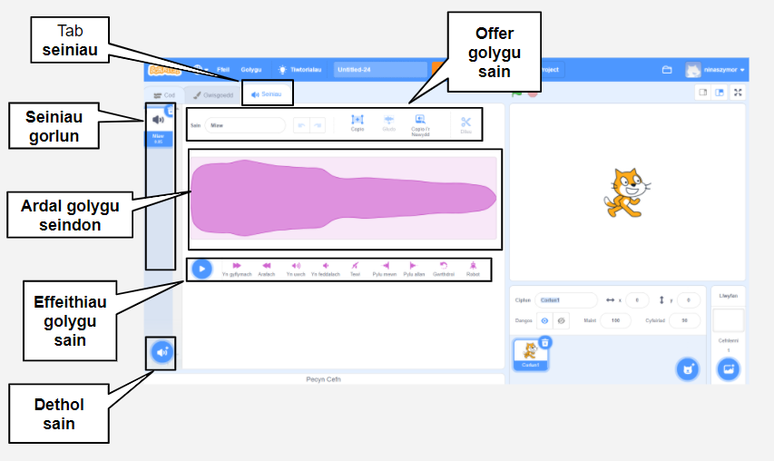

## Golygydd Sain

Defnyddia'r Golygydd sain i ychwanegu a golygu seiniau sy'n bodoli, ac i recordio dy seiniau dy hun.

{:width="600px"}

### Creu seiniau

\[[[scratch3-add-sound]]\] \[[[scratch3-record-sound\]]]

### Golygu seiniau

Golyga seiniau cyfan neu rannau o seiniau.

\[[[scratch3-reverse-sound]]\] \[[[scratch3-crop-sound\]]] [[[scratch3-sound-effects]]]
