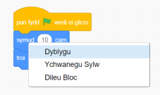
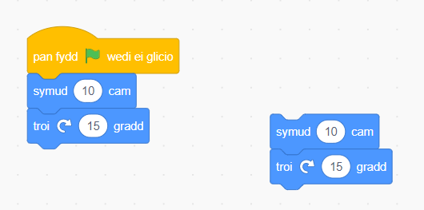
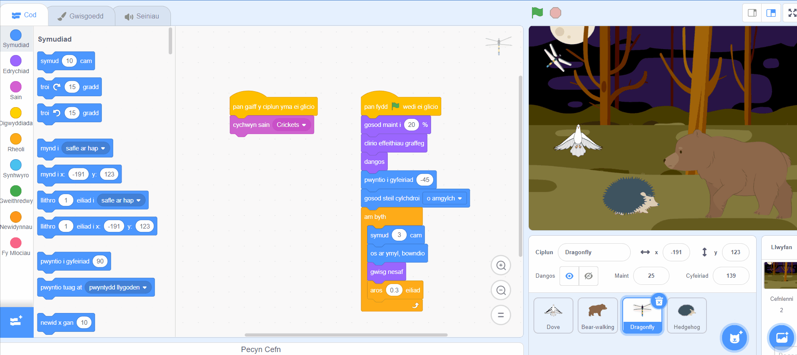

## Awgrymiadau golygu
Mae'n ddefnyddiol dysgu sut i gopïo a dileu blociau cod, a dyblygu corluniau.

**Awgrym:** Galli di ddefnyddio <kbd>Ctrl-z</kbd> (dal y fysell Ctrl i lawr a tharo 'z') i ddadwneud llawer o gamau yn Scratch. Os byddi di'n dileu Corlun neu eitem arall yn ddamweiniol, galli di ddefnyddio **Adfer** o'r ddewislen **Golygu** i'w gael yn ôl.

Galli di ddileu blociau cod nad oes eu hangen arnat ti mwyach:

[[[scratch-delete]]]

Gall dyblygu neu gopïo cod arbed amser i ti wrth greu prosiect.

--- collapse ---
---
title: Blociau dyblyg
---

Blociau dyblyg neu setiau o flociau i'w hailddefnyddio mewn rhaglen corlun:

* Cer i'r tab **Cod**.
* De-glicia (neu ar dabled, taro a dal) ar y bloc cyntaf rwyt ti am ei gopïo. Bydd hyn yn dewis yr holl flociau oddi tano hefyd.
* Dewisa **Dyblygu** yn y gwymplen. {:width="300px"}
* Llusga'r cod dyblyg lle rwyt ti am iddo fynd. {:width="300px"}
* Dilea unrhyw flociau nad oes eu hangen arnat.

--- /collapse ---

[[[scratch3-duplicate-sprite]]]

Creu corlun newydd a chopïo dros y cyfan neu rywfaint o god y corlun cyntaf.

--- collapse ---
---
title: Copïo cod corlun
---

Yng nghornel dde isaf y rhestr Corluniau, clicia ar **Dewiswch Gorlun** a dewis y corlun rwyt ti am ei ychwanegu.

Clicia ar y corlun cyntaf a mynd i'w dab **Cod**. Llusga'r cod sydd yn ardal Cod y corlun cyntaf i ddelwedd yr ail gorlun yn y rhestr Corluniau, wedyn gad fynd o'r cod i orffen ei gopïo i'r ail corlun. Efallai bydd gen ti un sgript sy'n dechrau â bloc `pan fydd y faner werdd wedi'i chlicio`{:class="block3events"}, yn ogystal â sgript arall sy'n dechrau â `pan gaiff y corlun hwn ei glicio`{:class="block3events"}. Gwna'n siŵr dy fod yn copïo **pob un** o'r sgriptiau cod rwyt ti wedi'u creu.

{:width="300px"}

Bydd gan dy ail gorlun yr un cod yn union â dy gorlun cyntaf nawr. Paid â rhedeg y rhaglen nes dy fod wedi dechrau newid cod yr ail gorlun - efallai na weli di'r ail gorlun oherwydd mae'n bosib ei fod o dan y corlun cyntaf.

--- /collapse ---

Os wyt ti eisiau copïo gwisgoedd, corluniau, seiniau a sgriptiau rhwng prosiectau, llusga nhw i'r **Pecyn Cefn**.

[[[scratch-backpack]]]

Mae bob amser yn werth treulio peth amser yn sicrhau dy fod wedi dilyn yr arferion gorau fel bod dy brosiect yn hawdd ei ddeall.

--- collapse ---
---
title: Arferion gorau ar gyfer prosiectau Scratch
---

- Rho enwau call i'r holl gorluniau, gwisgoedd, seiniau, newidynnau a negeseuon. Mae'n llawer haws deall prosiectau sy'n defnyddio enwau defnyddiol.
- Llenwa Dudalen y Prosiect gyda theitl, cyfarwyddiadau a nodiadau da fel bod defnyddwyr yn gwybod sut i ddefnyddio dy brosiect ac o ble ges di dy syniadau.
- Ychwanega sylwadau byr sy'n egluro beth mae dy god yn ei wneud.
- Gwna'n siŵr fod dy sgriptiau'n daclus yn y tab **Cod**. Galli di dde-glicio a dewis **Glanhau'r Blociau** neu drefnu'r sgriptiau mewn ffordd sy'n gwneud synnwyr i ti. Ceisia roi sgriptiau tebyg gyda'i gilydd.

--- /collapse ---
