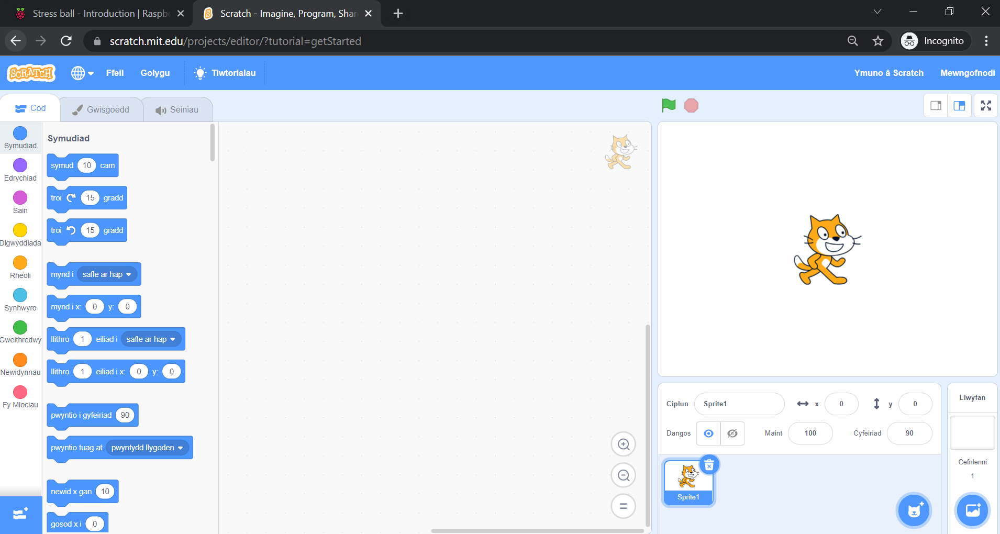
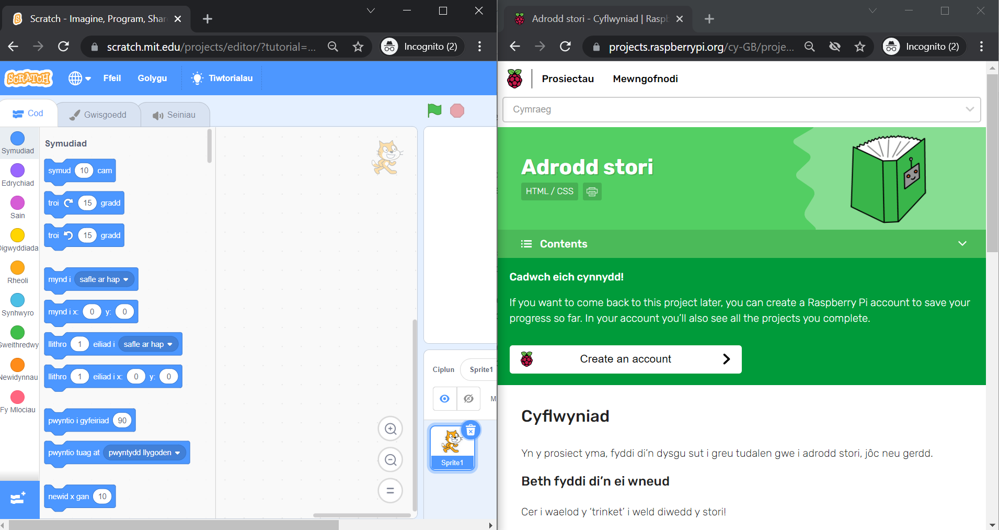
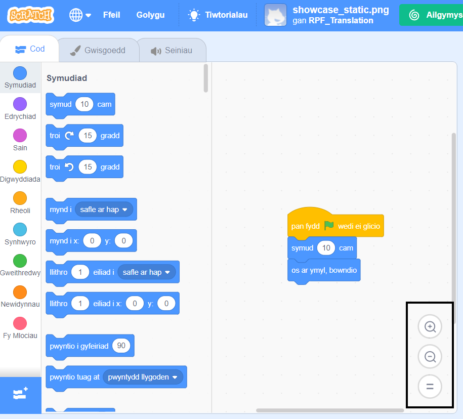

## Gosod Scratch
Galli di ddefnyddio Scratch ar liniadur neu gyfrifiadur bwrdd gwaith, neu ar dabled. Galli di hefyd ddefnyddio Scratch ar gyfrifiadur Raspberry Pi.

--- task ---

Agora borwr gwe ar dy gyfrifiadur neu dabled a mynd i [rpf.io/scratch-new](https://rpf.io/scratch-new){:target="_blank"} i agor prosiect newydd yn y golygydd Scratch. Bydd Scratch yn agor mewn tab newydd yn dy borwr gwe.

**Awgrym:** Galli di hefyd ymweld â [scratch.mit.edu](https://scratch.mit.edu/){:target="_blank"} a chlicio a **Creu**.

--- collapse ---
---
title: Gweithio all-lein heb gysylltiad â'r rhyngrwyd
---

Os wyt ti angen gweithio all-lein (heb gysylltiad â'r rhyngrwyd), yna galli di [lwytho Scratch i lawr](https://scratch.mit.edu/download){:target="_blank"} a'i osod ar gyfrifiadur.

Alli di ddim gweithio all-lein os wyt ti'n defnyddio tabled.

--- /collapse ---

--- collapse ---
---
title: Scratch ar Raspberry Pi
---

Os wyt ti'n defnyddio cyfrifiadur Raspberry Pi, mae'n bosib bod Scratch wedi'i osod yn barod. Clicia ar yr eicon **Raspberry Pi** i agor y ddewislen, wedyn clicia ar **Programming**, a dewis **Scratch 3**.

Os oes angen i ti osod Scratch, dilyna'r broses hon:
+ Clicia ar yr eicon Raspberry Pi i agor y ddewislen
+ Clicia ar **Preferences**
+ Clicia ar **Recommended Software**
+ Dewisa **Scratch 3**
+ Click on **OK**

Cymer olwg ar [Scratch 3 Desktop for Raspberry Pi](https://www.raspberrypi.org/blog/scratch-3-desktop-for-raspbian-on-raspberry-pi/) i gael mwy o wybodaeth.

--- /collapse ---

--- /task ---

--- task ---

Pan fyddi di'n defnyddio Scratch gyda'r canllaw yma neu un o'n prosiectau, bydd angen i ti newid rhwng Scratch a chyfarwyddiadau'r prosiect.

--- collapse ---
---
title: Newid rhwng tabiau porwr
---

Clicia ar (neu ar dabled, taro) deitl tab porwr i newid rhwng golygydd Scratch a chyfarwyddiadau'r prosiect.

--- /collapse ---

--- collapse ---
---
title: Cyfarwyddiadau ochr yn ochr a Scratch
---

Os ydy dy sgrin yn ddigon mawr, galli di weld Scratch wrth ymyl cyfarwyddiadau'r prosiect.

Os wyt ti'n defnyddio Microsoft Windows 10, llusga'r tab Scratch yn dy borwr gwe fel ei fod mewn ffenestr ar wahân, ac wedyn parhau i'w lusgo nes bod y cyrchwr yn cyrraedd ymyl dde dy sgrin. Bydd dy ffenestr wedi'i gosod ar ochr dde'r sgrin wedyn.

Nawr, llusga'r ffenestr sy'n cynnwys y canllaw yma neu gyfarwyddiadau dy brosiect i ochr chwith dy sgrin nes bod y cyrchwr yn cyrraedd yr ymyl chwith. Bydd y ffenestr yn cymryd hanner chwith dy sgrin.

Galli di newid maint y ffenestri i'w cael yn union fel rwyt ti'n dymuno.

**Awgrym:** Galli di hefyd ddal y fysell <kbd>Windows</kbd> i lawr a phwyso'r fysell saeth <kbd>Chwith</kbd> neu <kbd>Dde</kbd> i osod ffenestr yn hanner chwith neu dde dy sgrin.

--- /collapse ---

Rho gynnig arni nawr a gweld sut mae'n well gen ti weithio.

--- /task ---

--- task ---

Pan wyt ti'n defnyddio Scratch mewn porwr gwe, galli di nesáu neu bellhau i addasu'r maint.

Er enghraifft, os wyt ti'n defnyddio Microsoft Windows a rwyt ti am ddefnyddio nesáu/pellhau ar dudalen we yn Google Chrome neu Microsoft Edge, dalia'r fysell <kbd>Ctrl</kbd> i lawr a gwasgu'r fysell <kbd>+</kbd> neu <kbd>-</kbd> i nesáu neu bellhau.

--- collapse ---
---
title: Defnyddio nesáu/pellhau yn ardal y Cod
---

Galli di hefyd ddefnyddio'r rheolyddion nesáu/pellhau yn ardal y Cod yn Scratch i newid maint y blociau cod yn ardal y Cod.

--- /collapse ---

--- /task ---

