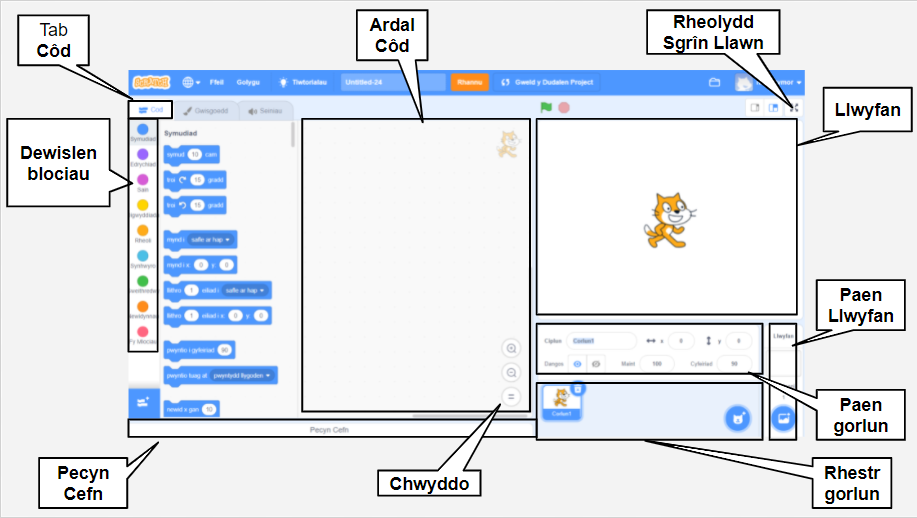

## Golygydd Scratch

Y **Llwyfan** yw lle mae'r hwyl yn digwydd yn dy brosiect. Mae gan y Llwyfan un neu fwy o ddelweddau cefndirol o'r enw **cefnlenni**.

Mae **Corluniau** yn gymeriadau a gwrthrychau sy'n ymddangos ar y **Llwyfan**. Rhoddir cyfarwyddiadau i Gorluniau drwy ddefnyddio blociau cod Scratch. Yr enw am hyn ydy **rhaglennu**.

Llusga **flociau cod** o'r **Ddewislen blociau** i **ardal y Cod** i raglennu dy gorluniau a'r Llwyfan. Gall blociau cod wneud i gorlun symud o gwmpas, newid y ffordd mae'n edrych, a chwarae seiniau.

Gall corluniau gael fwy nag un **gwisg**. Galli di newid y wisg i newid ymddangosiad corlun. Mae modd defnyddio hyn ar gyfer effeithiau fel rhoi'r argraff fod corlun yn cerdded.

Mae **sgript** yn gyfres o flociau sydd wedi'u cysylltu â'i gilydd i roi cyfarwyddiadau i'r Llwyfan neu gorluniau. Gall y Llwyfan a'r corluniau fod â llawer o sgriptiau gwahanol. 

