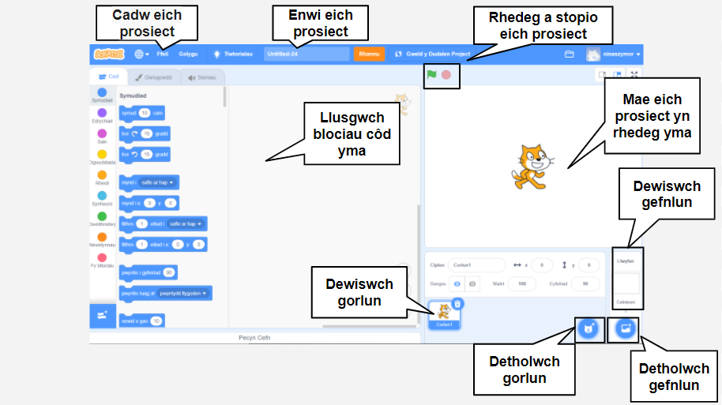
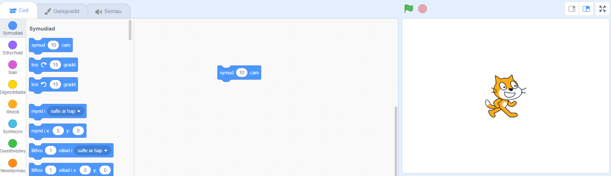
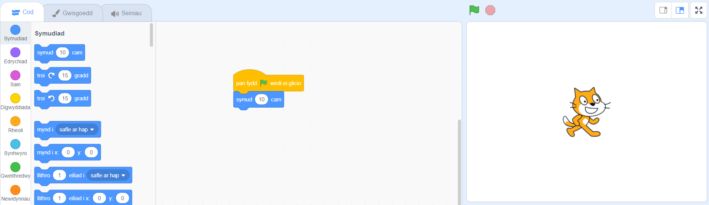
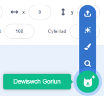
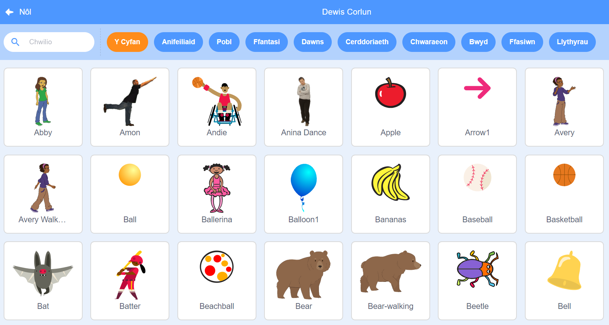
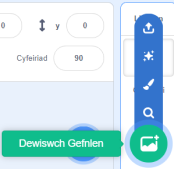
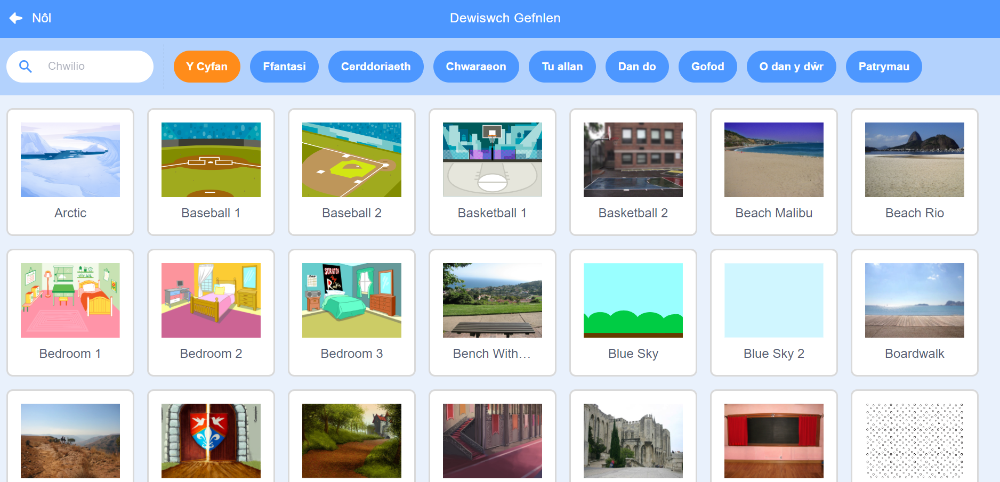
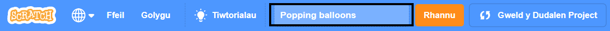

## Dy brosiect Scratch cyntaf



--- task ---

Pan fyddi di'n creu prosiect Scratch newydd, mae'n cynnwys corlun **cath**.

Llusga flociau o'r Ddewislen blociau i ardal y Cod i wneud i'r gath wneud rhywbeth.

I roi cynnig ar enghraifft, llusga floc `symud`{:class="block3motion"} o'r ddewislen blociau `Symudiad`{:class="block3motion"}. Mae'r blociau wedi'u codio yn ôl eu lliw er mwyn dy helpu i ddod o hyd iddyn nhw.



Galli di glicio ar flociau yn ardal y Cod i'w rhedeg. Clicia ar y bloc `symud`{:class="block3motion"} a bydd y gath yn symud.

**Awgrym:** Os wyt ti'n defnyddio Scratch ar dabled, galli di daro eitem i glicio arno.

Mae **blociau het** yn rhedeg y blociau oddi tanyn nhw pan fydd digwyddiad penodol yn digwydd. Mae'r bloc `pan fydd y faner werdd wedi'i chlicio `{:class="block3events"} yn rhedeg cod pan fyddi di'n clicio ar y faner werdd uwchben y Llwyfan i redeg dy brosiect.

Llusga floc `pan fydd y faner werdd wedi'i chlicio`{:class="block3events"} uwchben y bloc `symud`{:class="block3motion"} fel eu bod nhw'n snapio at ei gilydd.



Fe ddylai dy gôd edrych fel hyn:

```blocks3
when flag clicked
move (10) steps
```

**Awgrym:** Mae blociau Scratch wedi'u codio yn ôl eu lliw, felly bydd y bloc `pan fydd y faner werdd wedi'i chlicio`{:class="block3events"} yn y ddewislen `Digwyddiadau`{:class="block3events"}.

Nawr, clicia ar y faner werdd uwchben y Llwyfan a bydd y gath yn symud.

--- /task ---

Galli di ychwanegu mwy o gorluniau i dy brosiect, a galli di hefyd ychwanegu cefnlen.

--- task ---

--- collapse ---
---
title: Dewis corlun
---

Yn y rhestr Corluniau, clicia ar **Dewiswch Gorlun** i weld llyfrgell o bob corlun Scratch.



Mae modd chwilio am gorlun, neu bori yn ôl categori neu thema. Clicia ar gorlun i'w ychwanegu i dy brosiect.



--- /collapse ---

--- /task ---

--- task ---

--- collapse ---
---
title: Dewis cefnlen
---

Yng nghornel dde isaf cwarel y Llwyfan, clicia ar **Dewiswch Gefnlen**.



Mae modd chwilio am gefnlen neu bori yn ôl categori neu thema. Clicia ar gefnlen i'w ychwanegu i dy brosiect.



--- /collapse ---

--- /task ---

--- task ---

--- collapse ---
---
teitl: Rhoi enw i dy brosiect a'i gadw
---

Cer i **Ffeil** yn y ddewislen. Os oes gen ti gyfrif Scratch, clicia ar **Cadw nawr**. Os nad oes gen ti gyfrif, clicia ar **Cadw i'r cyfrifiadur**.

Clicia ym mlwch enw'r prosiect a newid yr enw i gyd-fynd â dy brosiect.



Os wyt ti wedi rhannu dy brosiect, yna bydd pobl eraill hefyd yn gweld yr enw hwn, felly gwna'n siŵr ei fod yn gwneud synnwyr.

--- /collapse ---

--- /task ---

Rwyt ti wedi creu dy brosiect Scratch cyntaf!

Rwyt ti nawr yn barod i ddysgu Scratch. We recommend that you start with our [Introduction to Scratch](https://projects.raspberrypi.org/en/raspberrypi/scratch-intro){:target="_blank"}, [Scratch: Module 1](https://projects.raspberrypi.org/en/raspberrypi/scratch-module-1){:target="_blank"} and/or [Look after yourself](https://projects.raspberrypi.org/en/raspberrypi/look-after-yourself){:target="_blank"} paths, which are designed for beginners.

 Galli di ddychwelyd i'r canllaw yma os wyt ti angen help i ddefnyddio Scratch wrth weithio ar ein prosiectau llwybr neu ar dy brosiectau annibynnol dy hun. 


