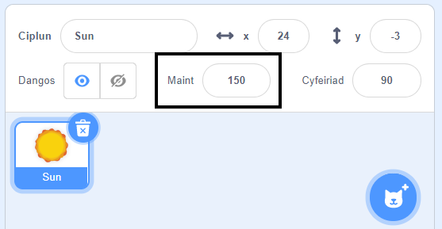

## Edrychiad

Mae blociau `Edrychiad`{:class="block3looks"} yn rheoli edrychiad corlun ar y Llwyfan.

Gall Corluniau gyfathrebu drwy ddefnyddio `Edrychiad`{:class="block3looks"}, swigen siarad `dweud`{:class="block3looks"}, swigen meddwl `meddwl`{:class="block3looks"}, neu drwy eu `effeithiau graffeg`{:class="block3looks"}.

### Dweud a meddwl

```blocks3
say () for () seconds

say ()

think () for () seconds

think ()
```

--- collapse ---
---
title: Defnyddio swigen siarad i gyfathrebu
---

Mae gan gorluniau `dweud`{:class="block3looks"} a `meddwl`{:class="block3looks"}.

Mae'r blociau `dweud () am () eiliad`{:class="block3looks"} a `meddwl () am () eiliad`{:class="block3looks"} yn cael eu defnyddio i ddweud neu feddwl rhywbeth am gyfnod penodol o amser.

```blocks3
when this sprite clicked
say [Hello!] for [2] seconds // hide speech after 2 seconds
```

Bydd y corlun yn dangos swigen siarad am ddwy eiliad pan gaiff ei glicio.

**Sgwrs yn y sêr**: [Gweld tu mewn](https://scratch.mit.edu/projects/485673032/editor){:target="_blank"}

Clicia ar y corluniau i'w gweld yn cyfathrebu drwy siarad neu feddwl.

<div class="scratch-preview">
  <iframe allowtransparency="true" width="485" height="402" src="https://scratch.mit.edu/projects/embed/485673032/?autostart=false" frameborder="0"></iframe>
</div>

Mae'r blociau `dweud ()`{:class="block3looks"} a `meddwl ()`{:class="block3looks"} yn cael eu defnyddio i ddweud neu feddwl rhywbeth, tan fod neges arall neu floc `dweud ()`{:class="block3looks"} neu `meddwl ()`{:class="block3looks"} arall yn ei ddisodli.

--- /collapse ---

### Maint

Gosod neu newid `maint`{:class="block3looks"} dy gorluniau.

```blocks3
change size by ()

set size to () %

(size)
```

--- collapse ---
---
title: Gosod maint dy gorlun
---

Pan fyddi di'n ychwanegu corlun at dy brosiect, mae ei faint wedi'i osod i `100` y cant. Gallai hyn fod yn rhy fawr neu'n rhy fach i dy brosiect.

Galli di ddefnyddio cod i osod maint corlun. I wneud hyn, defnyddia floc `gosod maint i`{:class="block3looks"}:

```blocks3
set size to (50) %
```

Os byddi di'n gosod maint corlun i `50` y cant, bydd hanner mor dal a hanner mor eang. Os byddi di'n gosod maint corlun i `200` y cant, bydd ddwywaith mor dal a ddwyaith mor eang.

I osod maint corlun pan gaiff y prosiect ei gychwyn, rho floc `gosod maint i`{:class="block3looks"} o dan bloc `pan fydd y fflag werdd wedi'i chlicio`{:class="block3events"}:

```blocks3
when green flag clicked
set size to (50) %
```

Galli di hefyd osod maint corlun yn gyflym yn y briodwedd **Maint** yng nghwarel y Corlun o dan y llwyfan:

{:width="400px"}

--- /collapse ---

### Effeithiau graffeg

Galli di osod neu newid amrywiaeth o effeithiau gweledol, fel lliw, llygad pysgodyn, chwyrliad, picseleiddio, mosaig, disgleirdeb ac ysbryd.

```blocks3
change [color v] effect by ()

set [color v] effect to ()

clear graphic effects
```

[[[scratch3-graphic-effects]]]

### Gwisgoedd

I greu effaith animeiddio gyda dy gorluniau, galli di newid eu gwisgoedd.

```blocks3
newid gwisg i (v)

gwisg nesaf

(gwisg [rhif v])
```

[[[scratch3-change-costumes-to-show-mood]]]

--- collapse ---
---
title: Newid yr edrychiad i greu effaith animeiddio
---

**Calon yn curo**: [Gweld tu mewn](https://scratch.mit.edu/projects/435725413/editor){:target="_blank"}

<div class="scratch-preview">
  <iframe allowtransparency="true" width="485" height="402" src="https://scratch.mit.edu/projects/embed/435725413/?autostart=false" frameborder="0"></iframe>
</div>

Galli di ddefnyddio'r blociau `gosod maint i`{:class="block3looks"} neu `newid maint gan`{:class="block3looks"} i greu effaith pwls, fel calon yn curo.

**Nodyn:** Mae'r bloc `newid maint i`{:class="block3looks"} yn gosod y maint i werth penodol, tra fo'r bloc `newid maint gan`{:class="block3looks"} yn newid y gwerth o beth roedd o'r blaen, e.e. mae `newid maint gan`{:class="block3looks"} `10` yn ychwanegu 10 i werth y maint.

```blocks3
when green flag clicked
set size to (160) %
forever
change size by (40)
wait (0.2) seconds
change size by (20)
wait (0.2) seconds
change size by (-20)
wait (0.2) seconds
change size by (-40)
wait (0.2) seconds
end
```

Mae'r cod yma yn defnyddio cyfres o flociau `newid maint gan`{:class="block3looks"} ac `aros`{:class="block3control"} i wneud i'r galon tyfu a chrebachu. Rho gynnig ar greu dy gorlun dy hun sy'n curo.

Fe allet ti hefyd ddefnyddio'r bloc `newid effaith graffeg gan`{:class="block3looks"} i greu corlun sy'n newid ei edrychiad.

```blocks3
when green flag clicked
change [ghost v] effect by (75)
wait (1) seconds
change [ghost v] effect by (-75)
```

**Nodyn:** Os wyt ti'n defnyddio cod sy'n newid effaith graffeg ac sydd yn ei newid eto wedyn, cofia ddefnyddio bloc `aros`{:class="block3control"} rhwng y blociau `newid effaith graffeg gan`{:class="block3looks"}, fel arall bydd yn digwydd mor gyflym fyddi di ddim yn ei weld!

Galli di ddefnyddio bloc `clirio effeithiau graffeg`{:class="block3looks"} i ailosod yr effeithiau:

```blocks3
clear graphic effects
```

--- /collapse ---

--- collapse ---
---
title: Clicio i newid ac yna newid yn ôl
---

Galli di ychwanegu gweithredoedd sy'n gwneud newid i gorlun ac yna yn ei wrthdroi, er engrhaifft tyfu, aros, ac yna crebachu.

**Gwasgu pêl ar ôl ei glicio**: [Gweld tu mewn](https://scratch.mit.edu/projects/435723273/editor){:target="_blank"}

<div class="scratch-preview">
  <iframe src="https://scratch.mit.edu/projects/435723273/embed" allowtransparency="true" width="485" height="402" frameborder="0" scrolling="no" allowfullscreen></iframe>
</div>

Bydd y cod yma yn tyfu corlun, yn defnyddio'r effaith `llygad pysgodyn`{:class="block3looks"} arno am 0.5 eiliad, ac yna'n dychwelyd y corlun i'w edrychiad cychwynnol:

```blocks3
when this sprite clicked
set size to (110)
set [fisheye v] effect to (50)
wait (0.5) seconds
set [fisheye v] effect to (0)
set size to (100)
```

--- /collapse ---

[[[scratch3-animate-movement-costumes]]]

### Cefnlenni

Galli di ddefnyddio cod i newid y gefnlen hefyd.

```blocks3
switch backdrop to ( v)

next backdrop

(backdrop [number v])
```

[[[scratch3-changing-backdrops-pages-levels]]]

### Gwelededd

Mae'r blociau `dangos`{:class="block3looks"} a `cuddio`{:class="block3looks"} yn rheoli gwelededd corlun.

```blocks3
show 

hide
```

[[[scratch3-show-hide-sprites-backdrops]]]

### Haenau

I newid sut mae dy gorluniau yn ymddangos mewn perthynas â'i gilydd, galli di ddefnyddio haenau.

```blocks3
go to [front v] layer

go [forward v] () layers
```

[[[scratch3-positioning-with-layers]]]

--- collapse ---
---
title: Lleoli corluniau mewn sawl haen
---

**Drwy'r ffenest gyda chorlun**: [Gweld tu mewn](https://scratch.mit.edu/projects/454188775/editor){:target="_blank"}

<div class="scratch-preview">
  <iframe allowtransparency="true" width="485" height="402" src="https://scratch.mit.edu/projects/embed/454188775/?autostart=false" frameborder="0"></iframe>
</div>

Yn yr enghraifft, mae'r corlun **Ffrâm ffenestr** yn ymddangos yn y blaen ac mae'r corlun **Haul** yn ymddangos yn y cefn. Mae'r corluniau **Avery yn Cerdded** a **Coeden** bob un yn eu haenau eu hunain rhwng y corlun **Ffrâm ffenestr** a'r corlun **Haul**.

Defnyddia'r bloc `mynd i haenau nôl`{:class="block3looks"} `1` i osod corlun un haen y tu ôl i'r corlun sydd yn y blaen:

``` blocks3
when green flag clicked
go to [front v] layer
+go [backward v] (1) layers
```

Newidia'r gwerth yn y bloc `mynd i haenau nôl`{:class="block3looks"} `1` ar gyfer pob corlun, gan ddibynu ble rwyt ti am iddo gael ei leoli mewn perthynas â chorluniau eraill:

``` blocks3
when green flag clicked
go to [front v] layer
+go [backward v] (2) layers
```

--- /collapse ---

