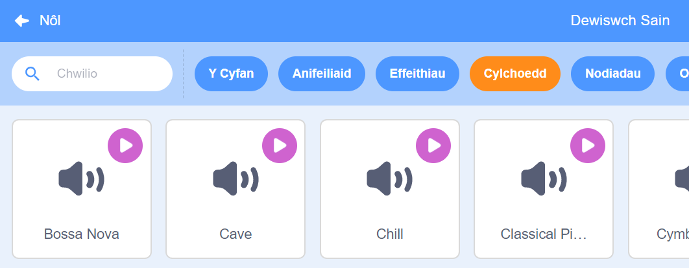

## Sain

I ychwanegu sain at dy brosiect, defnyddia flociau `Sain`{:class="block3sound"}. Er enghraifft, galli di greu trac sain cefndir parhaus, neu ychwanegu synau sy'n chwarae'n rheolaidd.

{:width="600px"}

Yn gyntaf, dewisa sain o'r Llyfrgell Sain, neu recordia dy sain eich hun.

[[[scratch3-add-sound]]]

[[[scratch3-record-sound]]]

Ychwanega god i redeg blociau `Sain`{:class="block3sound"} lle rwyt ti eisiau sain yn dy brosiect.

--- collapse ---
---
title: Ychwanegu sain hir i greu trac sain parhaus
---

Clicia ar y faner werdd i ddechrau.

**Trac sain radio**: [Gweld tu mewn](https://scratch.mit.edu/projects/444581851/editor){:target="_blank"}

<div class="scratch-preview">
 <iframe allowtransparency="true" width="485" height="402" src="https://scratch.mit.edu/projects/embed/444581851/?autostart=false" frameborder="0"></iframe>
</div>

Galli di ddefnyddio bloc `chwarae sain tan y diwedd`{:class="block3sound"} tu mewn i ddolen `am byth`{:class="block3control"}. Ar ôl i'r sain orffen, bydd y ddolen sain `am byth`{:class="block3control"} yn gwneud i'r sain ddechrau eto o'r dechrau.

Mae'r cod yma yn defnyddio un clip sain hir wedi'i ailadrodd fel trac sain:

```blocks3
when green flag clicked
forever
play sound (Dance Snare Beat v) until done
end
```

**Nodyn:** Pan wyt ti'n dewis sain newydd, os ddewisi di'r categori **Cylchoedd**, dim ond y seiniau sy'n addas ar gyfer un trac sain cylchog bydd Scratch yn ei ddangos i ti.



--- /collapse ---

--- collapse ---
---
title: Ychwanegu dilyniant o seiniau byr i greu trac sain parhaus
---

Clicia ar y faner werdd i ddechrau.

**Perfformiad i bencampwr**: [Gweld tu mewn](https://scratch.mit.edu/projects/444673165/editor){:target="_blank"}

<div class="scratch-preview">
 <iframe allowtransparency="true" width="485" height="402" src="https://scratch.mit.edu/projects/embed/444673165/?autostart=false" frameborder="0"></iframe>
</div>

 Defnyddia floc `am byth`{:class="block3control"} i greu sain cylchog. Galli di:
+ Roi cyfres o seiniau byr mewn dilyniant, neu
+ Defnyddio gwahanol nodau ac effeithiau offerynnol

```blocks3
when flag clicked
forever
play sound (Low Boing v) until done
play sound (Low Boing v) until done
play sound (Drum Buzz v) until done
play sound (Pop v) until done
play sound (Bird v) until done
play sound (Bark v) until done
play sound (Glug v) until done
End
```

--- /collapse ---

--- collapse ---
---
title: Ychwanegu seiniau sy'n chwarae'n rheolaidd
---

**Seiniau pêl droed**: [Gweld tu mewn](https://scratch.mit.edu/projects/450870079/editor){:target="_blank"}

Clicia ar y faner werdd i ddechrau.

<div class="scratch-preview">
 <iframe allowtransparency="true" width="485" height="402" src="https://scratch.mit.edu/projects/embed/450870079/?autostart=false" frameborder="0"></iframe>
</div>

 Yn y prosiect yma, mae gan y **Llwyfan** god i chwarae sain yn rheolaidd:

 ```blocks3
 when flag clicked
 forever
 wait (3) seconds
 play sound (Cheer v) until done
 end
 ```

Mae'r corlun **Whistle** hefyd yn chwarae sain yn rheolaidd:

 ```blocks3
 when this sprite clicked
 forever
 play sound (Referee Whistle v) until done
 wait (4) seconds
 end
 ```

--- /collapse ---

--- collapse ---
---
title: Ychwanegu seiniau sy'n chwarae ar yr un pryd
---

Mae dau floc `Sain`{:class="block3sound"} gyda gwahaniaeth pwysig:

+ Pan fyddi di'n `chwarae sain tan y diwedd`{:class="block3sound"}, bydd y sain gyfan yn cael ei chwarae. Fydd y llinell nesaf o god yn y sgript ddim yn rhedeg nes bod y sain wedi gorffen chwarae.

+ Pan fyddi di'n `dechrau sain`{:class="block3sound"}, bydd y sain yn chwarae, ond bydd y bloc nesaf yn rhedeg yn syth ac ni fydd yn aros i'r sain orffen chwarae gyntaf.

Mae hyn yn golygu pe byddai gen ti gyfres o flociau `dechrau sain`{:class="block3sound"}, bydd y seiniau i gyd yn chwarae bron ar yr un pryd, wedi'u haenu ar ben ei gilydd. Gall yr effaith fod yn ddiddorol ac weithiau'n flêr.

Rho gynnig arno rywbryd!

```blocks3
when green flag clicked
start sound (Meow v)
start sound (Alien Creak2 v)
start sound (Boing v)
start sound (Boom Cloud v)
start sound (Baa v)
```

--- /collapse ---

Ar ôl i ti ddewis dy seiniau, efallai hoffet ti newid `lefel sain`{:class="block3sound"}, `traw`{:class="block3sound"}, neu `troi`{:class="block3sound"} (fel dy fod ti'n clywed y sain drwy'r seinydd ar y chwith neu'r dde).

--- collapse ---
---
title: Lefel y sain, traw, a throi
---

Clicia ar y faner werdd i ddechrau.

**Ymarfer band**: [Gweld tu mewn](https://scratch.mit.edu/projects/451697380/editor){:target="_blank"}

<div class="scratch-preview">
 <iframe allowtransparency="true" width="485" height="402" src="https://scratch.mit.edu/projects/embed/451697380/?autostart=false" frameborder="0"></iframe>
</div>

Mae'r corlun **Drums** yn defnyddio bloc `gosod lefel sain i`{:class="block3sound"}, `gosod effaith traw i`{:class="block3sound"}, a `gosod effaith troi chwith/dde i`{:class="block3sound"} i newid y sain:

```blocks3
set volume to (80) %
set [pitch v] effect to (50) :: sound
set [pan left/right v] effect to (-100) :: sound
play sound (Drum Funky v) until done
```

+ Galli di `osod lefel sain i`{:class="block3sound"} werth o `0` (wedi mudo) i `100` (y lefel sain uchaf). Mae hyn yn ddefnyddiol os wyt ti am i rai seiniau chwarae'n uwch nag eraill, neu os wyt ti am i gorlun ymddangos ymhellach i ffwrdd.

+ Mae'r effaith `traw`{:class="block3sound"} yn rheoli pa mor uchel neu isel mae traw sain. Mae gosod y traw i werth uwch hefyd yn gwneud sain yn gyflymach. Galli di `osod effaith traw i`{:class="block3sound"} werthoedd rhwng `-360` (isel iawn) a `360` (uchel iawn).

+ Mae'r effaith `troi chwith/dde`{:class="block3sound"} yn dy alluogi di i reoli p'un ai ydy sain yn dod o'r seinydd neu glustffon chwith neu dde, neu o'r ddwy ochr. Galli di newid y gwerthoedd `gosod effaith troi chwith/dde`{:class="block3sound"} o `-100` (yr holl sain yn dod o'r chwith) i `100` (yr holl sain yn dod o'r dde).

--- /collapse ---

Galli di hefyd ddefnyddio'r estyniad `Testun i Leferydd`{:class="block3extensions"}:

[[[scratch3-text-to-speech]]]

