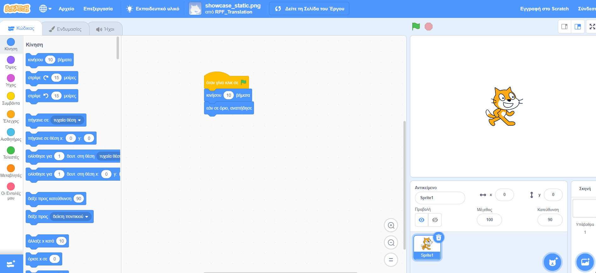

## Τι είναι το Scratch;
Το Scratch είναι μια γλώσσα προγραμματισμού με γραφικά που αναπτύχθηκε από την ομάδα Lifelong Kindergarten στο MIT Media Lab. Στο Scratch, μπορείς να σύρεις και να συνδυάσεις μπλοκ κώδικα για να δημιουργήσεις ένα εύρος προγραμμάτων, όπως κινούμενα σχέδια, ιστορίες, μουσικά όργανα και παιχνίδια. Μοιάζει λίγο με το ισοδύναμο του προγραμματισμού με τουβλάκια!

Το Scratch χρησιμοποιείται σε πολλά σχολεία ως μέρος του προγράμματος σπουδών. Είναι δωρεάν και οι νέοι μπορούν να το χρησιμοποιήσουν στο σπίτι αλλά και σε λέσχες.

Το Scratch επιτρέπει στους νέους να μάθουν έννοιες κώδικα και να δημιουργήσουν διαδραστικά έργα χωρίς να χρειάζεται να μάθουν μια γλώσσα προγραμματισμού που βασίζεται σε κείμενο. Δεν θα χρειαστεί να μπορείς να πληκτρολογείς γρήγορα ή να θυμάσαι πολύπλοκο κώδικα για να χρησιμοποιήσεις το Scratch.

### Πώς να χρησιμοποιήσεις αυτόν τον οδηγό αναφοράς
Εάν δεν έχεις χρησιμοποιήσει το Scratch στο παρελθόν, τότε αυτός ο οδηγός θα σε βοηθήσει να ρυθμίσεις και να δημιουργήσεις το πρώτο σου έργο.

Μπορείς να επιστρέψεις σε αυτόν τον οδηγό και να τον χρησιμοποιήσεις για να αναζητήσεις πληροφορίες που χρειάζεσαι όταν κάνεις τα δικά σου έργα στο Scratch.

Στο τέλος του οδηγού θα βρεις συνδέσμους για μονοπάτια έργων Scratch, από αρχάριους έως προχωρημένους, όπου μπορείς να μάθεις κώδικα κάνοντας διασκεδαστικές και ενδιαφέρουσες εφαρμογές, παιχνίδια, ιστορίες, κινούμενα σχέδια, τέχνη και μουσική.

--- collapse ---
---
title: Τι θα χρειαστείς
---
### Υλικό

+ Έναν υπολογιστή ή tablet ικανό να τρέχει το Scratch 3

### Λογισμικό

+ Αυτός ο οδηγός θα εξηγήσει πώς να ξεκινήσεις με το Scratch 3 (είτε [online](https://scratch.mit.edu/){:target="_blank"} είτε [offline](https://scratch.mit.edu/download){:target="_blank"})

--- /collapse ---
