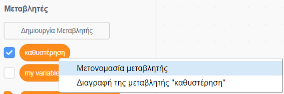
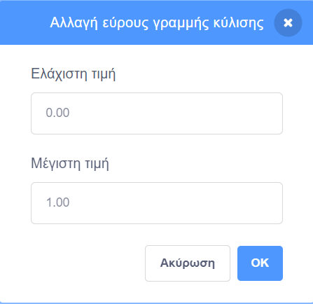

## Μεταβλητές

Μια `μεταβλητή `{:class="block3variables"} είναι ένας τρόπος αποθήκευσης αριθμών ή/και κειμένου.

Μπορείς να δημιουργήσεις τις δικές σου μεταβλητές και να επιλέξεις εάν θα εμφανίζονται στη Σκηνή:

[[[generic-scratch3-add-variable]]]

Θα πρέπει να σκεφτείς εάν πρέπει να ορίσεις μια αρχική τιμή όταν δημιουργείς μια μεταβλητή:

[[[scratch3-create-set-variable]]]

Μπορείς να μετονομάσεις μια μεταβλητή εάν αλλάξεις γνώμη:

--- collapse ---
---
title: Μετονομασία μεταβλητής
---

Μερικές φορές σκέφτεσαι ένα καλύτερο όνομα για μια μεταβλητή.

Μπορείς να δώσεις ένα νέο όνομα σε μια μεταβλητή: πήγαινε στο μενού `Μεταβλητές`{:class="block3variables"}, κάνε δεξί κλικ (ή σε tablet, πάτησε παρατεταμένα) στο `η μεταβλητή μου`{:class="block3variables "} και επίλεξε **Μετονομασία μεταβλητής**.



Αυτό θα αλλάξει το όνομα της μεταβλητής σε όλα τα μπλοκ στα οποία την έχεις χρησιμοποιήσει.

--- /collapse ---

**Συμβουλή:** Βεβαιώσου ότι γνωρίζεις τη διαφορά μεταξύ `όρισε`{:class="block3variables"} και `άλλαξε κατά`{:class="block3variables"}. Το `όρισε`{:class="block3variables"} θα αντικαταστήσει την τιμή που είναι αποθηκευμένη σε μια μεταβλητή. Το `άλλαξε κατά`{:class="block3variables"} θα αλλάξει την τιμή μιας αριθμητικής μεταβλητής κατά το ποσό που επιλέγεις, `άλλαξε κατά`{:class="block3variables"}`1` θα προσθέσει τον αριθμό ένα σε μια μεταβλητή. Το `άλλαξε κατά`{:class="block3variables"}`-1` θα αφαιρέσει τον αριθμό ένα από μια μεταβλητή.


**Συμβουλή:** Οι μεταβλητές στη Σκηνή εμφανίζονται πάντα σε ένα επίπεδο πάνω από όλα τα αντικείμενα. Εάν έχεις ένα κινούμενο αντικείμενο, το αντικείμενο θα μπει κάτω από οποιεσδήποτε μεταβλητές στη Σκηνή.

Μπορείς να χρησιμοποιήσεις μια γραμμή κύλισης για να ελέγξεις την τιμή σε μια μεταβλητή.

[[[scratch3-slider-variable]]]

Περισσότερες ιδέες για τη χρήση μεταβλητών:

[[[generic-scratch3-high-score]]]

[[[scratch3-join-text]]]

[[[scratch3-set-variable-with-button]]]

[[[scratch3-change-variable-in-loop]]]


--- collapse ---
---
title: Έλεγξε τα εφέ γραφικών με μια γραμμή κύλισης για τη μεταβλητή
---

Ακολουθούν μερικά παραδείγματα για το πώς μπορείς να χρησιμοποιήσεις slider στη μεταβλητή σου:


Αυτό το παράδειγμα αλλάζει το εφέ `φαντάσματος`{:class="block3looks"} έτσι ώστε να μπορείς να βλέπεις μέσα από το ουράνιο τόξο.

**Διαφανές ουράνιο τόξο**: [Δες μέσα](https://scratch.mit.edu/projects/451544795/editor){:target="_blank"}

<div class="scratch-preview">
  <iframe allowtransparency="true" width="485" height="402" src="https://scratch.mit.edu/projects/embed/451544795/?autostart=false" frameborder="0"></iframe>
</div>

Μπορείς να χρησιμοποιήσεις μια μεταβλητή `διαφανής`{:class="block3variables"} για να ελέγξεις το εφέ `φαντάσματος`{:class="block3looks"} σε ένα αντικείμενο `μπροστά`{:class="block3looks"} και να το χρησιμοποιήσεις για να αποκαλύψεις ή να κρύψεις αντικείμενα σε πίσω επίπεδα.

```blocks3
when flag clicked
go to [front v] layer
```

```blocks3
when flag clicked
forever
set [ghost v] effect to (transparent)
```

Δοκίμασε να χρησιμοποιήσεις την ίδια προσέγγιση με άλλα εφέ γραφικών, όπως `φωτεινότητα`{:class="block3looks"} ή `χρώμα`{:class="block3looks"}.

--- /collapse ---

--- collapse ---
---
title: Έλεγξε την ταχύτητα κίνησης με μια μεταβλητή
---

**Πασχαλίτσα σε τοίχο**: [Δες μέσα](https://scratch.mit.edu/projects/451545341/editor){:target="_blank"}

<div class="scratch-preview">
  <iframe allowtransparency="true" width="485" height="402" src="https://scratch.mit.edu/projects/embed/451545341/?autostart=false" frameborder="0"></iframe>
</div>

Χρησιμοποίησε τη μεταβλητή `ταχύτητα`{:class="block3variables"} ως είσοδο σε ένα μπλοκ `κινήσου`{:class="block3motion"}:

```blocks3
when flag clicked
forever
move (speed) steps
if on edge, bounce
```
Όρισε τις ελάχιστες και μέγιστες τιμές για το εύρος της γραμμής κύλισης για να ταιριάζει στο έργο σου.

--- /collapse ---

--- collapse ---
---
title: Έλεγξε την ταχύτητα στροφής με μια μεταβλητή
---

**Σκύλος διαστήματος**: [Δες μέσα](https://scratch.mit.edu/projects/451543041/editor){: target = "_ blank"}

<div class="scratch-preview">
  <iframe allowtransparency="true" width="485" height="402" src="https://scratch.mit.edu/projects/embed/451543041/?autostart=false" frameborder="0"></iframe>
</div>

Χρησιμοποίησε τη μεταβλητή `γωνία`{:class="block3variables"} ως είσοδο σε ένα μπλοκ `στρίψε`{:class="block3motion"}:

```blocks3
when flag clicked
forever
turn right (angle) degrees
```

--- /collapse ---

--- collapse ---
---
title: Άλλαξε την καθυστέρηση σε ένα μπλοκ αναμονής
---

**Χορός σκελετού**: [Δες μέσα](https://scratch.mit.edu/projects/451536565/editor){: target = "_ blank"}

<div class="scratch-preview">
  <iframe allowtransparency="true" width="485" height="402" src="https://scratch.mit.edu/projects/embed/451536565/?autostart=false" frameborder="0"></iframe>
</div>

Χρησιμοποίησε μια μεταβλητή `καθυστέρηση`{:class="block3variables"} ως είσοδο σε ένα μπλοκ `περίμενε`{:class="block3motion"}:

```blocks3
when flag clicked
forever
wait (delay) seconds
next costume
```

Μια καθυστέρηση μεγαλύτερη του ενός δευτερολέπτου είναι αρκετά μεγάλη. Εάν συμπεριλάβεις έναν δεκαδικό αριθμό στο εύρος μιας γραμμής κύλισης, τότε μπορείς να αλλάξεις την τιμή κατά ένα εκατοστό του δευτερολέπτου κάθε φορά.

Ένα εύρος από `0,00` έως `1,00` σου επιτρέπει να επιλέξεις καθυστέρηση μεταξύ `0` δευτερολέπτων (χωρίς καθυστέρηση) και `1` δευτερολέπτου.



Άλλαξε τους αριθμούς για να λάβεις τις ελάχιστες και μέγιστες τιμές που θέλεις να μπορούν να χρησιμοποιούν οι χρήστες στο έργο σου.

--- /collapse ---

--- collapse ---
---
title: Αλλαγή ηχητικών εφέ
---

**Τόνος τυμπάνου**: [Δες μέσα](https://scratch.mit.edu/projects/451547017/editor){:target="_blank"}

<div class="scratch-preview">
  <iframe allowtransparency="true" width="485" height="402" src="https://scratch.mit.edu/projects/embed/451547017/?autostart=false" frameborder="0"></iframe>
</div>

Μπορείς να χρησιμοποιήσεις μια `μεταβλητή`{:class="block3variables"} σε ένα μπλοκ `όρισε εφέ τόνος σε`{:class="block3sound"}. Εάν αυξήσεις τον τόνο ενός ήχου, οι νότες γίνονται πιο ψηλές και ο ήχος επιταχύνεται.

```blocks3
when flag clicked
forever
set [pitch v] effect to (beat) :: sound
```

Παίξε τον ήχο σε ξεχωριστό βρόχο `για πάντα`{:class="block3control"}, έτσι ώστε η τόνος να αλλάξει αμέσως, αντί να περιμένεις μέχρι να τελειώσει η αναπαραγωγή του ήχου:

```blocks3
when flag clicked
forever
play sound [Dance Head Nod v] until done
```

Μπορείς επίσης να χρησιμοποιήσεις μια `μεταβλητή `{:class="block3variables"} για να αλλάξεις την ένταση και το εφέ μετατόπισης (αριστερά/δεξιά).

--- /collapse ---


