## Ο επεξεργαστής ζωγραφικής

Χρησιμοποίησε το πρόγραμμα επεξεργασίας ζωγραφικής για να δημιουργήσεις τα δικά σου υπόβαθρα και ενδυμασίες και να επεξεργαστείς υπάρχοντα υπόβαθρα και ενδυμασίες.

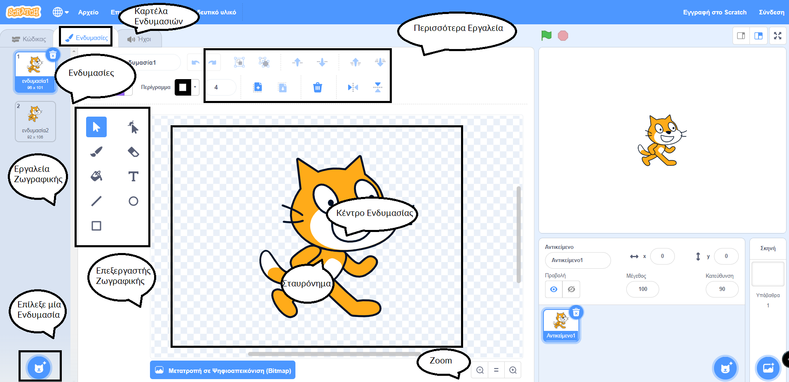{:width="600px"}

[[[scratch3-paint-a-new-backdrop-extended]]]

[[[scratch3-backdrops-and-sprites-using-shapes]]]

[[[scratch3-use-text-tool]]]

[[[scratch3-add-costumes-to-a-sprite]]]

[[[scratch-crosshair]]]

[[[scratch3-copy-parts-between-sprite-costumes]]]

--- collapse ---
---
title: Αντιγραφή και επεξεργασία ενδυμασίας για χρήση σε κινούμενα σχέδια
---

Ορισμένα αντικείμενα του Scratch έχουν απλώς μια ενδυμασία ή έχουν πολλές ενδυμασίες που δεν λειτουργούν ως κινούμενα σχέδια. Εάν επιλέξεις μια ενδυμασία, την αντιγράψεις (κάνε ένα αντίγραφό της) και κάνεις μια μικρή αλλαγή, μπορεί να δημιουργήσεις ένα εφέ κινουμένων σχεδίων.

**Κινούμενα σχέδια ρομπότ**: [Δες μέσα](https://scratch.mit.edu/projects/436260207/editor){:target="_blank"}

  <iframe allowtransparency="true" width="485" height="402" src="https://scratch.mit.edu/projects/embed/436260207/?autostart=false" frameborder="0"></iframe>

Πήγαινε στην καρτέλα **Ενδυμασίες** για το αντικείμενό σου.

Διάλεξε την ενδυμασία που θέλεις να χρησιμοποιήσεις και διάγραψε τις άλλες ενδυμασίες, γιατί δεν θα τις χρειαστείς για το κινούμενο σχέδιο. Για παράδειγμα, το αντικείμενο **Robot** συνοδεύεται από ενδυμασίες για τρία διαφορετικά ρομπότ, επομένως θα πρέπει να επιλέξεις μια από τις ενδυμασίες και να διαγράψεις τις άλλες ενδυμασίες.

Κάνε δεξί κλικ (ή σε ένα tablet, πάτησε παρατεταμένα) στην ενδυμασία και επίλεξε **διπλασιασμός**.

Κάνε μικρές αλλαγές στο αντίγραφο της ενδυμασίας. Για παράδειγμα, μπορείς να μετακινήσεις, να περιστρέψεις ή να αλλάξεις ολόκληρη την ενδυμασία ή μέρος της. Μπορείς επίσης να προσθέσεις γραμμές κίνησης.

Εάν η ενδυμασία σου χρησιμοποιεί διανυσματικά γραφικά, τότε μπορείς να επιλέξεις μέρη μιας ενδυμασίας και να αλλάξεις κάθε μέρος ξεχωριστά.

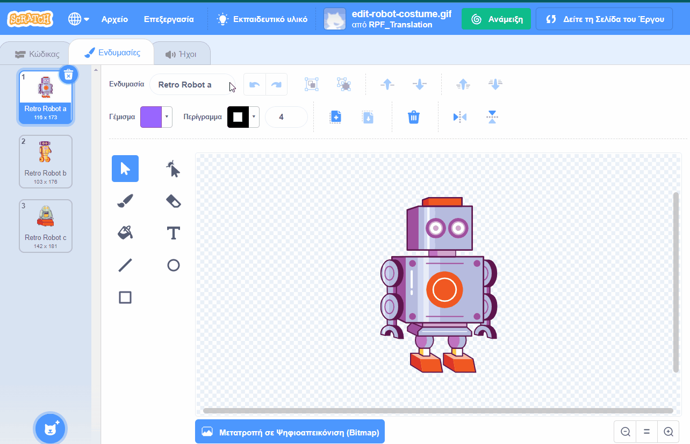

Μπορείς να αντιγράψεις ξανά την ενδυμασία και να κάνεις περισσότερες αλλαγές για να προσθέσεις περισσότερα καρέ στην κινούμενη εικόνα σου.

Τώρα μπορείς να χρησιμοποιήσεις τις ενδυμασίες σου σε ένα απλό αντικείμενο κινουμένων σχεδίων.

--- /collapse ---

--- collapse ---
---
title: Χρησιμοποίησε το Γέμισμα για να αλλάξεις το χρώμα μιας ενδυμασίας
---

Μπορείς να αλλάξεις το χρώμα του αντικειμένου σου. Πρώτα, επίλεξε το αντικείμενό σου από τη λίστα Αντικειμένων κάτω από τη Σκηνή και, στη συνέχεια, κάνε κλικ στην καρτέλα **Ενδυμασίες**.

Χρησιμοποίησε το εργαλείο **Επιλογή** (βέλος) για να επισημάνεις το μέρος της ενδυμασίας που θέλεις να αλλάξει χρώμα.

{:width="200px"}

{:width="300px"}

Πήγαινε στο **Γέμισμα** και επίλεξε ένα από τα διαθέσιμα χρώματα. Θα γεμίσει αυτόματα το σχήμα που έχεις επιλέξει.

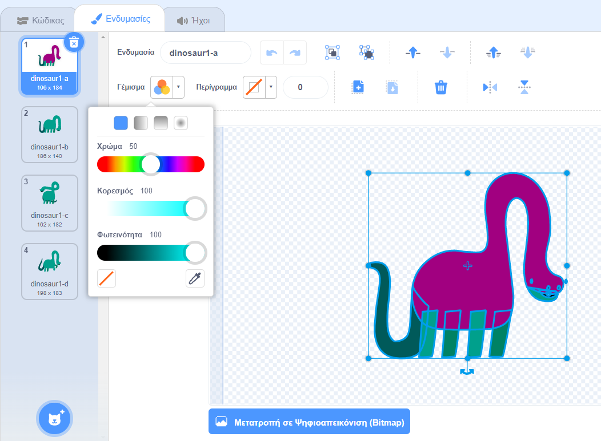{:width="300px"}

Επανάλαβε τα παραπάνω βήματα για οποιοδήποτε μέρος της ενδυμασίας που ξέχασες ή για οποιοδήποτε άλλο μέρος της ενδυμασίας που θέλεις να αλλάξει χρώμα.

{:width="300px"}

{:width="300px"}

{:width="300px"}

--- /collapse ---

Χρησιμοποίησε τις παρακάτω συμβουλές που θα σε βοηθήσουν να δημιουργήσεις τα δικά σου σχέδια για τα αντικείμενά σου στο πρόγραμμα επεξεργασίας ζωγραφικής.

--- collapse ---
---
title: Δημιουργία τοπίων ως αντικείμενα
---

**Λόφος ως αντικείμενο**: [Δες μέσα](https://scratch.mit.edu/projects/452582516/editor){:target="_blank"}

{:width="400px"}

Για να φτιάξεις το δικό σου **Λόφο**, όπως φαίνεται στο παραπάνω παράδειγμα, μπορείς να χρησιμοποιήσεις τα εργαλεία **Κύκλος** και **Ορθογώνιο** στον επεξεργαστή ζωγραφικής:

+ Πήγαινε στο **Επιλέξτε ένα Αντικείμενο** και επίλεξε **Ζωγραφική** για να δημιουργήσεις μια νέα ενδυμασία του αντικειμένου.

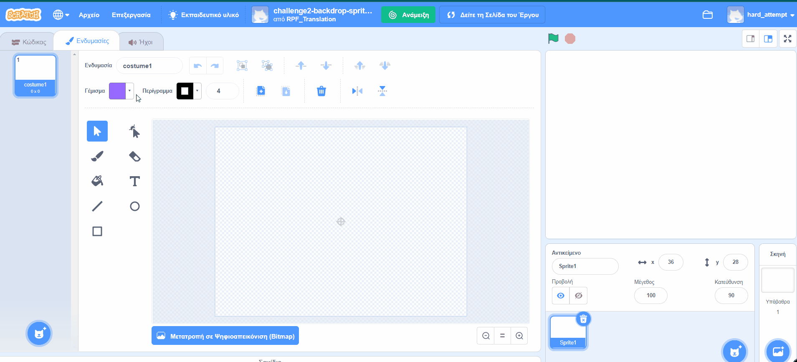{:width="400px"}

+ Επίλεξε ένα χρώμα για **Γέμισμα**. Κάνε κλικ στο **Περίγραμμα** και κατάργησε την επιλογή του (για να το κάνεις αυτό, κάνε κλικ στο πλαίσιο με τη διαγώνια γραμμή στην κάτω αριστερή γωνία του μενού). Τώρα, χρησιμοποίησε το εργαλείο **Κύκλος** για να σχεδιάσεις μία έλλειψη. Στη συνέχεια, επίλεξε το εργαλείο **Ορθογώνιο** και σχεδίασε ένα ορθογώνιο κάτω από την έλλειψη.

+ Εάν χρησιμοποιείς διαφορετικά χρώματα για τα σχήματα, ίσως χρειαστεί να χρησιμοποιήσεις τα εργαλεία **Προσκήνιο** και **Παρασκήνιο** στο πρόγραμμα επεξεργασίας ζωγραφικής για να μετακινήσεις τα σχήματά σου προς τα εμπρός ή προς τα πίσω, ώστε να τοποθετούνται σωστά στο υπόβαθρό σου.

+ Μπορείς να επιλέξεις όλα τα σχήματα και να τα **Ομαδοποιήσεις** μαζί, ώστε να μπορείς να τα προσαρμόσεις ή να τα μετακινήσεις ως ένα σχήμα.

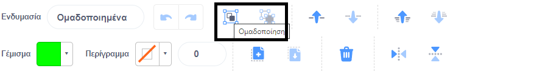{:width="400px"}

Τώρα, φτιάξε κι άλλα αντικείμενα για το σκηνικό σου, εάν αυτό ταιριάζει με την ιδέα του έργου σου.

Θυμήσου να ονομάσεις τα αντικείμενά σου.

--- /collapse ---

--- collapse ---
---
title: Χρησιμοποίησε το εργαλείο Γραμμή για να δημιουργήσεις ένα τρίγωνο
---

Μπορείς να δημιουργήσεις πολύγωνα, όπως ένα τρίγωνο, και να χρησιμοποιήσεις αυτά τα σχήματα για να δημιουργήσεις στέγες ή βουνά.

Πήγαινε στο **Επιλέξτε ένα Αντικείμενο** και επίλεξε **Ζωγραφική** για να δημιουργήσεις μια νέα ενδυμασία του αντικειμένου. Σε αυτό το παράδειγμα, θα φτιάξεις σπίτια.

**Σπίτι**: [Δες μέσα](https://scratch.mit.edu/projects/453595663/editor){:target="_blank"}

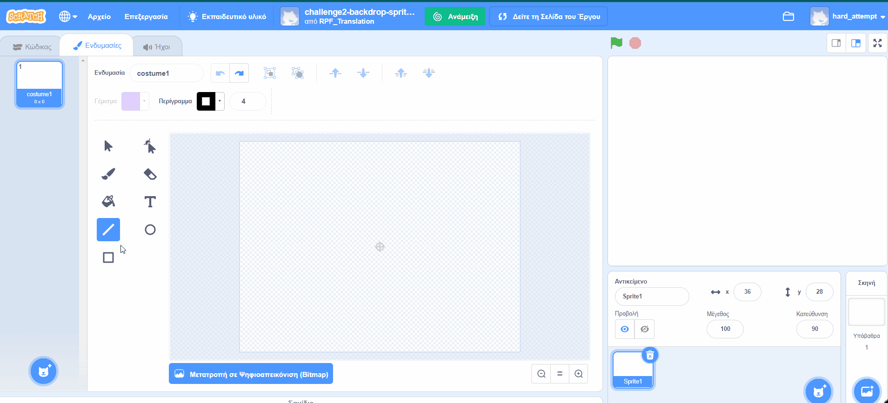{:width="400px"}

Εάν ακολουθήσεις τις παρακάτω οδηγίες, μπορείς να χρησιμοποιήσεις το εργαλείο **Γραμμή** για να δημιουργήσεις οποιοδήποτε σχήμα:
+ Επίλεξε ένα χρώμα **Γεμίσματος**. Για να επιλέξεις το μαύρο χρώμα, μείωσε τη **Φωτεινότητα** στο μηδέν (`0`).

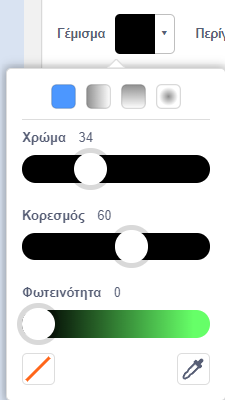{:width="150px"}

+ Επίλεξε **Χωρίς περίγραμμα**.

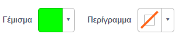{:width="200x"}

+ Χρησιμοποίησε το εργαλείο **Ορθογώνιο** για να σχεδιάσεις ένα ορθογώνιο.
+ Χρησιμοποίησε το εργαλείο **Γραμμή** για να σχεδιάσεις ένα τρίγωνο. Βεβαιώσου ότι έχεις ολοκληρώσει το τρίγωνο, διαφορετικά δεν θα γεμίσει με χρώμα.
+ Μετακίνησε τα δύο σχήματα μαζί.
+ Επίλεξε το εργαλείο **Γέμισμα** (Κάδος) και γέμισε το τρίγωνο με χρώμα.
+ Χρησιμοποίησε το εργαλείο **Ορθογώνιο** για να σχεδιάσεις άλλο ένα ορθογώνιο για την καμινάδα.
+ Μπορείς να χρησιμοποιήσεις τα **Προσκήνιο** και **Παρασκήνιο** στο πρόγραμμα επεξεργασίας ζωγραφικής για να μετακινήσεις τα σχήματά σου προς τα εμπρός ή προς τα πίσω, ώστε να είναι σωστά τοποθετημένα. Σε αυτό το παράδειγμα, δεν θα χρειαστεί να το κάνεις αυτό, επειδή τα σχήματα είναι μαύρα για να δημιουργήσουν μια σιλουέτα.
+ Επίλεξε όλα τα σχήματα και **Ομαδοποίηση** έτσι ώστε να μπορείς να τα προσαρμόσεις ή να τα μετακινήσεις ως ένα σχήμα.

Για να δημιουργήσεις διπλότυπα σχήματα του σπιτιού σου (για παράδειγμα, για να φτιάξεις έναν ορίζοντα), ακολούθησε τις συμβουλές στην ενότητα **Διπλότυπα σχήματα για να δημιουργήσεις μια ενδυμασία σκηνικού** παρακάτω.

--- /collapse ---

--- collapse ---
---
title: Διπλότυπα σχήματα για να δημιουργήσεις μια ενδυμασία σκηνικού
---

Μπορεί να θέλεις να αντιγράψεις σχήματα μέσα σε μια ενδυμασία, έτσι ώστε το τοπίο σου να φαίνεται πιο πολυσύχναστο ή πιο γεμάτο.

**Πολλαπλά σύννεφα**: [Δες μέσα](https://scratch.mit.edu/projects/447278432/editor){:target="_blank"}

{:width="400px"}

Το αποτέλεσμα του πολλαπλασιασμού των σχημάτων χρησιμοποιείται από επαγγελματίες γραφίστες κινουμένων σχεδίων για να δημιουργήσουν την εντύπωση καιρικών φαινομένων, όπως βροχή ή σύννεφα, ένα σύμπλεγμα αντικειμένων, όπως κτίρια ή δάσος, ή ένα πλήθος ανθρώπων σε μια σκηνή.

--- no-print ---

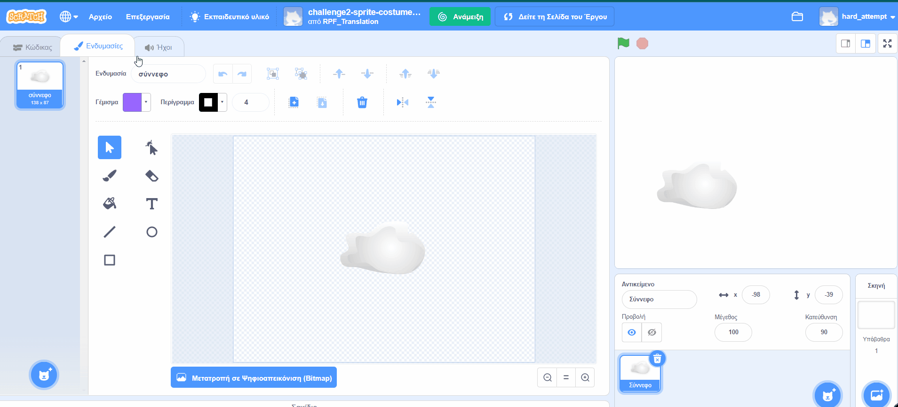

--- /no-print ---

Για να πολλαπλασιάσεις οποιοδήποτε τύπο σχήματος:
+ Πήγαινε στο **Επιλέξτε ένα Αντικείμενο** και επίλεξε, σε αυτό το παράδειγμα, το αντικείμενο **Cloud**
+ Στην καρτέλα **Ενδυμασίες**, χρησιμοποίησε το εργαλείο **Επιλογή** για να επιλέξεις ολόκληρο το σχήμα
+ Χρησιμοποίησε τα εργαλεία **Αντιγραφή** και **Επικόλληση** για να δημιουργήσεις διπλότυπα του σχήματος
+ Χρησιμοποίησε το εργαλείο **Επιλογή** για να μετακινήσεις το σχήμα μέσα στο πρόγραμμα επεξεργασίας ζωγραφικής
+ Μπορείς να αλλάξεις το μέγεθος των σχημάτων για να δημιουργήσεις μια μεγαλύτερη αίσθηση τρισδιάστατων εφέ, για παράδειγμα
+ Μπορείς να επιλέξεις όλα τα σχήματα και **Ομαδοποίηση** ώστε να μπορείς να τα προσαρμόσεις ή να τα μετακινήσεις ως ένα σχήμα

--- /collapse ---

--- collapse ---
---
title: Χρησιμοποίησε τον Κορεσμό και τη Φωτεινότητα για να δημιουργήσεις βάθος
---

Στον πραγματικό κόσμο, τα αντικείμενα που βρίσκονται πιο μακριά φαίνονται πιο ανοιχτόχρωμα. Για να επιτύχεις πιο ρεαλιστικά τρισδιάστατα σκηνικά, μπορείς να **μειώσεις** στο χρώμα τον **Κορεσμό** ή/και την **Φωτεινότητα** κάθε αντικειμένου, ώστε να εμφανίζονται όλο και πιο μακριά.

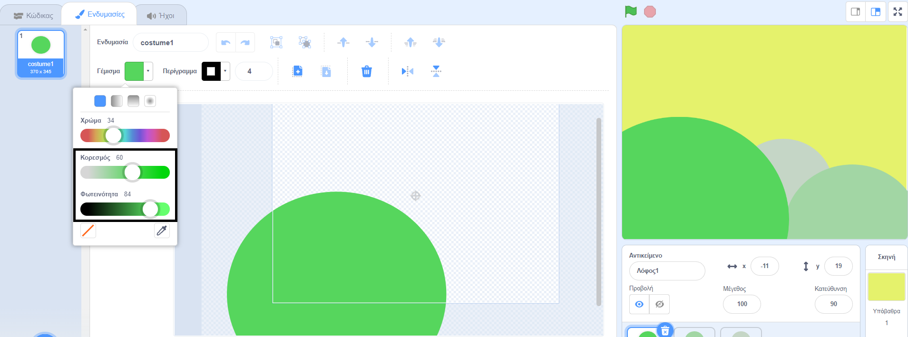{:width="400px"}

--- /collapse ---

--- collapse ---
---
title: Δημιούργησε ένα αντικείμενο με κενά για να μπορείς να δεις μέσα από αυτό
---

Μπορείς να δημιουργήσεις ένα αντικείμενο που έχει κενά για να μπορείς να δεις μέσα από αυτό. Εάν είναι τοποθετημένο στο μπροστινό επίπεδο και έχει το μέγεθος της Σκηνής, μπορεί να φαίνεται σαν θέα μέσα από τα κάγκελα ενός κλουβιού ή ενός παραθύρου.

--- no-print ---

**Λιοντάρι στο κλουβί**: [Δες μέσα](https://scratch.mit.edu/projects/445680159/editor){:target="_blank"}

--- /no-print ---

Για να δημιουργήσεις έναν τύπο μάσκας για αντικείμενο:
+ Πήγαινε στο **Επιλέξτε ένα Αντικείμενο** και επίλεξε **Ζωγραφική**
+ Επίλεξε ένα χρώμα για **Γέμισμα** χωρίς **Περίγραμμα** και σχεδίασε ένα κατακόρυφο ορθογώνιο
+ Χρησιμοποίησε τα εργαλεία **Αντιγραφή** και **Επικόλληση** για να επαναλάβεις το σχήμα
+ Χρησιμοποίησε το εργαλείο **Επιλογή** για να μετακινήσεις τα σχήματα
+ Καθώς τοποθετείς τα σχήματά σου, βεβαιώσου ότι αγγίζουν την άκρη της Σκηνής για να ταιριάζουν με την ιδέα του έργου σου

--- /collapse ---

**Συμβουλή:** Εάν δυσκολεύεσαι να διαχειριστείς τα αντικείμενα στη Σκηνή σου, όπως για παράδειγμα αν έχεις ένα μεγάλο αντικείμενο που εξακολουθεί να καλύπτει ένα πολύ μικρότερο, μπορείς να κάνεις κλικ στο **Εξαφανίσου**, ώστε να μην βλέπεις ένα αντικείμενο ή αντικείμενα. Στη συνέχεια, όταν τελειώσεις, επίλεξε ξανά **Εμφανίσου**.

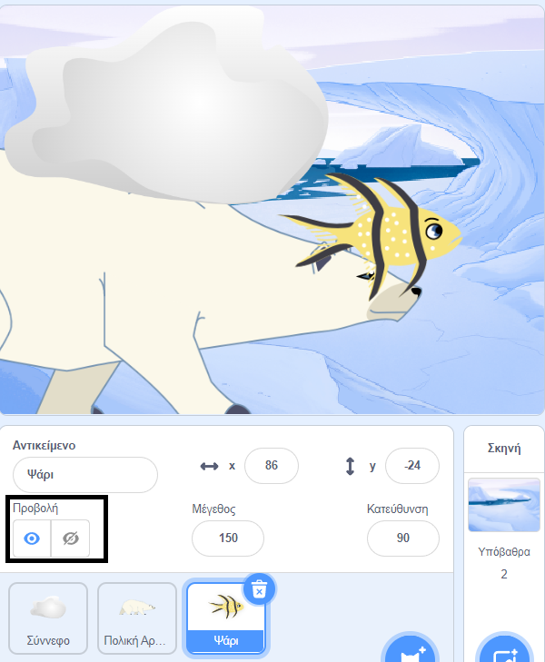{:width="300px"}
