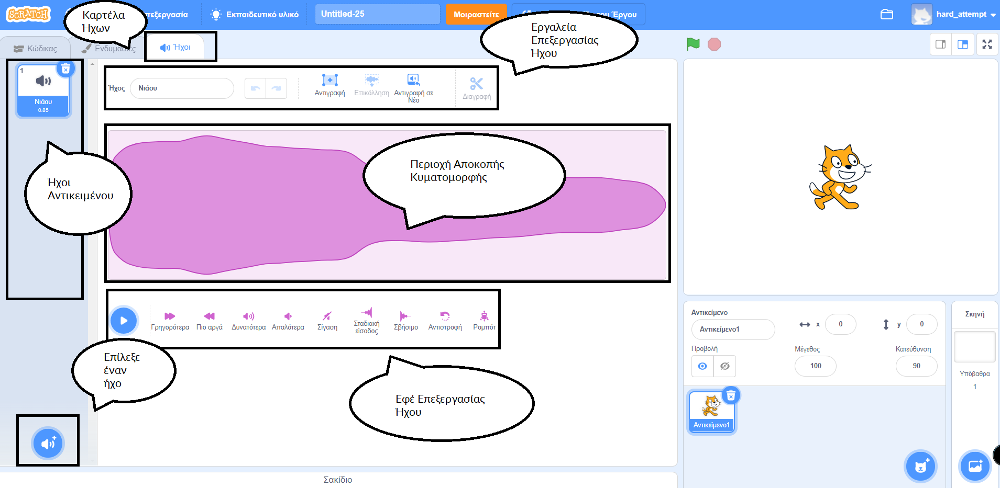

## Επεξεργαστής ήχου

Χρησιμοποίησε το πρόγραμμα επεξεργασίας ήχου για να προσθέσεις και να επεξεργαστείς υπάρχοντες ήχους και να ηχογραφήσεις τους δικούς σου ήχους.

{:width="600px"}

### Δημιουργία ήχων

[[[scratch3-add-sound]]] [[[scratch3-record-sound]]]

### Επεξεργασία ήχων

Μπορείς να επεξεργαστείς ολόκληρους ήχους ή μέρη ήχων.

[[[scratch3-reverse-sound]]] [[[scratch3-crop-sound]]] [[[scratch3-sound-effects]]]
