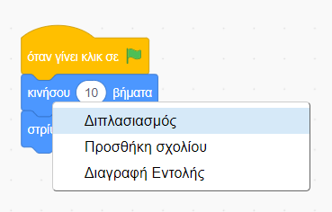
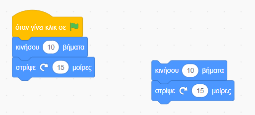
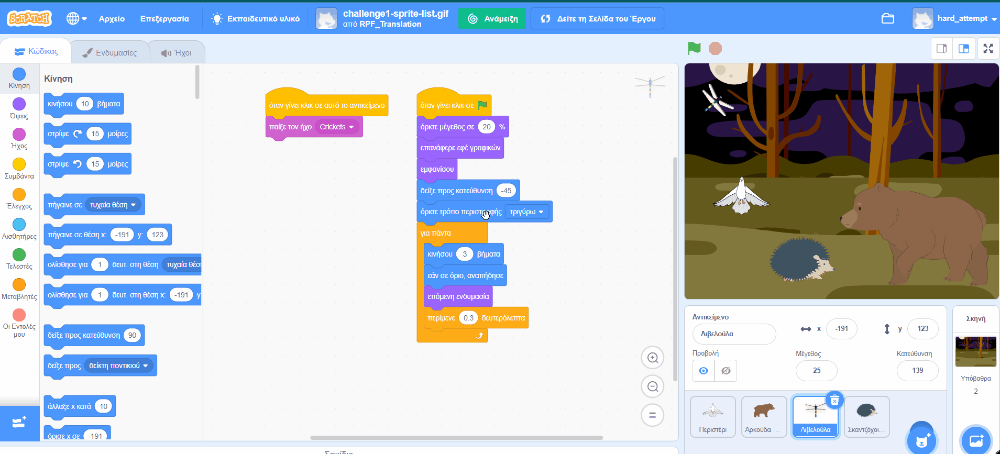

## Συμβουλές επεξεργασίας
Είναι χρήσιμο να μάθεις πώς να αντιγράφεις και να διαγράφεις μπλοκ κώδικα και να αντιγράφεις αντικείμενα.

**Συμβουλή:** Μπορείς να χρησιμοποιήσεις <kbd>Ctrl-z</kbd> (κράτα πατημένο το πλήκτρο Ctrl και πάτα το 'z') για να αναιρέσεις πολλές ενέργειες στο Scratch. Εάν διαγράψεις κατά λάθος ένα Αντικείμενο ή άλλο στοιχείο, μπορείς να χρησιμοποιήσεις την **Επαναφορά** από το μενού **Επεξεργασία** για να το επαναφέρεις.

Μπορείς να διαγράψεις μπλοκ κώδικα που δεν χρειάζεσαι πλέον:

[[[scratch-delete]]]

Ο διπλασιασμός ή η αντιγραφή κώδικα μπορεί να σου εξοικονομήσει χρόνο όταν κάνεις ένα έργο.

--- collapse ---
---
title: Διπλασιασμός μπλοκ
---

Διπλασιασμός μπλοκ ή συνόλων μπλοκ για επανάχρηση στο πρόγραμμα ενός αντικειμένου:

* Πήγαινε στην καρτέλα **Κώδικας**.
* Κάνε δεξί κλικ (ή σε tablet, πάτα παρατεταμένα) στο πρώτο μπλοκ που θέλεις να αντιγράψεις. Θα επιλέξει επίσης όλα τα μπλοκ κάτω από αυτό.
* Επίλεξε **Διπλασιασμός** στο αναπτυσσόμενο μενού. {:width="300px"}
* Σύρε τον διπλότυπο κώδικα εκεί που θέλεις να πάει. {:width="300px"}
* Διάγραψε τυχόν μπλοκ που δεν χρειάζεσαι.

--- /collapse ---

[[[scratch3-duplicate-sprite]]]

Δημιούργησε ένα νέο αντικείμενο και αντίγραψε ολόκληρο ή κάποιο από τον κώδικα του πρώτου αντικειμένου.

--- collapse ---
---
title: Αντίγραψε τον κώδικα ενός αντικειμένου
---

Στην κάτω δεξιά γωνία της λίστας Αντικειμένων, κάνε κλικ στο **Επιλέξτε ένα Αντικείμενο** και επίλεξε το αντικείμενο που θέλεις να προσθέσεις.

Κάνε κλικ στο πρώτο αντικείμενο και πήγαινε στην καρτέλα **Κώδικας**. Σύρε τον κώδικα που βρίσκεται στην περιοχή Κώδικα του πρώτου αντικειμένου στην εικόνα του δεύτερου αντικειμένου στη λίστα Αντικείμενα και στη συνέχεια, άσε τον κώδικα για να ολοκληρώσεις την αντιγραφή του στο δεύτερο αντικείμενο. Μπορεί να έχεις ένα script που ξεκινά με μπλοκ `όταν γίνει κλικ σε πράσινη σημαία`{:class="block3events"}, καθώς και ένα άλλο script που ξεκινά με `όταν γίνει κλικ σε αυτό το αντικείμενο`{:class="block3events"}. Βεβαιώσου ότι έχεις αντιγράψει **όλα** τα script κώδικα που έχεις δημιουργήσει.

{:width="300px"}

Το δεύτερο αντικείμενό σου θα έχει τώρα ακριβώς τον ίδιο κώδικα με το πρώτο σου αντικείμενο. Μην εκτελέσεις το πρόγραμμα μέχρι να αρχίσεις να αλλάζεις τον κώδικά του δεύτερου αντικειμένου — ενδέχεται να μην δεις το δεύτερο αντικείμενο επειδή μπορεί να βρίσκεται κάτω από το πρώτο αντικείμενο.

--- /collapse ---

Εάν θέλεις να αντιγράψεις ενδυμασίες, αντικείμενα, ήχους και script μεταξύ έργων, σύρε τα στο **Σακίδιο**.

[[[scratch-backpack]]]

Αξίζει πάντα να αφιερώνεις λίγο χρόνο για να βεβαιωθείς ότι έχεις ακολουθήσει τις βέλτιστες πρακτικές, ώστε το έργο σου να είναι εύκολο να κατανοηθεί.

--- collapse ---
---
title: Βέλτιστες πρακτικές για έργα Scratch
---

- Ονόμασε όλα τα αντικείμενα, τις ενδυμασίες, τους ήχους, τις μεταβλητές και τα μηνύματα με βάση τη λογική. Είναι πολύ πιο εύκολο να κατανοήσεις έργα που χρησιμοποιούν κατάλληλα επιλεγμένα ονόματα.
- Συμπλήρωσε τη σελίδα του έργου με έναν καλό τίτλο, οδηγίες και σημειώσεις, ώστε οι χρήστες να γνωρίζουν πώς να χρησιμοποιούν το έργο σου και από πού πήρες ιδέες.
- Πρόσθεσε σύντομα σχόλια που εξηγούν τι κάνει ο κώδικάς σου.
- Βεβαιώσου ότι τα script σου είναι τακτοποιημένα στην καρτέλα **Κώδικας**. Μπορείς να κάνεις δεξί κλικ και να επιλέξεις **Τακτοποίησε Εντολές** ή μπορείς να τακτοποιήσεις τα script με τρόπο που να έχει νόημα για σένα. Δοκίμασε να συνδυάσεις παρόμοια script.

--- /collapse ---
