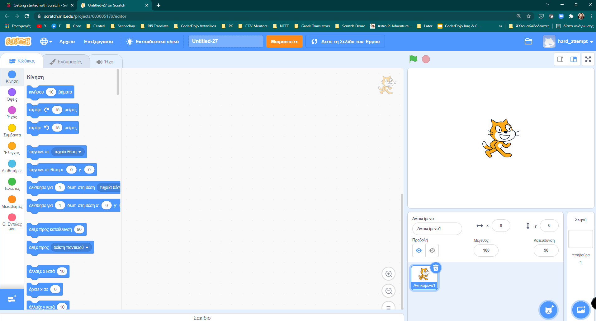
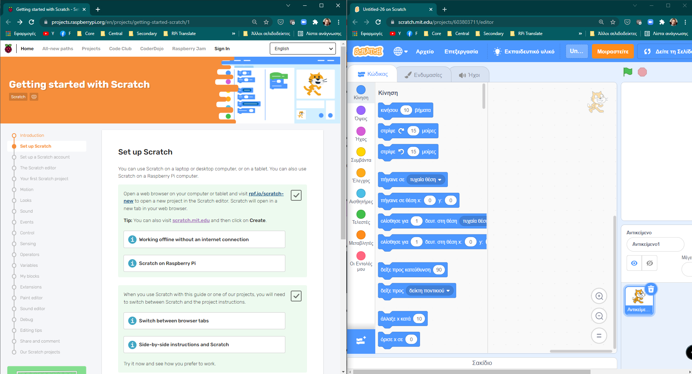
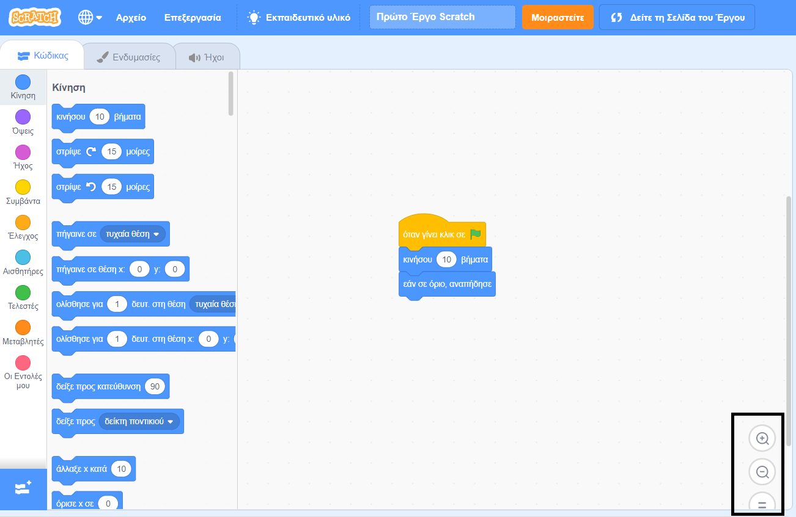

## Ρύθμιση του Scratch
Μπορείτε να χρησιμοποιήσεις το Scratch σε φορητό υπολογιστή ή σε υπολογιστή γραφείου ή σε tablet. Μπορείς επίσης να χρησιμοποιήσεις το Scratch σε έναν υπολογιστή Raspberry Pi.

--- task ---

Άνοιξε έναν φυλλομετρητή διαδικτύου στον υπολογιστή σου ή στο tablet σου και πήγαινε στη διεύθυνση [rpf.io/scratch-new](https://rpf.io/scratch-new){:target="_blank"} για να ανοίξεις ένα νέο έργο στο πρόγραμμα επεξεργασίας Scratch. Το Scratch θα ανοίξει σε μια νέα καρτέλα στον φυλλομετρητή διαδικτύου.

**Συμβουλή:** Μπορείς επίσης να επισκεφτείς το [scratch.mit.edu](https://scratch.mit.edu/){:target="_blank"} και μετά να κάνεις κλικ στο **Δημιουργία**.

--- collapse ---
---
title: Εργασία εκτός σύνδεσης χωρίς σύνδεση στο διαδίκτυο
---

Αν χρειαστεί να εργαστείς εκτός σύνδεσης (χωρίς σύνδεση στο διαδίκτυο), τότε μπορείς να κάνεις [λήψη Scratch](https://scratch.mit.edu/download){:target="_ blank"} και να το εγκαταστήσεις σε έναν υπολογιστή.

Δεν μπορείς να εργαστείς εκτός σύνδεσης εάν χρησιμοποιείς tablet.

--- /collapse ---

--- collapse ---
---
title: Scratch στο Raspberry Pi
---

Εάν χρησιμοποιείς υπολογιστή Raspberry Pi, το Scratch μπορεί να είναι ήδη εγκατεστημένο. Κάντε κλικ στο **Raspberry Pi** για να ανοίξεις το μενού, μετά κάνε κλικ στο **Προγραμματισμός**και μετά επίλεξε **Scratch 3**.

Εάν πρέπει να εγκαταστήσεις το Scratch, ακολούθησε αυτή τη διαδικασία:
+ Κάνε κλικ στο εικονίδιο Raspberry Pi για να ανοίξεις το μενού
+ Κάνε κλικ στο **Προτιμήσεις** (Preferences)
+ Κάνε κλικ στο **Προτεινόμενο λογισμικό** (Recommended Software)
+ Επίλεξε **Scratch 3**
+ Κάνε κλικ στο **OK**

Δες το [Scratch 3 Desktop for Raspberry Pi](https://www.raspberrypi.org/blog/scratch-3-desktop-for-raspbian-on-raspberry-pi/) για περισσότερες πληροφορίες.

--- /collapse ---

--- /task ---

--- task ---

Όταν χρησιμοποιείς το Scratch με αυτόν τον οδηγό ή ένα από τα έργα μας, θα χρειαστεί να κάνεις εναλλαγή μεταξύ του Scratch και των οδηγιών του έργου.

--- collapse ---
---
title: Εναλλαγή μεταξύ καρτελών του φυλλομετρητή
---

Κάνε κλικ (ή σε ένα tablet, πάτησε) στον τίτλο μιας καρτέλας του φυλλομετρητή για εναλλαγή μεταξύ του προγράμματος επεξεργασίας Scratch και των οδηγιών έργου.

--- /collapse ---

--- collapse ---
---
title: Οδηγίες δίπλα-δίπλα με το Scratch
---

Εάν η οθόνη σου είναι αρκετά μεγάλη, μπορείς να δεις το Scratch δίπλα στις οδηγίες του έργου.

Εάν χρησιμοποιείς Microsoft Windows 10, σύρε την καρτέλα Scratch στο πρόγραμμα περιήγησής σου, ώστε να βρίσκεται σε ξεχωριστό παράθυρο και συνέχισε να σύρεις μέχρι ο δρομέας να φτάσει στη δεξιά άκρη της οθόνης σου. Στη συνέχεια, το παράθυρο θα τοποθετηθεί στη δεξιά πλευρά της οθόνης.

Τώρα, σύρε το παράθυρο που περιέχει αυτόν τον οδηγό ή τις οδηγίες του έργου σου στην αριστερή πλευρά της οθόνης σου μέχρι ο κέρσορας να φτάσει στην αριστερή άκρη. Το παράθυρο θα καταλάβει το αριστερό μισό της οθόνης σου.

Μπορείς να αλλάξεις το μέγεθος των παραθύρων για να τα τακτοποιήσεις ακριβώς όπως θέλεις.

**Συμβουλή:** Μπορείς επίσης να κρατήσεις πατημένο το πλήκτρο<kbd>Windows</kbd> και να πατήσεις το <kbd>Αριστερό</kbd> βελάκι ή το <kbd>Δεξί</kbd> βελάκι, για να τοποθετήσεις ένα παράθυρο στο αριστερό ή το δεξί μισό της οθόνης σου.

--- /collapse ---

Δοκίμασε το τώρα και δες πώς προτιμάς να εργάζεσαι.

--- /task ---

--- task ---

Όταν χρησιμοποιείς το Scratch σε φυλλομετρητή διαδικτύου, μπορείς να κάνεις μεγέθυνση ή σμίκρυνση για να προσαρμόσεις το μέγεθος.

Για παράδειγμα, εάν χρησιμοποιείς Microsoft Windows και θέλεις να χρησιμοποιήσεις το ζουμ σε μια ιστοσελίδα στο Google Chrome ή στο Microsoft Edge, κράτησε πατημένο το πλήκτρο <kbd>Ctrl</kbd> και πάτα το πλήκτρο <kbd>+</kbd> ή το πλήκτρο <kbd>-</kbd> για μεγέθυνση ή σμίκρυνση.

--- collapse ---
---
title: Χρησιμοποίησε το ζουμ στην περιοχή Κώδικας
---

Μπορείς επίσης να χρησιμοποιήσεις τα στοιχεία ελέγχου ζουμ στην περιοχή Κώδικας στο Scratch για να αλλάξεις το μέγεθος των μπλοκ κώδικα στην περιοχή Κώδικας.

--- /collapse ---

--- /task ---

