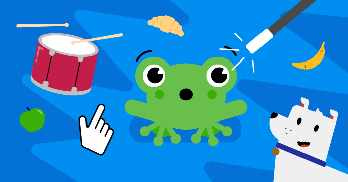
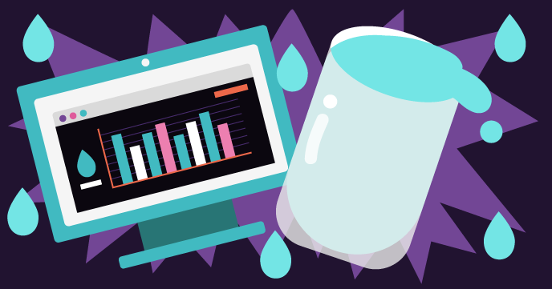
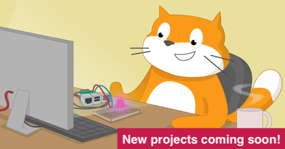

## Τα έργα μας Scratch

Τα μονοπάτια Scratch έχουν έξι έργα το καθένα, για να σε βοηθήσουν να μάθεις διαφορετικές δεξιότητες στο Scratch, προκειμένου να δημιουργήσεις τα δικά σου έργα ανεξάρτητα.

Μπορείς να επιστρέψεις σε αυτόν τον οδηγό αναφοράς, Ξεκινώντας με το Scratch, όποτε χρειαστεί να υπενθυμίσεις στον εαυτό σου τις δεξιότητες που έχεις μάθει.

Αυτά τα έργα μπορούν να ολοκληρωθούν σε οποιονδήποτε υπολογιστή ή tablet που εκτελεί το Scratch 3.

### Έργα για αρχάριους Scratch

Εάν είσαι αρχάριος/α στο Scratch, μπορείς να ξεκινήσεις με τις διαδρομές μας για αρχαρίους:

[Εισαγωγή στο Scratch: αντικείμενα, scripts και βρόχοι](https://projects.raspberrypi.org/el-GR/pathways/scratch-intro){:target="_blank"} 
Σε αυτήν την εισαγωγή για αρχαρίους, θα μάθεις πώς να προσθέτεις κώδικα, ενδυμασίες και ήχους σε αντικείμενα καθώς δημιουργείς κινούμενα σχέδια, ένα παιχνίδι, εφαρμογές και μια ιστορία.

[Φρόντισε τον εαυτό σου](https://projects.raspberrypi.org/el-GR/pathways/look-after-yourself){:target="_blank"} 
Μάθε πώς να φροντίζεις τον εαυτό σου και τους άλλους με τα έργα Scratch για να σε κάνουν να γελάς, να χαλαρώνεις, να ελέγχεις, να δημιουργείς, να ασκείσαι και να συγκεντρώνεσαι.

[Ενότητα Scratch 1](https://projects.raspberrypi.org/el-GR/pathways/scratch-module-1){:target="_blank"}

 

### Πέρα από τα βασικά έργα Scratch

Εάν γνωρίζεις ήδη για αντικείμενα, ενδυμασίες, σκηνικά και βρόχους, δοκίμασε αυτά τα έργα:

[Περισσότερο Scratch: εκπομπή, αποφάσεις και μεταβλητές](https://projects.raspberrypi.org/el-GR/pathways/more-scratch){:target="_blank"} 
Το "Περισσότερο Scratch" κινείται πέρα από τα βασικά που περιγράφονται στην "Εισαγωγή στο Scratch". Θα κάνεις εφαρμογές, παιχνίδια και προσομοιώσεις χρησιμοποιώντας τη μετάδοση μηνυμάτων, αποφάσεις εάν..τότε και εάν..τότε..αλλιώς, και μεταβλητές.

[Ενότητα Scratch 2](https://projects.raspberrypi.org/el-GR/pathways/scratch-module-2){:target="_blank"} 

 

### Έργα για προχωρημένους στο Scratch

Εάν θέλεις να μάθεις σχετικά με τις λίστες, τους κλώνους και τη δημιουργία των δικών σου εντολών, δοκίμασε αυτά τα έργα:

[Περαιτέρω Scratch: κλώνοι, οι εντολές μου, and boolean λογική](https://projects.raspberrypi.org/el-GR/pathways/further-scratch){:target="_blank"} 
Το "Περαιτέρω Scratch" κινείται πέρα από τις δεξιότητες που περιγράφονται στην "Εισαγωγή στο Scratch" και στο "Περισσότερο Scratch". Θα δημιουργήσεις εφαρμογές, παιχνίδια, τέχνη που δημιουργείται από υπολογιστή και προσομοιώσεις χρησιμοποιώντας λογική Boole, συναρτήσεις, κλώνους και πολλά άλλα.

[Προστατεύστε τον πλανήτη μας](https://projects.raspberrypi.org/el-GR/pathways/protect-our-planet){:target="_blank"} 
Χρησιμοποίησε το Scratch για μάθεις για τον πλανήτη μας και πώς να προστατεύσουμε το περιβάλλον για τις μελλοντικές γενιές.

[Scratch για κοινωνικές επιχειρήσεις](https://projects.raspberrypi.org/el-GR/coderdojo/scratch-for-social-enterprise){:target="_blank"} 

[Ενότητα Scratch 3](https://projects.raspberrypi.org/el-GR/pathways/scratch-module-3){:target="_blank"} 

 

### Έργα Scratch με υλικό GPIO για το Raspberry Pi

Εάν διαθέτεις υπολογιστή Raspberry Pi, τότε μπορείς επίσης να δοκιμάσεις αυτά τα έργα. Θα χρειαστείς επιπλέον ηλεκτρονικά εξαρτήματα.

 

[Physical computing στη διαδρομή Scratch](https://projects.raspberrypi.org/el-GR/pathways/physical-computing-with-scratch-and-the-raspberry -pi){:target="_blank"}

 

[Physical computing με πρόσθετα έργα Scratch](https://projects.raspberrypi.org/el-GR/projects?software%5B%5D=scratch&hardware%5B%5D=raspberry-pi){:target="_blank"}

 

Σου άρεσε ο οδηγός Scratch; Εντόπισες κάποιο πρόβλημα; Κάνε κλικ στο κουμπί **Αποστολή σχολίων** παρακάτω και ενημέρωσέ μας!

***
Το έργο αυτό μεταφράστηκε από τους εθελοντές:

Σταυρούλα Μισθού
Μάνος Ζεάκης

Χάρη στους εθελοντές, μπορούμε να δώσουμε σε ανθρώπους σε όλο τον κόσμο την ευκαιρία να μάθουν στη γλώσσα τους. Μπορείτε να μας βοηθήσετε να προσεγγίσουμε περισσότερους ανθρώπους μεταφράζοντας εθελοντικά - περισσότερες πληροφορίες στο [rpf.io/translate](https://rpf.io/translate).
