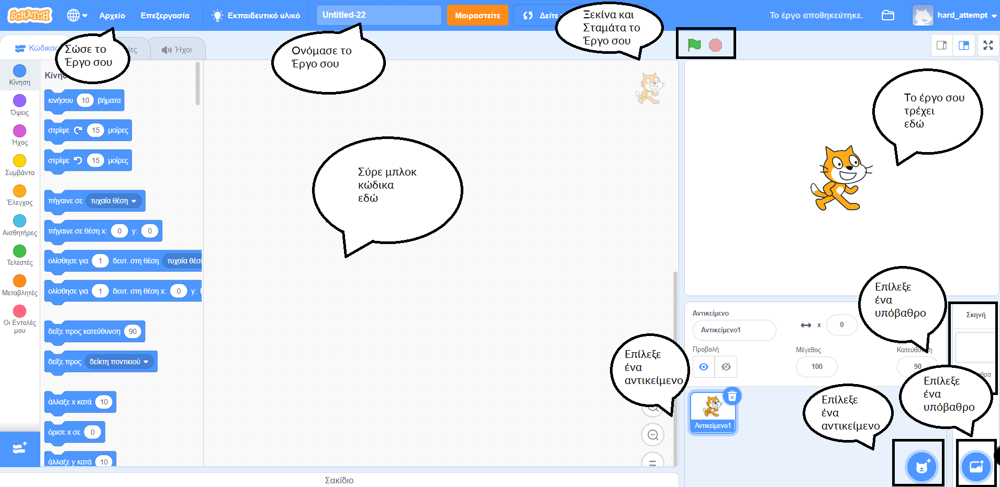
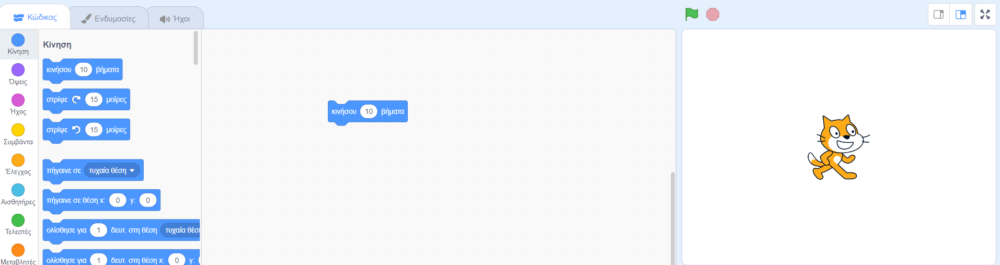
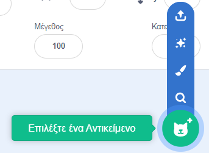
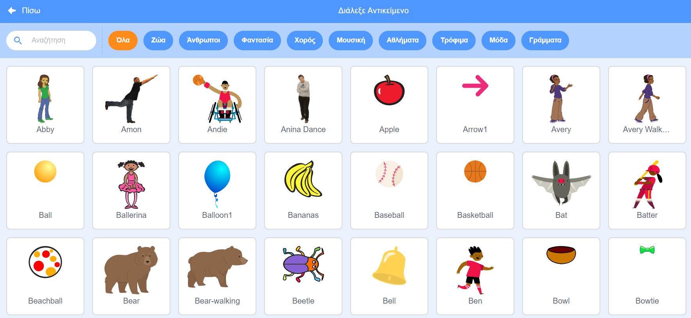
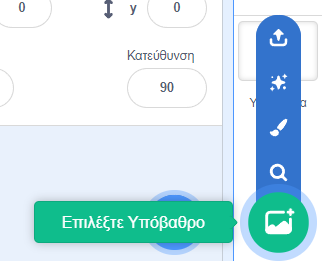
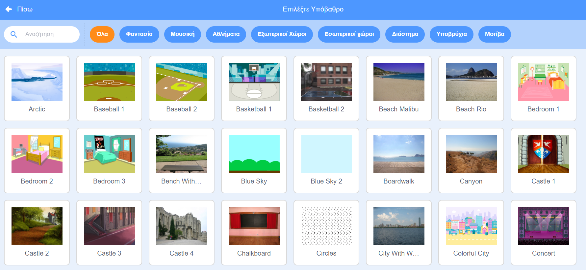

## Your first Scratch project



--- task --- When you create a new Scratch project, it includes a cat sprite.

Drag blocks from the Blocks menu to the Code area to make the cat do something.

To try an example, drag a `move`{:class="block3motion"} block from the `Motion`{:class="block3motion"} blocks menu. The blocks are colour-coded to help you find them.



You can click on blocks in the Code area to run them. Click on the `move`{:class="block3motion"} block and the cat will move.

**Hat blocks** run the blocks below them when a particular event happens. The `when green flag clicked`{:class="block3events"} block runs code when you click on the green flag above the Stage to run your project.

Drag a `when green flag clicked`{:class="block3events"} block above the `move`{:class="block3motion"} block so that they snap together.


Your code should look like this:

```blocks3
when flag clicked
move (10) steps
```

**Tip:** Scratch blocks are colour-coded, so you will find the `when green flag clicked`{:class="block3events"} block in the `Events`{:class="block3events"} blocks menu.

Now, click on the green flag above the Stage and the cat will move.

--- /task ---

You can add more sprites to your project, and you can also add a backdrop.

--- task ---

--- collapse ---
---

title: Choose a sprite

---

In the Sprite pane, click on **Choose a Sprite** to see the library of all Scratch sprites.



You can search or browse sprites by theme. Click on a sprite to add it to your project.



--- /collapse ---

--- /task ---

--- task ---

--- collapse ---
---

title: Choose a backdrop

---

In the bottom right-hand corner of the Stage pane, click on **Choose a Backdrop**.



You can search for a backdrop, or browse for one by category or theme. Click on a backdrop to select it.



--- /collapse ---

--- /task ---

--- task ---

--- collapse ---
---

title: Name and save your project

---

Go to **File** in the menu. If you have a Scratch account, click on **Save now**. If you do not have an account, click on **Save to your computer**.

Click in the project name box and change the name to match your project.


If you share your project, then other people will also see this name, so make sure that it makes sense.

--- /collapse ---

--- /task ---

You have created your first Scratch project!

You are now ready to learn Scratch. We recommend that you start with our [Scratch: Module 1](https://projects.raspberrypi.org/en/raspberrypi/scratch-module-1){:target="_blank"} or [Look after yourself](https://projects.raspberrypi.org/en/raspberrypi/look-after-yourself){:target="_blank"} pathways, which are designed for beginners.

 You can return to this guide if you need help using Scratch when you are working on our pathway projects or your own independent projects. 


