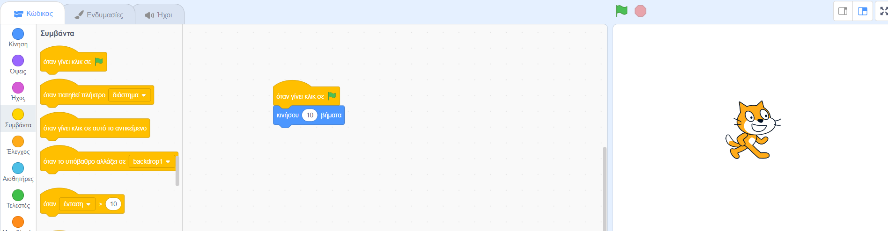

## Το πρώτο σου έργο Scratch


--- task ---

Όταν δημιουργείς ένα νέο έργο Scratch, περιλαμβάνει ένα αντικείμενο **γάτα**.

Σύρε μπλοκ από το μενού Μπλοκ στην περιοχή Κώδικας για να κάνεις τη γάτα να κάνει κάτι.

Για να δοκιμάσεις ένα παράδειγμα, σύρε ένα μπλοκ `κινήσου`{:class="block3motion"} από το μενού μπλοκ `Κίνηση`{:class="block3motion"}. Τα μπλοκ είναι χρωματικά κωδικοποιημένα για να σε βοηθήσουν να τα βρεις.


Μπορείς να κάνεις κλικ σε μπλοκ στην περιοχή Κώδικας για να τα εκτελέσεις. Κάνε κλικ στο μπλοκ `κινήσου`{:class="block3motion"} και η γάτα θα μετακινηθεί.

**Συμβουλή:** Εάν χρησιμοποιείς το Scratch σε tablet, μπορείς να πατήσεις ένα στοιχείο για να κάνεις κλικ σε αυτό.

Τα **μπλοκ Hat** εκτελούν τα μπλοκ κάτω από αυτά όταν συμβαίνει ένα συγκεκριμένο συμβάν. Το μπλοκ `όταν γίνει κλικ σε πράσινη σημαία`{:class="block3events"} εκτελεί τον κώδικα όταν κάνεις κλικ στην πράσινη σημαία πάνω από τη Σκηνή για να εκτελέσεις το έργο σου.

Σύρε ένα μπλοκ `όταν γίνει κλικ σε πράσινη σημαία `{:class="block3events"} πάνω από το μπλοκ `κινήσου`{:class="block3motion"}, ώστε να κουμπώσουν μεταξύ τους.



Ο κώδικας θα πρέπει να μοιάζει κάπως έτσι:

```blocks3
when flag clicked
move (10) steps
```

**Συμβουλή:** Όλα τα μπλοκ είναι χρωματικά κωδικοποιημένα, επομένως θα βρεις το μπλοκ `όταν γίνει κλικ σε πράσινη σημαία`{:class="block3looks"} στο μενού μπλοκ `Συμβάντα`{:class="block3looks"}.

Τώρα, κάνε κλικ στην πράσινη σημαία πάνω από τη Σκηνή και η γάτα θα μετακινηθεί.

--- /task ---

Μπορείς να προσθέσεις περισσότερα αντικείμενα στο έργο σου και μπορείς επίσης να προσθέσεις ένα υπόβαθρο.

--- task ---

--- collapse ---
---
title: Επίλεξε ένα αντικείμενο
---

Στη λίστα Αντικειμένων, κάνε κλικ στο **Επιλέξτε ένα Αντικείμενο** για να δεις τη βιβλιοθήκη όλων των αντικειμένων του Scratch.


Μπορείς να ψάξεις για ένα αντικείμενο ή να αναζητήσεις ένα ανά κατηγορία ή θέμα. Κάνε κλικ σε ένα αντικείμενο για να το προσθέσεις στο έργο σου.


--- /collapse ---

--- /task ---

--- task ---

--- collapse ---
---
title: Διάλεξε ένα υπόβαθρο
---

Στην κάτω δεξιά γωνία του παραθύρου Σκηνή, κάνε κλικ στο **Επιλέξτε Υπόβαθρο**.


Μπορείς να ψάξεις για ένα υπόβαθρο ή να αναζητήσεις ένα ανά κατηγορία ή θέμα. Κάνε κλικ σε ένα υπόβαθρο για να το προσθέσεις στο έργο σου.


--- /collapse ---

--- /task ---

--- task ---

--- collapse ---
---
title: Ονόμασε και αποθήκευσε το έργο σου
---

Πήγαινε στο μενού **Αρχείο**. Εάν έχεις λογαριασμό Scratch, κάνε κλικ στο **Αποθήκευση τώρα**. Εάν δεν έχεις λογαριασμό, κάνε κλικ στο **Αποθήκευση στον υπολογιστή σου**.

Κάνε κλικ στο πλαίσιο ονόματος έργου και άλλαξε το όνομα για να ταιριάζει με το έργο σου.


Εάν μοιραστείς το έργο σου, τότε και άλλα άτομα θα δουν αυτό το όνομα, οπότε βεβαιώσου ότι έχει νόημα.

--- /collapse ---

--- /task ---

Έχεις γράψει το πρώτο σου πρόγραμμα στο Scratch!

Τώρα είσαι έτοιμος να μάθεις Scratch. Συνιστούμε να ξεκινήσετε με τα μονοπάτια [Scratch: Ενότητα 1](https://projects.raspberrypi.org/en/raspberrypi/scratch-module-1){:target="_blank"} ή/και [Φρόντισε τον εαυτό σου](https://projects.raspberrypi.org/en/raspberrypi/look-after-yourself){:target="_blank"}, τα οποία έχουν σχεδιαστεί για αρχάριους.

 Μπορείς να επιστρέψεις σε αυτόν τον οδηγό εάν χρειάζεσαι βοήθεια στη χρήση του Scratch όταν εργάζεσαι σε έργα από τα δικά μας μονοπάτια ή σε δικά σου ανεξάρτητα έργα. 


