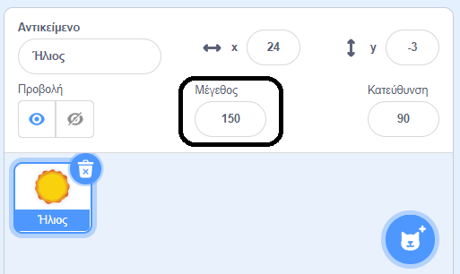

## Όψεις

Τα μπλοκ `Όψεις`{:class="block3looks"} ελέγχουν την εμφάνιση ενός αντικειμένου στη Σκηνή.

Τα αντικείμενα μπορούν να επικοινωνούν χρησιμοποιώντας `Όψεις`{:class="block3looks"}, μέσω ενός σύννεφου ομιλίας `πες`{:class="block3looks"}, ενός σύννεφου σκέψης `σκέψου`{:class="block3looks"} ή μέσω από `εφέ γραφικών`{:class="block3looks"}.

### Πες και σκέψου

```blocks3
say () for () seconds

say ()

think () for () seconds

think ()
```

--- collapse ---
---
title: Χρησιμοποίησε ένα συννεφάκι ομιλίας για να επικοινωνήσεις
---

Τα αντικείμενα μπορούν να `πουν`{:class="block3looks"} και να `σκεφτούν`{:class="block3looks"} για να επικοινωνήσουν.

Τα μπλοκ `πες () για () δευτερόλεπτα`{:class="block3looks"} και `σκέψου () για () δευτερόλεπτα`{:class="block3looks"} χρησιμοποιούνται για να πούμε ή να σκεφτούμε κάτι για ένα καθορισμένο χρονικό διάστημα.

```blocks3
when this sprite clicked
say [Hello!] for [2] seconds // απόκρυψη ομιλίας μετά από 2 δευτερόλεπτα
```

Το αντικείμενο θα εμφανίσει ένα συννεφάκι ομιλίας για δύο δευτερόλεπτα όταν γίνει κλικ σ' αυτό το αντικείμενο.

**Ομιλία στο διάστημα**: [Δες μέσα](https://scratch.mit.edu/projects/485673032/editor){:target="_blank"}

Κάνε κλικ στα αντικείμενα για να τα δεις να επικοινωνούν με ομιλία και με σκέψη.

<div class="scratch-preview">
  <iframe allowtransparency="true" width="485" height="402" src="https://scratch.mit.edu/projects/embed/485673032/?autostart=false" frameborder="0"></iframe>
</div>

Τα μπλοκ `πες()`{:class="block3looks"} και `σκέψου()`{:class="block3looks"} χρησιμοποιούνται για να πούμε ή να σκεφτούμε κάτι, έως ότου ένα μπλοκ με άλλο μήνυμα ή ένα κενό μήνυμα `πες()`{:class="block3looks"} ή `σκέψου()`{:class="block3looks"} τα αντικαταστήσει.

--- /collapse ---

### Μέγεθος

Όρισε ή άλλαξε το `μέγεθος`{:class="block3looks"} των αντικειμένων σου.

```blocks3
change size by ()

set size to () %

(size)
```

--- collapse ---
---
title: Όρισε το μέγεθος του αντικειμένου σου
---

Όταν προσθέσεις ένα αντικείμενο στο έργο σου, το μέγεθός του ορίζεται σε `100` τοις εκατό. Αυτό μπορεί να είναι πολύ μεγάλο ή πολύ μικρό για το έργο σου.

Μπορείς να χρησιμοποιήσεις κώδικα για να ορίσεις το μέγεθος ενός αντικειμένου. Για να το κάνεις αυτό, χρησιμοποίησε ένα μπλοκ `όρισε μέγεθος σε`{:class="block3looks"}:

```blocks3
set size to (50) %
```

Εάν ορίσεις το μέγεθος ενός αντικειμένου σε `50` τοις εκατό, θα έχει το μισό ύψος και το μισό πλάτος. Εάν ορίσεις το μέγεθος ενός αντικειμένου σε `200` τοις εκατό, θα έχει το διπλάσιο ύψος και το διπλάσιο πλάτος.

Για να ορίσεις το μέγεθος ενός αντικειμένου κατά την έναρξη του έργου, τοποθέτησε ένα μπλοκ `όρισε μέγεθος σε`{:class="block3looks"} κάτω από ένα μπλοκ `όταν γίνει μπλοκ στην πράσινη σημαία`{:class="block3events"}:

```blocks3
when green flag clicked
set size to (50) %
```

Μπορείς επίσης να ορίσεις γρήγορα το μέγεθος ενός αντικειμένου στην ιδιότητα **Μέγεθος** στο παράθυρο Αντικειμένων κάτω από τη Σκηνή:

{:width="400px"}

--- /collapse ---

### Εφέ γραφικών

Ρύθμισε ή άλλαξε μια σειρά οπτικών εφέ, όπως χρώμα, κυρτότητα, δίνη, εικονοστοιχειοποίηση, ψηφιδωτό, φωτεινότητα και φάντασμα.

```blocks3
change [color v] effect by ()

set [color v] effect to ()

clear graphic effects
```

[[[scratch3-graphic-effects]]]

### Ενδυμασίες

Για να δημιουργήσεις ένα εφέ κινουμένων σχεδίων για τα αντικείμενά σου, μπορείς να αλλάξεις τις ενδυμασίες τους.

```blocks3
switch costume to ( v)

next costume

(costume [number v])
```

[[[scratch3-change-costumes-to-show-mood]]]

--- collapse ---
---
title: Άλλαξε την ενδυμασία για να δημιουργήσεις ένα εφέ κίνησης
---

**Καρδιά που χτυπά**: [Δες μέσα](https://scratch.mit.edu/projects/435725413/editor){:target="_blank"}

<div class="scratch-preview">
  <iframe allowtransparency="true" width="485" height="402" src="https://scratch.mit.edu/projects/embed/435725413/?autostart=false" frameborder="0"></iframe>
</div>

Μπορείς να χρησιμοποιήσεις τα μπλοκ `όρισε μέγεθος σε`{:class="block3looks"} ή `άλλαξε μέγεθος κατά`{:class="block3looks"} για να δημιουργήσεις ένα παλμικό εφέ, όπως μια καρδιά που χτυπά.

**Σημείωση:** Το μπλοκ `όρισε μέγεθος σε`{:class="block3looks"} ορίζει το μέγεθος σε μια συγκεκριμένη τιμή, ενώ το μπλοκ `άλλαξε μέγεθος κατά`{:class="block3looks"} αλλάζει την τιμή από αυτήν που ήταν πριν, π.χ. `άλλαξε μέγεθος κατά`{:class="block3looks"} `10` προσθέτει 10 στην τιμή του μεγέθους.

```blocks3
when green flag clicked
set size to (160) %
forever
change size by (40)
wait (0.2) seconds
change size by (20)
wait (0.2) seconds
change size by (-20)
wait (0.2) seconds
change size by (-40)
wait (0.2) seconds
end
```

Αυτός ο κώδικας χρησιμοποιεί μια σειρά από μπλοκ `άλλαξε μέγεθος κατά`{:class="block3looks"} και `περίμενε`{:class="block3control"} για να κάνει την καρδιά να μεγαλώνει και να συρρικνώνεται. Προσπάθησε να δημιουργήσεις το δικό σου παλλόμενο αντικείμενο.

Θα μπορούσες επίσης να χρησιμοποιήσεις το μπλοκ `άλλαξε εφέ κατά`{:class="block3looks"} για να δημιουργήσεις ένα αντικείμενο που συνεχίζει να αλλάζει την εμφάνισή του.

```blocks3
when green flag clicked
change [ghost v] effect by (75)
wait (1) seconds
change [ghost v] effect by (-75)
```

**Σημείωση:** Εάν χρησιμοποιείς κώδικα που αλλάζει ένα γραφικό εφέ και μετά το αλλάζει ξανά, θυμήσου να χρησιμοποιήσεις ένα μπλοκ `περίμενε`{:class="block3control"} μεταξύ των μπλοκ `άλλαξε εφέ κατά`{:class="block3looks"}, διαφορετικά, θα συμβαίνει τόσο γρήγορα που δεν θα το βλέπεις!

Μπορείς να χρησιμοποιήσεις ένα μπλοκ `επανάφερε εφέ γραφικών`{:class="block3looks"} ανά πάσα στιγμή για να επαναφέρεις τα εφέ:

```blocks3
clear graphic effects
```

--- /collapse ---

--- collapse ---
---
title: Κάνε κλικ για αλλαγή και επαναφορά
---

Μπορείς να προσθέσεις ενέργειες που κάνουν μια αλλαγή σε ένα αντικείμενο και στη συνέχεια να τις αντιστρέψεις, όπως να μεγαλώνει, να περιμένει και μετά να συρρικνώνεται.

**Μπάλα που ζουλιέται όταν γίνεται κλικ σε αυτή**: [Δες μέσα](https://scratch.mit.edu/projects/435723273/editor){:target="_blank"}

<div class="scratch-preview">
  <iframe src="https://scratch.mit.edu/projects/435723273/embed" allowtransparency="true" width="485" height="402" frameborder="0" scrolling="no" allowfullscreen></iframe>
</div>

Αυτός ο κώδικας θα μεγαλώσει ένα αντικείμενο, θα εφαρμόσει το εφέ `κυρτότητα`{:class="block3looks"} για 0,5 δευτερόλεπτα και, στη συνέχεια, θα επιστρέψει το αντικείμενο στην αρχική του εμφάνιση:

```blocks3
when this sprite clicked
set size to (110)
set [fisheye v] effect to (50)
wait (0.5) seconds
set [fisheye v] effect to (0)
set size to (100)
```

--- /collapse ---

[[[scratch3-animate-movement-costumes]]]

### Υπόβαθρα

Μπορείς επίσης να χρησιμοποιήσεις κώδικα για να αλλάξεις το υπόβαθρο.

```blocks3
switch backdrop to ( v)

next backdrop

(backdrop [number v])
```

[[[scratch3-changing-backdrops-pages-levels]]]

### Ορατότητα

Τα μπλοκ `εμφανίσου`{:class="block3looks"} και `εξαφανίσου`{:class="block3looks"} ελέγχουν την ορατότητα ενός αντικειμένου.

```blocks3
show 

hide
```

[[[scratch3-show-hide-sprites-backdrops]]]

### Επίπεδα

Για να αλλάξεις το πώς εμφανίζονται τα αντικείμενά σου, το ένα σε σχέση με το άλλο, μπορείς να χρησιμοποιήσεις επίπεδα.

```blocks3
go to [front v] layer

go [forward v] () layers
```

[[[scratch3-positioning-with-layers]]]

--- collapse ---
---
title: Τοποθέτησε τα αντικείμενα σε πολλά επίπεδα
---

**Μέσα από το παράθυρο με τα δέντρα**: [Δες μέσα](https://scratch.mit.edu/projects/454188775/editor){:target="_blank"}

<div class="scratch-preview">
  <iframe allowtransparency="true" width="485" height="402" src="https://scratch.mit.edu/projects/embed/454188775/?autostart=false" frameborder="0"></iframe>
</div>

Στο παράδειγμα, το αντικείμενο **Window frame** εμφανίζεται μπροστά και το αντικείμενο **Sun** στο πίσω μέρος. Τα αντικείμενα **Avery Walking** και **Tree** βρίσκονται το καθένα στο δικό του επίπεδο μεταξύ του αντικειμένου **Window frame** και του αντικειμένου **Sun**.

Χρησιμοποίησε το μπλοκ `πήγαινε πίσω`{:class="block3looks"} `1` `επίπεδα`{:class="block3looks"} για να τοποθετήσεις ένα αντικείμενο ένα επίπεδο πίσω από το αντικείμενο που βρίσκεται μπροστά:

``` blocks3
when green flag clicked
go to [front v] layer
+go [backward v] (1) layers
```

Άλλαξε την τιμή στο `πήγαινε πίσω`{:class="block3looks"} `1` `επίπεδα`{:class="block3looks"} για κάθε αντικείμενο, ανάλογα με το πού θέλεις να τοποθετηθεί σε σχέση με άλλα αντικείμενα:

``` blocks3
when green flag clicked
go to [front v] layer
+go [backward v] (2) layers
```

--- /collapse ---

