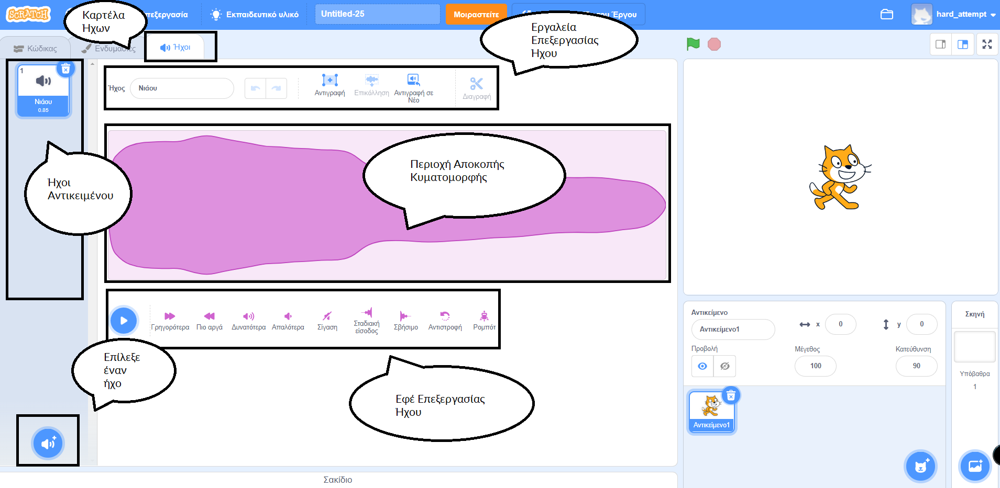
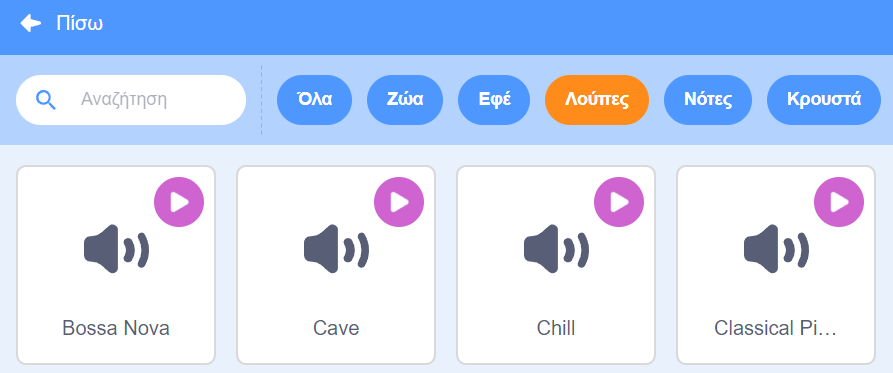

## Ήχος

Για να προσθέσεις ήχο στο έργο σου, χρησιμοποίησε τα μπλοκ `Ήχοι`{:class="block3sound"}. Για παράδειγμα, μπορείς να δημιουργήσεις μια συνεχή μουσική επένδυση στο φόντο ή να προσθέσεις ήχους που αναπαράγονται σε τακτά χρονικά διαστήματα.

{:width="600px"}

Πρώτα, επίλεξε έναν ήχο από τη Βιβλιοθήκη Ήχων ή ηχογράφησε τον δικό σου ήχο.

[[[scratch3-add-sound]]]

[[[scratch3-record-sound]]]

Πρόσθεσε κώδικα για εκτέλεση μπλοκ `Ήχων`{:class="block3sound"} όπου θέλεις να υπάρχει ήχος στο έργο σου.

--- collapse ---
---
title: Πρόσθεσε έναν ήχο μεγάλης διάρκειας για να δημιουργήσεις μια συνεχή μουσική επένδυση
---

Κάνε κλικ στην πράσινη σημαία για να ακούσεις τους ήχους σου.

**Ραδιοφωνική μουσική επένδυση**: [Δες μέσα](https://scratch.mit.edu/projects/444581851/editor){: target = "_ blank"}

<div class="scratch-preview">
 <iframe allowtransparency="true" width="485" height="402" src="https://scratch.mit.edu/projects/embed/444581851/?autostart=false" frameborder="0"></iframe>
</div>

Μπορείς να χρησιμοποιήσεις ένα μπλοκ `παίξε τον ήχο μέχρι τέλους`{:class="block3sound"} μέσα σε έναν βρόχο `για πάντα`{:class="block3control"}. Μόλις τελειώσει ο ήχος, ο βρόχος `για πάντα`{:class="block3control"} κάνει τον ήχο να ξεκινήσει ξανά από την αρχή.

Αυτός ο κώδικας χρησιμοποιεί ένα κλιπ ήχου μεγάλης διάρκειας που επαναλαμβάνεται ως μουσική επένδυση:

```blocks3
when green flag clicked
forever
play sound (Dance Snare Beat v) until done
end
```

**Σημείωση:** Όταν επιλέγεις έναν νέο ήχο, εάν επιλέξεις την κατηγορία **Λούπες**, το Scratch θα σου δείξει μόνο τους ήχους που είναι κατάλληλοι για μια μουσική επένδυση σε λούπα.



--- /collapse ---

--- collapse ---
---
title: Πρόσθεσε μία αλληλουχία από ήχους μικρής διάρκειας για να δημιουργήσεις μια συνεχή μουσική επένδυση
---

Κάνε κλικ στην πράσινη σημαία για να ακούσεις τους ήχους.

**Επίδοση Πρωταθλητή**: [Δες μέσα](https://scratch.mit.edu/projects/444673165/editor){:target="_blank"}

<div class="scratch-preview">
 <iframe allowtransparency="true" width="485" height="402" src="https://scratch.mit.edu/projects/embed/444673165/?autostart=false" frameborder="0"></iframe>
</div>

 Χρησιμοποίησε ένα μπλοκ `για πάντα`{:class="block3control"} για να δημιουργήσεις έναν επαναλαμβανόμενο ήχο. Μπορείς:
+ Να βάλεις μια σειρά από σύντομους ήχους σε μια σειρά ή
+ Να χρησιμοποιήσεις διαφορετικές νότες οργάνων και εφέ

```blocks3
when flag clicked
forever
play sound (Low Boing v) until done
play sound (Low Boing v) until done
play sound (Drum Buzz v) until done
play sound (Pop v) until done
play sound (Bird v) until done
play sound (Bark v) until done
play sound (Glug v) until done
End
```

--- /collapse ---

--- collapse ---
---
title: Πρόσθεσε ήχους που παίζουν σε τακτά χρονικά διαστήματα
---

**Ήχοι ποδοσφαίρου**: [Δες μέσα](https://scratch.mit.edu/projects/450870079/editor){:target="_blank"}

Κάνε κλικ στην πράσινη σημαία για να ακούσεις τους ήχους.

<div class="scratch-preview">
 <iframe allowtransparency="true" width="485" height="402" src="https://scratch.mit.edu/projects/embed/450870079/?autostart=false" frameborder="0"></iframe>
</div>

 Σε αυτό το έργο, η **Σκηνή** έχει κώδικα για την αναπαραγωγή ενός ήχου σε τακτά χρονικά διαστήματα:

 ```blocks3
 when flag clicked
 forever
 wait (3) seconds
 play sound (Cheer v) until done
 end
 ```

Το αντικείμενο **Whistle** αναπαράγει επίσης έναν ήχο σε τακτά χρονικά διαστήματα:

 ```blocks3
 when this sprite clicked
 forever
 play sound (Referee Whistle v) until done
 wait (4) seconds
 end
 ```

--- /collapse ---

--- collapse ---
---
title: Πρόσθεσε ήχους που αρχίζουν να αναπαράγονται ταυτόχρονα
---

Υπάρχουν δύο μπλοκ `Ήχου`{:class="block3sound"} με μια σημαντική διαφορά:

+ Όταν `παίξεις ήχο μέχρι τέλους`{:class="block3sound"}, ο ήχος θα αναπαράγεται μέχρι να τελειώσει. Η επόμενη γραμμή κώδικα στο script δεν θα εκτελεστεί μέχρι να ολοκληρωθεί η αναπαραγωγή του ήχου.

+ Όταν εκτελεστεί το μπλοκ `παίξε τον ήχο`{:class="block3sound"}, ο ήχος θα παίξει, αλλά το επόμενο μπλοκ θα τρέξει αμέσως και δεν θα περιμένει για τον πρώτο ήχο να τελειώσει.

Αυτό σημαίνει ότι αν είχες μια σειρά από μπλοκ `παίξε τον ήχο`{:class="block3sound"}, οι ήχοι θα παίζονταν σχεδόν ταυτόχρονα, ο ένας πάνω στον άλλο. Το αποτέλεσμα μπορεί να είναι ενδιαφέρον και μερικές φορές μπερδεμένο.

Παίξε μαζί του κάποια στιγμή!

```blocks3
when green flag clicked
start sound (Meow v)
start sound (Alien Creak2 v)
start sound (Boing v)
start sound (Boom Cloud v)
start sound (Baa v)
```

--- /collapse ---

Αφού επιλέξεις τους ήχους σου, μπορεί να θέλεις να αλλάξεις την `ένταση `{:class="block3sound"}, τον `τόνο`{:class="block3sound"} ή την `μετατόπιση αριστερά/δεξιά`{:class="block3sound"} ( ώστε να ακούσεις τον ήχο από το αριστερό ή το δεξί ηχείο).

--- collapse ---
---
title: Ένταση, τόνος και μετατόπιση ήχου
---

Κάνε κλικ στην πράσινη σημαία για να ακούσεις τους ήχους.

**Εξάσκηση μπάντας**: [Δες μέσα](https://scratch.mit.edu/projects/451697380/editor){:target="_blank"}

<div class="scratch-preview">
 <iframe allowtransparency="true" width="485" height="402" src="https://scratch.mit.edu/projects/embed/451697380/?autostart=false" frameborder="0"></iframe>
</div>

Το αντικείμενο **Drums** χρησιμοποιεί τα μπλοκ `άλλαξε ένταση κατά`{:class="block3sound"}, `όρισε εφέ τόνος σε`{:class="block3sound"} και `όρισε εφέ μετατόπιση αριστερά/δεξιά σε`{:class=" block3sound"} για να αλλάξει τον ήχο:

```blocks3
set volume to (80) %
set [pitch v] effect to (50) :: sound
set [pan left/right v] effect to (-100) :: sound
play sound (Drum Funky v) until done
```

+ Μπορείς να `ορίσεις ένταση σε`{:class="block3sound"} μια τιμή από `0` (άηχο) έως `100` (πλήρης ένταση). Αυτό είναι χρήσιμο εάν θέλεις κάποιοι ήχοι να παίζουν πιο δυνατά από άλλους ή εάν θέλεις ένα αντικείμενο να εμφανίζεται πιο μακριά.

+ Το εφέ `τόνος`{:class="block3sound"} ελέγχει πόσο ψηλός ή χαμηλός είναι ένας ήχος. Η ρύθμιση του τόνου σε υψηλότερη τιμή κάνει επίσης έναν ήχο πιο γρήγορο. Μπορείς να `ορίσεις εφέ τόνος σε`{: class = "block3sound"} τιμές μεταξύ `-360` (πολύ χαμηλή) και `360` (πολύ υψηλή).

+ Το εφέ `μετατόπιση αριστερά/δεξιά`{:class="block3sound"} σου επιτρέπει να ελέγχεις εάν ένας ήχος βγαίνει από ένα αριστερό ή δεξί ηχείο ή ακουστικό ή και τα δύο. Μπορείς να `ορίσεις μετατόπιση αριστερά/δεξιά σε`{: class = "block3sound"} τιμές από `-100` (ήχος πλήρως από αριστερά) έως `100` (ήχος πλήρως από δεξιά).

--- /collapse ---

Μπορείς επίσης να χρησιμοποιήσεις την επέκταση `Κείμενο σε Ομιλία`{:class="block3extensions"}:

[[[scratch3-text-to-speech]]]

