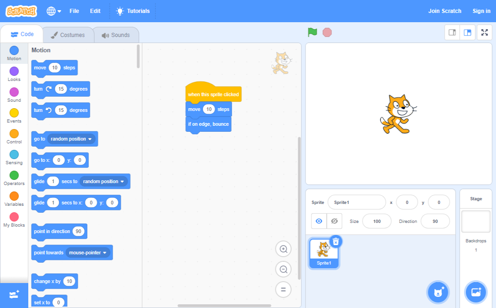

## Introduction

Scratch is a graphical programming language developed by the Lifelong Kindergarten group at the Massachusetts Institute of Technology. In Scratch, you can drag and combine code blocks to make a range of programs, including animations, stories, musical instruments, and games. It’s a bit like the programming equivalent of LEGO!

Scratch is used in many schools as part of the curriculum. It is free, and young people can use it at home as well as in clubs.

Scratch allows young people to learn coding concepts and create interactive projects without needing to learn a text-based programming language. This means they won’t be slowed down by their keyboard skills or their ability to remember complex code.

### What you will make
If you have not used Scratch before then you will get set up and create your first Scratch project. You will be able to continue to our Scratch pathways to develop your Scratch skills.

Then you can return to this Scratch guide and use it to look up information that you need when you are making your own Scratch projects. 

--- no-print ---
Add instructions for interacting with the embedded content here.

  <iframe allowtransparency="true" width="485" height="402" src="https://scratch.mit.edu/projects/embed/160619869/?autostart=false" frameborder="0"></iframe>

--- /no-print ---

--- print-only ---

--- /print-only ---

--- collapse ---
---
title: What you will need
---
### Hardware

+ A computer or tablet capable of running Scratch 3

### Software

+ This guide will explain how to get started with Scratch 3 (either [online](https://scratch.mit.edu/){:target="_blank"} or [offline](https://scratch.mit.edu/download){:target="_blank"})

### Downloads

--- /collapse ---

--- collapse ---
---
title: What you will learn
---

+ How to create your first Scratch project
+ Where to find Scratch pathways to help you develop Scratch skills
+ Useful information for independent learners when making their own projects

--- /collapse ---

--- collapse ---
---
title: Additional information for educators
---

You can download the completed project [here](http://rpf.io/p/en/projectName-get){:target="_blank"}.

If you need to print this project, please use the [printer-friendly version](https://projects.raspberrypi.org/en/projects/projectName/print){:target="_blank"}.

--- /collapse ---
