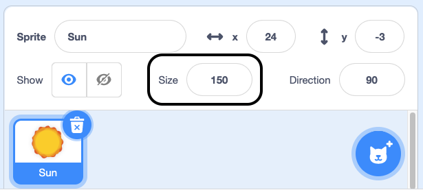

## Looks

Add code to your sprites to change the way they look.

--- task ---

Set the size and/or effect for your sprites.

--- collapse ---
---
title: Set size of your sprite
---

When you add a sprite to your project its size is set to `100` percent. This may be too big or too small for your project. 

You can use code to set the size of a sprite. 

```blocks3
set size to (50) %
```

If you set the size of a sprite to `50` percent, it will be half as tall and half as wide. If you set the size of a sprite to `200` percent, it will be twice as tall and twice as wide. 

Place a `set size`{:class="block3looks"} block under a `when green flag clicked`{:class="block3events"} block to set the size of a sprite when the project is started: 

```blocks3
when green flag clicked
set size to (50) %
```

You can also quickly set the size of a sprite using the **Size** button underneath the Stage:

{:width="400px"}

--- /collapse ---

--- collapse ---
---
title: Set graphic effects
---

**Rooster effects**: [See inside](https://scratch.mit.edu/projects/435730522/editor){:target="_blank"}

<div class="scratch-preview">
  <iframe allowtransparency="true" width="485" height="402" src="https://scratch.mit.edu/projects/embed/435730522/?autostart=false" frameborder="0"></iframe>
</div>

Place a `set graphic effects`{:class="block3looks"} block under a `when green flag clicked`{:class="block3events"} block to set the size of a sprite when the project is started:

```blocks3
when green flag clicked
set [ghost v] effect to (25)
```

The `set color`{:class="block3looks"} and `color`{:class="block3looks"} blocks both have drop-down boxes where you can choose from a range of different graphic effects that can be used to change your sprite's appearance.

+ `color`{:class="block3looks"}: From 0 to 199 (bigger numbers will wrap around, so 200 is the same as 0)
+ `fisheye`{:class="block3looks"}: 0 is no effect, bigger numbers give a bigger 'bulge' effect
+ `whirl`{:class="block3looks"}: 0 is no effect, big number gives a big whirl to the left, big negative number gives a big whirl to the right
+ `pixelate`{:class="block3looks"}: 0 is no effect, bigger numbers create more pixels
+ `mosaic`{:class="block3looks"}: 0 is no effect, bigger numbers create more copies
+ `brightness`{:class="block3looks"}: 0 is no effect, bigger numbers up to 100 make the sprite lighter, and negative numbers down to -100 make the sprite darker 
+ `ghost`{:class="block3looks"}: 0 is no effect, bigger numbers up to 100 make the sprite more transparent 

Try `setting`{:class="block3looks"} the different effect values to see what each one does. Explore how different value changes make your sprite look.

```blocks3
set [whirl v] effect to (100)

set [pixelate v] effect to (50)
```

--- /collapse ---

--- /task ---

--- task ---
Add code to your sprite to create an animation effect.

--- collapse ---
---
title: Change looks to create an animation effect
---

**Beating heart**: [See inside](https://scratch.mit.edu/projects/435725413/editor){:target="_blank"}

<div class="scratch-preview">
  <iframe allowtransparency="true" width="485" height="402" src="https://scratch.mit.edu/projects/embed/435725413/?autostart=false" frameborder="0"></iframe>
</div>

You can use the `set size`{:class="block3looks"} or `change size`{:class="block3looks"} block to create a pulsing effect, such as a beating heart.

**Note:** The `set size`{:class="block3looks"} block sets size to a specific value, while `change size`{:class="block3looks"} changes the value from what it previously was, e.g. `change size by 10`{:class="block3looks"} adds `10` to the value of size.

```blocks3
when green flag clicked
set size to (160) %
forever
change size by (40)
wait (0.2) seconds
change size by (20)
wait (0.2) seconds
change size by (-20)
wait (0.2) seconds
change size by (-40)
wait (0.2) seconds
end
```

This code uses a series of `change size`{:class="block3looks"} and `wait`{:class="block3control"} blocks to make the heart grow and shrink. Try to create your own pulsating sprite.

You could also try change the `graphic effects`{:class="block3looks"} to create a sprite that continues to change its appearance. 

```blocks3
when green flag clicked
change [ghost v] effect by (75)
wait (1) seconds
change [ghost v] effect by (-75)
```

**Note:** If you use code that changes a graphic effect and then changes it back again, don't forget to use a `wait`{:class="block3control"} block in between, otherwise it will happen so fast that you won't see it!

You can use a `clear graphic effects`{:class="block3looks"} block at any time to reset the effects.

```blocks3
clear graphic effects
```

--- /collapse ---

--- collapse ---
---
title: Change costumes to make a simple animation
---

Some Scratch sprites have costumes that can be used to create a simple animation. 

**Avery walking**: [See inside](https://scratch.mit.edu/projects/436256679/editor){:target="_blank"}

<div class="scratch-preview">
  <iframe allowtransparency="true" width="485" height="402" src="https://scratch.mit.edu/projects/embed/436256679/?autostart=false" frameborder="0"></iframe>
</div>


Use `next costume`{:class="block3looks"} inside a `forever`{:class="block3control"} loop with a `wait`{:class="block3control"} block to create an animation: 

```blocks3
when green flag clicked
forever
next costume
wait (0.3) seconds
```

One second is often too long to wait before changing to the next costume, so you need to use numbers smaller than `1` in the `wait`{:class="block3control"} block. A wait of `0.1` is one tenth of a second, and `0.5` is half a second. If you wait `0.2` seconds, then the sprite will change costumes five times every second. 

When a sprite reaches its last costume, the `next costume`{:class="block3looks"} block goes back to the first costume, so the sprite continues to move. 

You can combine animation with movement to create sprites that walk or fly.

--- /collapse ---

--- collapse ---
---

title: Click to change and then change back

---

You can add actions that make a change to a sprite and then reverse them, such as growing, waiting, and then shrinking. 

**Squash ball when clicked**: [See inside](https://scratch.mit.edu/projects/435723273/editor){:target="_blank"}

<div class="scratch-preview">
  <iframe src="https://scratch.mit.edu/projects/435723273/embed" allowtransparency="true" width="485" height="402" frameborder="0" scrolling="no" allowfullscreen></iframe>
</div>

This code will grow a sprite and apply the fisheye effect for one second and then return to normal:

```blocks3
when this sprite clicked
set size to (110)
set [fisheye v] effect to (50)
wait (0.5) seconds
set [fisheye v] effect to (0)
set size to (100)
```

--- /collapse ---

If your sprite doesn't have costumes that are suitable for animation, then you can make your own:

--- collapse ---
---
title: Duplicate and edit a costume to use in an animation
---

Some Scratch sprites just have one costume or have multiple sprites that don't work as an animation. If you choose one costume, then duplicate it and make a small change, it can create an animation effect. 

**Robot animation**: [See inside](https://scratch.mit.edu/projects/436260207/editor){:target="_blank"}

<div class="scratch-preview">
  <iframe allowtransparency="true" width="485" height="402" src="https://scratch.mit.edu/projects/embed/436260207/?autostart=false" frameborder="0"></iframe>
</div>

Switch to the **Costumes** tab for your sprite. 

The **Robot** sprite comes with costumes for three different robots and you only want to use one of them. Delete any costumes that you will not use in your animation. 

Right-click on the costume, and choose **Duplicate**. 

Make small changes to the costume, you could move, rotate, or change all or part of the costume. Alternatively, you could add movement lines. 

If your costume uses vector graphics, then you can select parts of a costume to change. 


You can duplicate the costume again and make more changes to add more frames to your animation.

You can now use your costumes in a simple sprite animation.

--- /collapse ---

--- /task ---

--- task ---

Change how your sprites appear in relation to each other using layers.

--- collapse ---
---

title: Layering sprites

---
There are two ways to create layering.

**Option one:** In the Stage area, click on the sprite you want as the front layer. Drag it over the front of the other sprite. This layering will stay when you run the program next time.

{:width="300px"}


**Option two:** Use a `go to front layer`{:class="block3looks"} block to the relevant sprite and select either a drop-down `front`{:class="block3looks"} or `back`{:class="block3looks"} block, and add it to the set-up under a `when green flag clicked`{:class="block3events"} block.

```blocks3
go to [front v] layer
```

--- /collapse ---

--- collapse ---
---
title: Use front and back layers to position your sprites
--- 

**Through the window**: [See inside](https://scratch.mit.edu/projects/451497627/editor){:target="_blank"}

<div class="scratch-preview">
  <iframe allowtransparency="true" width="485" height="402" src="https://scratch.mit.edu/projects/embed/451497627/?autostart=false" frameborder="0"></iframe>
</div>

In the example, the **Window frame** sprite appears at the front. The **Avery Walking** sprite appears at the back behind the **Window frame** sprite.

Select the sprite that you want at the front and click on its **Code** tab. Add a `go to front layer`{:class="block3looks"} block:

``` blocks3
when green flag clicked
go to [front v] layer
```

Select the sprite(s) that you want at the back and click on its **Code** tab. Add a `go to back layer`{:class="block3looks"} block:

``` blocks3
when green flag clicked
go to [back v] layer
```

--- /collapse ---

--- collapse ---
---
title: Program your sprites into a number of layers
---

**Through the window with tree**: [See inside](https://scratch.mit.edu/projects/454188775/editor){:target="_blank"}

<div class="scratch-preview">
  <iframe allowtransparency="true" width="485" height="402" src="https://scratch.mit.edu/projects/embed/454188775/?autostart=false" frameborder="0"></iframe>
</div>

In the example, the **Window frame** sprite appears at the front and the **Sun** sprite appears at the back. The **Avery Walking** and **Tree** sprites are each in their own layers between the **Window frame** sprite and the **Sun** sprite.

Use the `go backward`{:class="block3looks"}`1``layers`{:class="block3looks"} block to place a sprite one layer behind the sprite at the front:

``` blocks3
when green flag clicked
go to [front v] layer
+go [backward v] (1) layers
```

Change the value in the `go backward`{:class="block3looks"}`1``layers`{:class="block3looks"} block for each sprite depending on where you want it to be positioned in relation to other sprites:

``` blocks3
when green flag clicked
go to [front v] layer
+go [backward v] (2) layers
```

--- /collapse ---

--- /task ---
