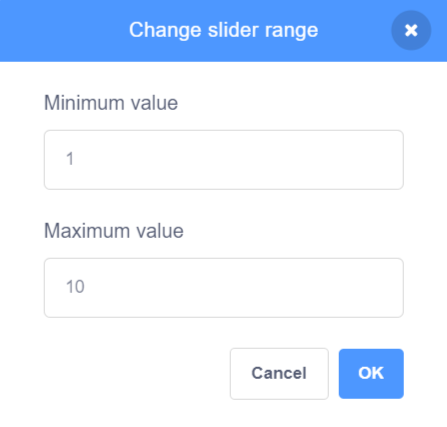

## Variables

In this step, you will add one or more `variables`{:class="block3variables"} with sliders to control something in your scene such as graphic effects, sound effects, movement, or timing. 

--- task --- 

Look at the example below. The `speed`{:class="block3variables"} variable controls how fast the snowman moves, `snowflake`{:class="block3variables"} controls the snowflake size, and `music`{:class="block3variables"} controls the pitch of the music that is playing.

**Winter scene**: [See inside](https://scratch.mit.edu/projects/451563340/editor){:target="_blank"}

<div class="scratch-preview">
  <iframe allowtransparency="true" width="485" height="402" src="https://scratch.mit.edu/projects/embed/451563340/?autostart=false" frameborder="0"></iframe>
</div>

--- /task ---

--- task ---

Decide what you want your variable to control.  

Create a new `variable`{:class="block3variables"} and give it a name that matches its use. For example: 

+ If it will control the `volume`{:class="block3sound"} of a sound, name it `noise`{:class="block3variables"}
+ If it will control the length of a `wait`{:class="block3control"}, name it `delay`{:class="block3variables"}
+ If it will control how many degrees a sprite will `turn`{:class="block3motion"}, name it `angle`{:class="block3variables"}

--- collapse ---

---

title: Add a new variable

---

Click on the **Code** tab for any **sprite** or the **Stage**. 

Go to the `Variables`{:class="block3variables"} blocks menu and click on **Make a Variable**.


Name the `variable`{:class="block3variables"} to match its use, for example, `angle`. 

Keep the **For all sprites** box selected. This means that you will be able to use the `variable`{:class="block3variables"} in the code for any of your sprites or the Stage.


Click on **OK** to make the new `variable`{:class="block3variables"}. You will have new `Variables`{:class="block3variables"} blocks available, including an `angle`{:class="block3variables"} block (or whatever you named your variable) that you can drag and use as an input to other blocks. 


--- /collapse ---

--- /task ---

Your new `variable`{:class="block3variables"} will automatically appear on the Stage.

--- task ---
 
Change the `variable`{:class="block3variables"} to a **slider** and **change its range**.

--- collapse ---

---

title: Use a slider to set a variable

---

Right-click or tap and hold on your `variable`{:class="block3variables"} on the Stage. 

Select **slider** in the menu. 


**Tip:** You can double-click or tap on the `variable`{:class="block3variables"} displayed on the Stage and select **slider**.

Right-click or tap and hold on the `variable`{:class="block3variables"} displayed on the Stage and select **change slider range**.


To set the range, specify a minimum and maximum value.

A minimum of `1` and a maximum of `10` work fairly well for how quickly a sprite spins.



The value range that is right for your variable depends on what you are using it for. Sometimes you will need to experiment a little to get it right, but remember that you can change it at any time.

Drag the slider to a convenient position on the Stage.

**Tip:** Variables on the Stage always appear in a layer above all of the sprites. If you have a moving sprite, the sprite will go under any variables on the Stage. 

--- /collapse ---

--- /task ---

--- task ---

Use your rounded `variable`{:class="block3variables"} input block to control something in your project, for example, to change the size of a sprite, the way that it looks, or the volume of a sound.

Here are some examples of how you can use your variable slider: 

--- collapse ---

---

title: Control graphic effects with a variable

---

This example changes the `ghost`{:class="block3looks"} graphic effect so you can see through the rainbow.

**Transparent rainbow**: [See inside](https://scratch.mit.edu/projects/451544795/editor){:target="_blank"}

<div class="scratch-preview">
  <iframe allowtransparency="true" width="485" height="402" src="https://scratch.mit.edu/projects/embed/451544795/?autostart=false" frameborder="0"></iframe>
</div>

You can use a `transparent`{:class="block3variables"} variable to control the `ghost effect`{:class="block3looks"} on a sprite at the `front`{:class="block3looks"} and use it to reveal or hide sprites in lower layers. 

```blocks3
when flag clicked
go to [front v] layer
```

```blocks3
when flag clicked
forever
set [ghost v] effect to (transparent)
```

Try using the same approach with other graphic effects such as `brightness`{:class="block3looks"} or `color`{:class="block3looks"}.

--- /collapse ---

--- collapse ---

---

title: Control movement speed with a variable

---

**Ladybug on a wall**: [See inside](https://scratch.mit.edu/projects/451545341/editor){:target="_blank"}

<div class="scratch-preview">
  <iframe allowtransparency="true" width="485" height="402" src="https://scratch.mit.edu/projects/embed/451545341/?autostart=false" frameborder="0"></iframe>
</div>

Use the `speed`{:class="block3variables"} variable as the input to a `move`{:class="block3motion"} block:

```blocks3
when flag clicked
forever
move (speed) steps
if on edge, bounce
```
Set the minimum and maximum values for the range of the slider to suit your project.

--- /collapse ---

--- collapse ---

---
title: Control turn speed with a variable
---

**Space dog**: [See inside](https://scratch.mit.edu/projects/451543041/editor){:target="_blank"}

<div class="scratch-preview">
  <iframe allowtransparency="true" width="485" height="402" src="https://scratch.mit.edu/projects/embed/451543041/?autostart=false" frameborder="0"></iframe>
</div>

Use an `angle`{:class="block3variables"} variable as the input to a `turn right`{:class="block3motion"} block:

```blocks3
when flag clicked
forever
turn right (angle) degrees
```

--- /collapse ---

--- collapse ---

---

title: Change the delay in a wait block

---

**Skeleton dance**: [See inside](https://scratch.mit.edu/projects/451536565/editor){:target="_blank"}

<div class="scratch-preview">
  <iframe allowtransparency="true" width="485" height="402" src="https://scratch.mit.edu/projects/embed/451536565/?autostart=false" frameborder="0"></iframe>
</div>

Use a `delay`{:class="block3variables"} variable as the input to a `wait`{:class="block3control"} block:

```blocks3
when flag clicked
forever
wait (delay) seconds
next costume
```

A delay of more than one second is quite a long time. If you include a decimal number in the range of a slider then you can change the value by a 100th of a second at a time. 

A range of `0.0` to `1.0` allows you to choose a delay between `0` seconds (no delay) and `1` second.


Try changing the numbers to get the maximum and minimum values that you want users to be able to use in your project.

--- /collapse ---

--- collapse ---

---

title: Change sound effects

---

**Drum pitch**: [See inside](https://scratch.mit.edu/projects/451547017/editor){:target="_blank"}

<div class="scratch-preview">
  <iframe allowtransparency="true" width="485" height="402" src="https://scratch.mit.edu/projects/embed/451547017/?autostart=false" frameborder="0"></iframe>
</div>

Changing the `pitch`{:class="block3sound"} of a sound makes the notes higher and also speeds the sound up. 

```blocks3
when flag clicked
forever
set [pitch v] effect to (beat) :: sound
```

Play the sound in a separate `forever`{:class="block3control"} loop so that the pitch will change immediately rather than waiting until the sound has finished playing: 

```blocks3
when flag clicked
forever
play sound [Dance Head Nod v] until done
```

You can also use a `variable`{:class="block3variables"} to change the `volume`{:class="block3sound"} and `pan`{:class="block3sound"} (tilt) effect.

--- /collapse ---

--- /task ---

You can rename a variable if you change your mind.

--- collapse ---

---

title: Rename a variable

---

Sometimes you think of a better name for a variable. 

You can give a variable a new name: go to the `Variables`{:class="block3variables"} blocks menu, right-click on the `variable`{:class="block3variables"}, and choose **Rename variable**.


This will change the name of the variable in all the blocks in which you have used it. 

--- /collapse ---

--- task ---
Add as many `variables`{:class="block3variables"} as you like to control movement, delays, graphic effects, and sound effects. 

Things to consider:
+ Have you given your variables names that match what they are used for?
+ Have you chosen the best maximum and minimum values for your sliders?
+ Are your sliders neatly arranged on the Stage?
+ Is it helpful to use the same variable in multiple places?

--- /task ---

**Tip:** If you are using a computer with a keyboard then you can use the arrow keys to change the value of a slider by `1`. First, click on the slider to select it, then use the <kbd>Left</kbd> arrow key to change the value by `-1` and the <kbd>Right</kbd> arrow key to change the value by `1`.
