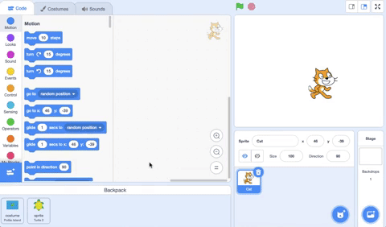

## Duplicate sprites and copy code

Duplicating or copying code can save you time when making a project. 

--- collapse ---
---
title: Duplicate blocks
---

Duplicate blocks or sets of blocks to reuse in a sprite's program:

* Go to the **Code** tab.
* Right-click (or on a tablet, tap and hold) on the first block that you want to copy. It will select all the blocks below it too.
* Select **Duplicate** in the drop-down menu.
{:width="300px"}
* Drag the duplicated code where you want it to go.
{:width="300px"}
* Delete any blocks that you do not need.

--- /collapse ---

--- collapse ---
---

title: Duplicate a sprite

---

Right-click (or on a tablet, tap and hold) on your first sprite in the Sprite list below the Stage:
{:width="300px"}

Select **duplicate**. This will create a copy of your first sprite with the suffix "2":
{:width="300px"}

Rename your sprite:
{:width="300px"}

Your sprite's name will change in the Sprite list:
{:width="300px"}

Your second sprite has exactly the same code as your first sprite. Do not run the program until you have started to change the second sprite's code — you will not see the second sprite because it is positioned underneath the first sprite.

--- /collapse ---

Create a new sprite and copy over all or some of the first sprite's code.

--- collapse ---
---

title: Copy a sprite's code

---
In bottom left-hand corner of the Sprite list, click on **Choose a Sprite** and select the sprite that you want to add.

Click on the first sprite and go to its **Code** tab. Drag the code that is in the first sprite's Code area to the image of the second sprite in the Sprite list, then let go of the code to finish copying it to the second sprite. You may have one script that starts with a `when green flag clicked`{:class="block3events"} block, as well as another script that starts with `when this sprite clicked`{:class="block3events"}. Make sure that you copy **all** the code scripts that you have created. 

{:width="300px"}

Your second sprite will now have exactly the same code as your first sprite. Do not run the program until you have started to change the second sprite's code — you might not see the second sprite because it is positioned underneath the first sprite.

--- /collapse ---

Drag into a **Backpack** costumes, sprites, sounds, and scripts that you want to copy between projects.

--- collapse ---

---
title: Use your Backpack
---

- You can use your Scratch Backpack to store costumes, sprites, sounds, and scripts that you want to copy between projects.

- You can only access your own Backpack, and must be logged in to your Scratch account to use it.

- To open your Backpack, click on the **Backpack** tab at the bottom of the screen.

--- no-print ---

--- /no-print ---

--- print-only ---

--- /print-only ---

- To add a sprite, drag the sprite from the Sprite list to the Backpack. This will store the full sprite in your Backpack, including all costumes, sounds, and scripts.

--- no-print ---

--- /no-print ---

--- print-only ---

--- /print-only ---

- To add a backdrop to your Backpack, first, click on the Stage pane (on the right-hand side of the screen, below the Stage). Then, click on the **Backdrops** tab, then choose the backdrop that you want and drag it to your Backpack.

--- no-print ---

--- /no-print ---

--- print-only ---

--- /print-only ---

- To use an item in your Backpack in another project, open the project and drag the item to the correct pane or tab.

--- no-print ---

--- /no-print ---

--- print-only ---

--- /print-only ---

- To delete an item from your Backpack, find the item in the **Backpack** tab, then right-click on the item and select **delete**.

--- no-print ---

--- /no-print ---

--- print-only ---

--- /print-only ---

- You can hide your Backpack when you are not using it. To do this, click on the **Backpack** tab at the bottom of the screen.

--- no-print ---

--- /no-print ---

--- print-only ---

--- /print-only ---

--- /collapse ---
