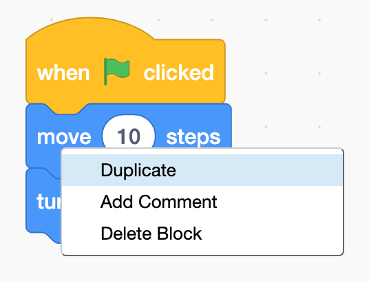
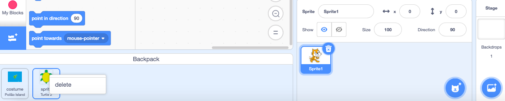

## Duplicate sprites and copy code

Choose one of these four methods to copy code:

--- task ---

Duplicate blocks or sets of blocks to reuse in a sprite's program:

<mark>the below task could be turned into a collapse and introduced in one of the Design projects</mark>

* Go to the **Code** tab.
* Right-click on the first block you want to copy (or if you are using a tablet, tap and hold). It will copy all the blocks below it as well.
* Select 'Duplicate' from the dropdown options.
{:width="300px"}
* Drag the duplicated code where you want it to go.
{:width="300px"}
* Delete any blocks you don't require.

 Duplicate your first sprite if you want multiples of the same sprite:
 
  --- collapse ---
---

title: Duplicate a sprite

---

Right-click on your first sprite in the Sprite list below the Stage (or if you are using a tablet, tap and hold):
{:width="300px"}

Select **duplicate**. This will create a copy of your first sprite with the suffix '2':
{:width="300px"}

Rename your sprite:
{:width="300px"}

Your sprite's name will change in the Sprite list:
{:width="300px"}

Your second sprite has exactly the same code as your first sprite. Do not run the program until you have begun to alter the second sprite — you will not see the second sprite because it is sitting underneath the first sprite.

--- /collapse ---

Create a new sprite and copy over all or some of the first sprite's code:

--- collapse ---
---

title: Copy sprite code

---
In the Sprite pane, go to **Choose a Sprite** and select your second sprite.

Click the first sprite and go to its **Code** tab. Drag the code that is in the first sprite to the second sprite. You may have one script that starts with a `when the green flag clicked`{:class="block3events"} block, as well as another script that starts with `when this sprite clicked`{:class="block3events"}. Make sure you copy **all** the code scripts that you have created. 

{:width="300px"}

Your second sprite has exactly the same code as your first sprite. Do not run the program until you have begun to alter the second sprite — you will not see the second sprite because it is sitting underneath the first sprite.

--- /collapse ---

Drag into a **backpack** costumes, sprites, sounds and scripts that you want to copy between projects:

--- collapse ---

---
title: Backpack
---

- Your Scratch backpack can be used to store costumes, sprites, sounds and scripts that you want to copy between projects.

- You can only access your own backpack and must be logged into your Scratch account to use it.

- Open your backpack by clicking on the **Backpack** tab at the bottom of the screen.

--- no-print ---

--- /no-print ---

--- print-only ---

--- /print-only ---

- To add a sprite, drag the sprite from the Sprite pane to the backpack. This will store the full sprite in your backpack including all costumes, sounds and script.

--- no-print ---

--- /no-print ---

--- print-only ---

--- /print-only ---

- To add a backdrop to your backpack, select the Backdrops pane and click on the **Costumes** tab choose the backdrop you want and drag it to your backpack.

--- no-print ---

--- /no-print ---

--- print-only ---

--- /print-only ---

- To use your backpack items in another project, open the project and drag items you need to their correct pane or tab.

--- no-print ---

--- /no-print ---

--- print-only ---

--- /print-only ---

- To delete items from your backpack, find the item in the **Backpack** tab then right-click and select delete.

--- no-print ---

--- /no-print ---

--- print-only ---

--- /print-only ---

- You can hide your backpack when you're not using it by clicking on the **Backpack** tab at the bottom of the screen.

--- no-print ---

--- /no-print ---

--- print-only ---

--- /print-only ---

--- /collapse ---

--- /task ---
