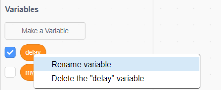

## Variables

A `variable`{:class="block3variables"} is a way of storing numbers and/or text.

You can make your own variables and choose whether they show on the Stage:

[[[generic-scratch3-add-variable]]]

You should think about whether you need to set a starting value when you make a variable:

[[[scratch3-create-set-variable]]]

You can rename a variable if you change your mind:

--- collapse ---

---

title: Rename a variable

---

Sometimes you think of a better name for a variable. 

You can give a variable a new name: go to the `Variables`{:class="block3variables"} blocks menu, right-click (or on a tablet, tap and hold) on the `variable`{:class="block3variables"}, and choose **Rename variable**.



This will change the name of the variable in all the blocks in which you have used it. 

--- /collapse ---

**Tip:** Make sure you know the difference between `set`{:class="block3variables"} and `change by`{:class="block3variables"}. `set`{:class="block3variables"} will replace the value stored in a variable. `change by`{:class="block3variables"} will change the value of a number variable by the amount you choose, `change by`{:class="block3variables"}`1` will add one to a variable. `change by`{:class="block3variables"}`-1` will take one away from a variable. 


**Tip:** Variables on the Stage always appear in a layer above all of the sprites. If you have a moving sprite, the sprite will go under any variables on the Stage. 

You can use a slider to control the value in a variable.

[[[scratch3-slider-variable]]]

More ideas for using variables:

[[[generic-scratch3-high-score]]]

[[[scratch3-join-text]]]

[[[scratch3-set-variable-with-button]]]

[[[scratch3-change-variable-in-loop]]]


--- collapse ---

---

title: Control graphic effects with a variable slider

---

Here are some examples of how you can use your variable slider: 


This example changes the `ghost`{:class="block3looks"} graphic effect so you can see through the rainbow.

**Transparent rainbow**: [See inside](https://scratch.mit.edu/projects/451544795/editor){:target="_blank"}

<div class="scratch-preview">
  <iframe allowtransparency="true" width="485" height="402" src="https://scratch.mit.edu/projects/embed/451544795/?autostart=false" frameborder="0"></iframe>
</div>

You can use a `transparent`{:class="block3variables"} variable to control the `ghost`{:class="block3looks"} effect on a sprite at the `front`{:class="block3looks"} and use it to reveal or hide sprites in lower layers. 

```blocks3
when flag clicked
go to [front v] layer
```

```blocks3
when flag clicked
forever
set [ghost v] effect to (transparent)
```

Try using the same approach with other graphic effects such as `brightness`{:class="block3looks"} or `color`{:class="block3looks"}.

--- /collapse ---

--- collapse ---

---

title: Control movement speed with a variable

---

**Ladybug on a wall**: [See inside](https://scratch.mit.edu/projects/451545341/editor){:target="_blank"}

<div class="scratch-preview">
  <iframe allowtransparency="true" width="485" height="402" src="https://scratch.mit.edu/projects/embed/451545341/?autostart=false" frameborder="0"></iframe>
</div>

Use the `speed`{:class="block3variables"} variable as the input to a `move`{:class="block3motion"} block:

```blocks3
when flag clicked
forever
move (speed) steps
if on edge, bounce
```
Set the minimum and maximum values for the range of the slider to suit your project.

--- /collapse ---

--- collapse ---

---
title: Control turn speed with a variable
---

**Space dog**: [See inside](https://scratch.mit.edu/projects/451543041/editor){:target="_blank"}

<div class="scratch-preview">
  <iframe allowtransparency="true" width="485" height="402" src="https://scratch.mit.edu/projects/embed/451543041/?autostart=false" frameborder="0"></iframe>
</div>

Use an `angle`{:class="block3variables"} variable as the input to a `turn right`{:class="block3motion"} block:

```blocks3
when flag clicked
forever
turn right (angle) degrees
```

--- /collapse ---

--- collapse ---

---

title: Change the delay in a wait block

---

**Skeleton dance**: [See inside](https://scratch.mit.edu/projects/451536565/editor){:target="_blank"}

<div class="scratch-preview">
  <iframe allowtransparency="true" width="485" height="402" src="https://scratch.mit.edu/projects/embed/451536565/?autostart=false" frameborder="0"></iframe>
</div>

Use a `delay`{:class="block3variables"} variable as the input to a `wait`{:class="block3control"} block:

```blocks3
when flag clicked
forever
wait (delay) seconds
next costume
```

A delay of more than one second is quite a long time. If you include a decimal number in the range of a slider, then you can change the value by a 100th of a second at a time. 

A range of `0.00` to `1.00` allows you to choose a delay between `0` seconds (no delay) and `1` second.


Change the numbers to get the minimum and maximum values that you want users to be able to use in your project.

--- /collapse ---

--- collapse ---

---

title: Change sound effects

---

**Drum pitch**: [See inside](https://scratch.mit.edu/projects/451547017/editor){:target="_blank"}

<div class="scratch-preview">
  <iframe allowtransparency="true" width="485" height="402" src="https://scratch.mit.edu/projects/embed/451547017/?autostart=false" frameborder="0"></iframe>
</div>

You can use a `variable`{:class="block3variables"} in a `set pitch effect to`{:class="block3sound"} block. If you increase the pitch of a sound, the notes get higher and the sound speeds up.

```blocks3
when flag clicked
forever
set [pitch v] effect to (beat) :: sound
```

Play the sound in a separate `forever`{:class="block3control"} loop so that the pitch will change immediately rather than waiting until the sound has finished playing: 

```blocks3
when flag clicked
forever
play sound [Dance Head Nod v] until done
```

You can also use a `variable`{:class="block3variables"} to change the volume and pan (tilt) effect.

--- /collapse ---


