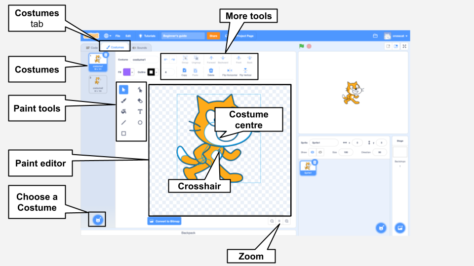
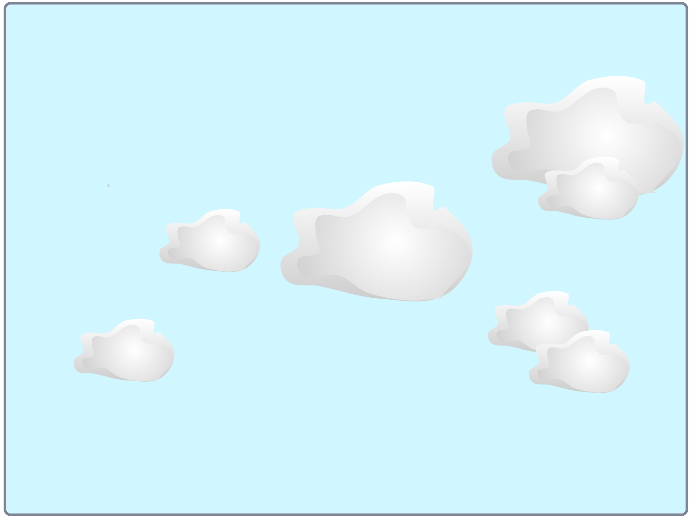

## Paint editor

Use the Paint editor to create your own backdrops and costumes, and to edit existing backdrops and costumes. 

{:width="600px"}

[[[scratch3-paint-a-new-backdrop-extended]]]

[[[scratch3-backdrops-and-sprites-using-shapes]]]

[[[scratch3-use-text-tool]]]

[[[scratch3-add-costumes-to-a-sprite]]]

[[[scratch-crosshair]]]

[[[scratch3-copy-parts-between-sprite-costumes]]]

--- collapse ---
---
title: Duplicate and edit a costume to use in an animation
---

Some Scratch sprites just have one costume, or have multiple costumes that don't work as an animation. If you choose one costume, then duplicate it (make a copy of it) and make a small change, it can create an animation effect.

**Robot animation**: [See inside](https://scratch.mit.edu/projects/436260207/editor){:target="_blank"}

  <iframe allowtransparency="true" width="485" height="402" src="https://scratch.mit.edu/projects/embed/436260207/?autostart=false" frameborder="0"></iframe>

Switch to the **Costumes** tab for your sprite. 

Choose the costume that you want to use, and delete the other costumes, because you will not need them for your animation. For example, the **Robot** sprite comes with costumes for three different robots, so you should choose one of the costumes and delete the other costumes.

Right-click (or on a tablet, tap and hold) on the costume, and choose **duplicate**. 

Make small changes to the copy of the costume. For example, you can move, rotate, or change all or part of the costume. You can also add movement lines. 

If your costume uses vector graphics, then you can select parts of a costume and change each part separately.

You can duplicate the costume again and make more changes to add more frames to your animation.

You can now use your costumes in a simple sprite animation.

--- /collapse ---

--- collapse ---
---
title: Use the Fill tool to change the colours in a costume
---

You can change the colour of your sprite. First, select your sprite in the Sprite list below the Stage and then click on the **Costumes** tab.

Use the **Select** (Arrow) tool to highlight the part of the costume you want to change colour.

{:width="200px"}

{:width="300px"}

Go to the **Fill** colour chooser and select a colour. It will automatically fill the shape that you have selected.

{:width="300px"}

Repeat the steps above for any part of the costume that you have missed, or for any other part of the costume you want to change colour.

{:width="300px"}

{:width="300px"}

{:width="300px"}

--- /collapse ---

Use the tips below to help you to create your own designs for your sprites in the Paint editor.

--- collapse ---
---

title: Create scenery as sprites

---

**Hill as a sprite**: [See inside](https://scratch.mit.edu/projects/452582516/editor){:target="_blank"}

{:width="400px"}

To make your own **Hill** sprite, shown in the example above, you can use the **Circle** and **Rectangle** tools in the Paint editor:

+ Go to **Choose a Sprite** and select **Paint** to create a new sprite costume.

{:width="400px"}

+ Choose a **Fill** colour. Click on **Outline** and deselect it (to do this, click on the box with the diagonal line in the bottom left-hand corner of the menu). Now, use the **Circle** tool to draw an oval. Then, select the **Rectangle** tool and draw a rectangle underneath the oval.

+ If you use varying colours for the shapes, you may need to use the **Front** and **Back** tools in the Paint editor to move your shapes forward or backward so that they are positioned correctly within your background.

+ You can select all the shapes and **Group** them together so that you can adjust them or move them as one shape.

{:width="400px"}

Now, make other sprites for your scenery, if this fits in with your project idea.

Remember to name your sprite(s).

--- /collapse ---

--- collapse ---
---

title: Use the Line tool to create a triangle

---

You can create polygons, such as a triangle, and use these shapes to create roofs or mountains.

Go to **Choose a Sprite** and select **Paint** to create a new sprite costume. In this example, you will make houses.

**House**: [See inside](https://scratch.mit.edu/projects/453595663/editor){:target="_blank"}

{:width="400px"}

If you follow the instructions below, you can use the **Line** tool to create any shape:
+ Choose a **Fill** colour. To choose the colour black, decrease the **Brightness** to zero (`0`).

{:width="150px"}

+ Select **No outline**.

{:width="200x"}

+ Use the **Rectangle** tool to draw a rectangle.
+ Use the **Line** tool to draw a triangle. Make sure that you complete the triangle, otherwise it will not fill with colour.
+ Move the two shapes together.
+ Select the **Fill** (Bucket) tool and fill the triangle with colour.
+ Use the **Rectangle** tool to draw another rectangle for the chimney.
+ You can use the **Front** and **Back** tools in the Paint editor to move your shapes forward or backward so that they are positioned correctly. In this example, you will not need to do this, because the shapes are black to make a silhouette.
+ Select all the shapes and **Group** them together so that you can adjust them or move them as one shape.

To create duplicate shapes of your house (for example, to make a skyline), follow the tips under **Duplicate shapes to create a scenery costume** below.

--- /collapse ---

--- collapse ---
---

title: Duplicate shapes to create a scenery costume

---

You may want to duplicate shapes within a costume so that your scenery appears busier or more crowded.

**Multiple clouds**: [See inside](https://scratch.mit.edu/projects/447278432/editor){:target="_blank"}

{:width="400px"}

The effect of multiplying shapes is used by professional animators to create the impression of weather patterns, such as rain or clouds; a cluster of objects, such as buildings or a wood; or a crowd of people in a scene.

--- no-print ---

--- /no-print ---

To multiply any type of shape:
+ Go to **Choose a Sprite** and select, in this example, the **Cloud** sprite
+ In the **Costumes** tab, use the **Select** tool to highlight the whole of the shape
+ Use the **Copy** and **Paste** tools to create duplicates of the shape
+ Use the **Select** tool to move the shape within the Paint editor
+ You can vary the size of the shapes to help to create a greater sense of 3D effects, for example
+ You can select all the shapes and **Group** them together, so that you can adjust them or move them as one shape

--- /collapse ---

--- collapse ---
---

title: Use Saturation and Brightness to create depth

---

In the real world, objects that are further away appear lighter in colour. To achieve more realistic 3D scenery, you can **decrease** the colour **Saturation** and/or **Brightness** of each sprite so that they appear further and further away.

{:width="400px"}

--- /collapse ---

--- collapse ---
---

title: Create a sprite with gaps that you can see through

---

You can create a sprite that has gaps that you can see through. If it is positioned as the front layer and is the size of the Stage, it can appear like a view through the bars of a cage or a window.

--- no-print ---

**Caged lion**: [See inside](https://scratch.mit.edu/projects/445680159/editor){:target="_blank"}

--- /no-print ---

To create a type of masking sprite:
+ Go to **Choose a Sprite** and select **Paint**
+ Choose a **Fill** colour with no **Outline** and draw a vertical rectangle
+ Use the **Copy** and **Paste** tools to repeat this shape
+ Use the **Select** tool to move the shapes around
+ As you place your shapes, make sure that they are touching the edge of the Stage to fit in with your project idea

--- /collapse ---

**Tip:** If you find it hard to manage the sprites on your Stage, such as having a large sprite that keeps covering a much smaller one, you can click on **Hide** so that you don't see a sprite or sprites. Then, when you have finished, click on **Show** again.

{:width="300px"}
