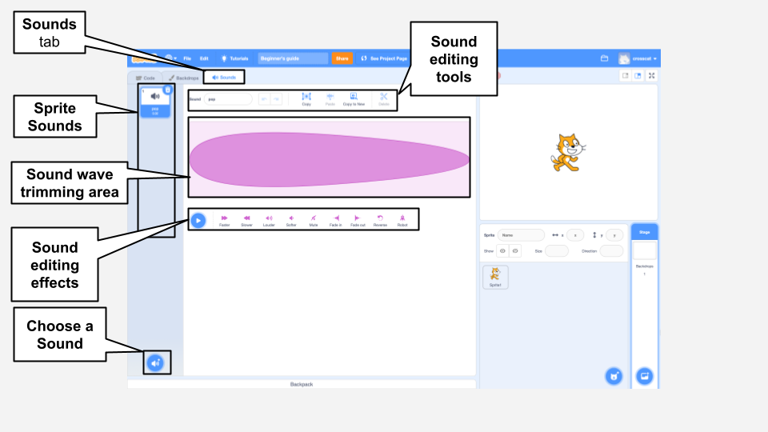

## Sound Editor

Use the Sound editor to add and edit existing sounds and to record your own sounds. 

{:width="600px"}

[[[scratch3-add-sound]]]
[[[scratch3-record-sound]]]

[[[scratch3-reverse-sound]]]
[[[scratch3-crop-sound]]]
[[[scratch3-sound-effects]]]