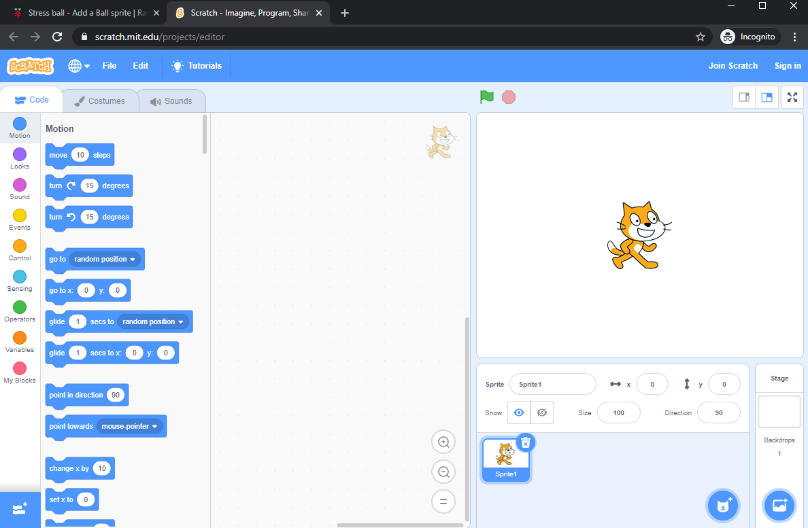
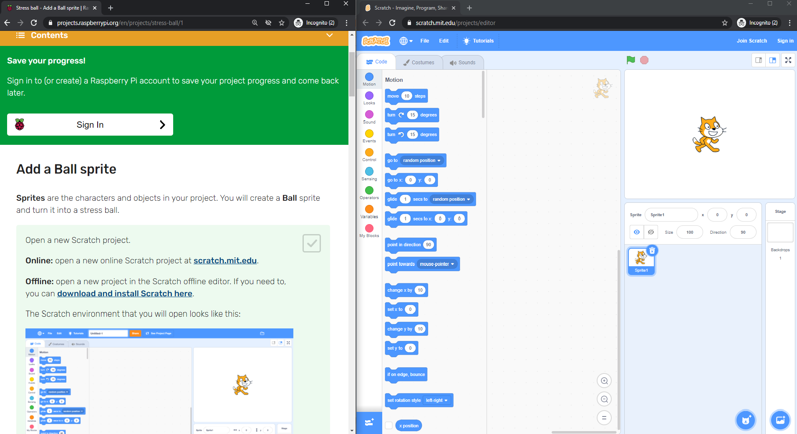
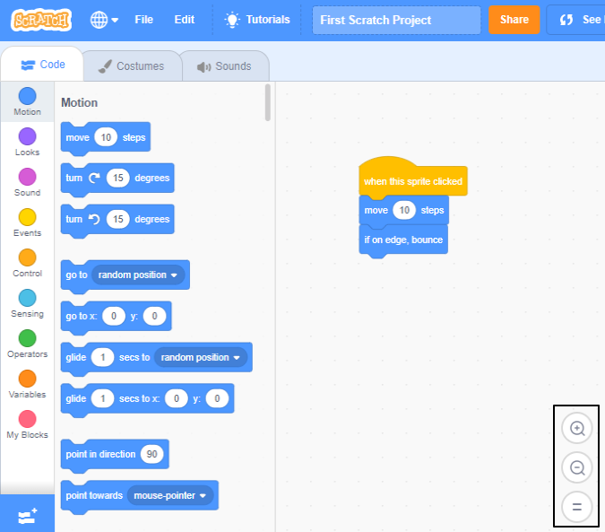

## Set up Scratch
You can use Scratch on a laptop or desktop computer or on a tablet. You can also use Scratch on a Raspberry Pi computer.

--- task ---

Open a web browser on your computer or tablet and visit [rpf.io/scratch-new](https://rpf.io/scratch-new){:target="_blank"} to open a new project in the Scratch editor. Scratch will open in a new tab in your web browser.

**Tip:** You can also visit [scratch.mit.edu](https://scratch.mit.edu/){:target="_blank"} and then click on **Create**.

--- collapse ---
---
title: Working offline without an internet connection
---

If you need to work offline (without an internet connection), then you can [download Scratch](https://scratch.mit.edu/download){:target="_blank"} and install it on a computer. 

You cannot work offline if you are using a tablet.

--- /collapse ---

--- collapse ---
--- 
title: Scratch on Raspberry Pi
---

If you are using a Raspberry Pi computer, Scratch may already be installed. Click on the Raspberry Pi icon to open the menu, then click on **Programming**, then select **Scratch 3**.

If you need to install Scratch, follow this process:
+ Click on the Raspberry Pi icon to open the menu
+ Click on **Preferences**
+ Click on **Recommended Software**
+ Select **Scratch 3**
+ Click on **OK**

See [Scratch 3 Desktop for Raspberry Pi](https://www.raspberrypi.org/blog/scratch-3-desktop-for-raspbian-on-raspberry-pi/) for more information.

--- /collapse ---

--- /task ---

--- task ---

When you use Scratch with this guide or one of our projects, you will need to switch between Scratch and the project instructions. 

--- collapse ---
---
title: Switch between browser tabs
---

Click on (or on a tablet, tap) the title of a browser tab to switch between the Scratch editor and project instructions.

--- /collapse ---

--- collapse ---
--- 
title: Side-by-side instructions and Scratch
---

If your screen is big enough, you can view Scratch next to the project instructions.  

If you are using Microsoft Windows 10, drag the Scratch tab in your web browser so that it is in a separate window, and keep dragging until the cursor reaches the right-hand edge of your screen. The window will then be positioned on the right-hand side of the screen. 

Now, drag the window containing this guide or your project instructions to the left-hand side of your screen until the cursor reaches the left-hand edge. The window will take up the left half of your screen.

You can resize the windows to get them just the way you want.

**Tip:** You can also hold down the <kbd>Windows</kbd> key and press the <kbd>Left</kbd> arrow key or <kbd>Right</kbd> arrow key to position a window in the left or right half of your screen.

--- /collapse ---

Try it now and see how you prefer to work.

--- /task ---

--- task ---

When you are using Scratch in a web browser, you can zoom in or out to adjust the size. 

For example, if you are using Microsoft Windows and you want to use zoom on a webpage in Google Chrome or Microsoft Edge, hold down the <kbd>Ctrl</kbd> key and press the <kbd>+</kbd> key or <kbd>-</kbd> key to zoom in or out.

--- collapse ---
---
title: Use zoom in the Code area
---

You can also use the zoom controls in the Code area in Scratch to change the size of the code blocks in the Code area.

--- /collapse ---

--- /task ---

