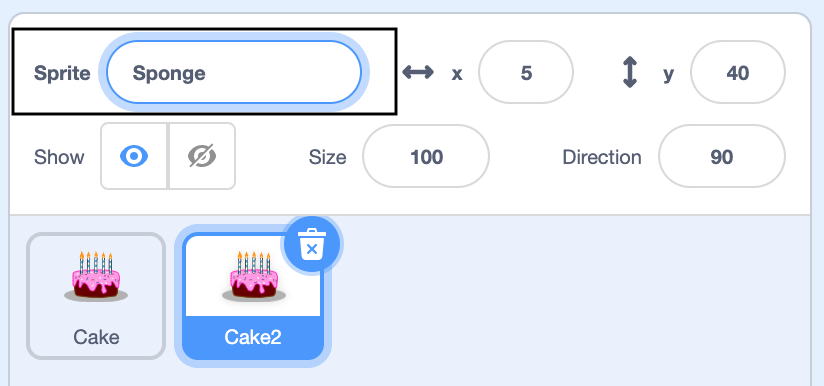

## Sprites and backdrops

--- task ---

Add a backdrop of your choice. Don't worry about it too much, as you can change it as you develop your idea. Below are some **Information** tips, you can use these if you need a reminder, or to understand blocks in more detail.

--- collapse ---
---

title: Choose a backdrop

---

In the bottom-right corner of the Stage pane, click on **Choose a Backdrop**.

You can search for a backdrop, or browse for one by category or theme. Click on a backdrop to select it.

--- /collapse --- 

--- /task ---

--- task ---

Add your first sprite. You will be able to change the way it looks or add more sprites later.

--- collapse ---
---

title: Choose a sprite

---

In the Sprite pane, click **Choose a Sprite** to see the library of all Scratch sprites.

You can search or browse sprites by theme. Click on a sprite to add it to your project.

--- /collapse --- 

--- /task ---

--- task ---

Give your project a name that matches your theme. 

--- collapse ---
---

title: How do I give my project a name?

---

Click in the project name box and change the name to match your project. 

If you share your project, then others will also see this name, so make sure it makes sense. 

--- /collapse --- 

--- /task ---

--- task ---

Choose one of these three methods to create your second sprite: 
+ Duplicate your first sprite if you want multiples of the same sprite
+ Create a new sprite and copy over the first sprite's code 
+ Create a new sprite and start coding it from the beginning

--- collapse ---
---

title: Duplicate a sprite

---

Right-click on your first sprite in the Sprite list below the Stage (or if you are using a tablet, tap and hold):
{:width="300px"}

Select **duplicate**. This will create a copy of your first sprite with the suffix '2':
{:width="300px"}

Rename your sprite:
{:width="300px"}

Your sprite's name will change in the Sprite list:
{:width="300px"}

Your second sprite has exactly the same code as your first sprite. Do not run the program until you have begun to alter the second sprite — you will not see the second sprite because it is sitting underneath the first sprite.

--- /collapse ---

--- collapse ---
---

title: Copy sprite code

---
In the Sprite pane, go to **Choose a Sprite** and select your second sprite.

Click the first sprite and go to its **Code** tab. Drag the code that is in the first sprite to the second sprite. You may have one script that starts with a `when the green flag clicked`{:class="block3events"} block, as well as another script that starts with `when this sprite clicked`{:class="block3events"}. Make sure you copy **all** the code scripts that you have created. 

{:width="300px"}

Your second sprite has exactly the same code as your first sprite. Do not run the program until you have begun to alter the second sprite — you will not see the second sprite because it is sitting underneath the first sprite.

--- /collapse ---

--- /task ---
