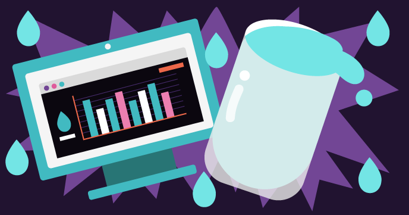

## Our Scratch projects

This reference guide, Getting started with Scratch, aims to support you to use Scratch in our projects, as well as in your own projects.

Our Scratch paths each have six projects to help you to learn different skills in Scratch, and to progress to making your own projects independently. You can return to this guide whenever you need to remind yourself of the skills you have learned.

### Beginner Scratch projects

If you are new to Scratch, start with our pathways for beginners:

[Introduction to Scratch: sprites, costumes, backdrops and scripts](https://projects.raspberrypi.org/en/pathways/scratch-intro){:target="_blank"}
In this introduction to coding in Scratch for beginners, you will learn how to add code, costumes and sounds to sprites as you make animations, a game, apps and a story.

[Look after yourself](https://projects.raspberrypi.org/en/pathways/look-after-yourself){:target="_blank"}
Learn how to look after yourself and others with Scratch projects to make you laugh, relax, control, create, exercise and focus.

[Scratch module 1]https://projects.raspberrypi.org/en/pathways/scratch-module-1{:target="_blank"}

 

### Beyond the basics Scratch projects

[More Scratch: broadcast, decisions and variables](https://projects.raspberrypi.org/en/pathways/more-scratch){:target="_blank"}
More Scratch moves beyond the basics introduced in Introduction to Scratch. You will make apps, games and simulations using message broadcasting, if..then and if..then..else decisions and variables.

[Scratch module 2]https://projects.raspberrypi.org/en/pathways/scratch-module-2{:target="_blank"}

### Advanced Scratch projects

Protect our planet](https://projects.raspberrypi.org/en/pathways/protect-our-planet){:target="_blank"}
Use Scratch to learn about our planet and how to protect the environment for future generations

https://projects.raspberrypi.org/en/coderdojo/scratch-for-social-enterprise

[Scratch module 3]https://projects.raspberrypi.org/en/pathways/scratch-module-3{:target="_blank"}

### Scratch GPIO hardware projects for the Raspberry Pi

[Physical omputing with Scratch]https://projects.raspberrypi.org/en/projects?software%5B%5D=scratch&hardware%5B%5D=raspberry-pi{:target="_blank"}

Did you enjoy the Scratch guide? Have you spotted an issue? Please click the **Send feedback** button below and let us know!
