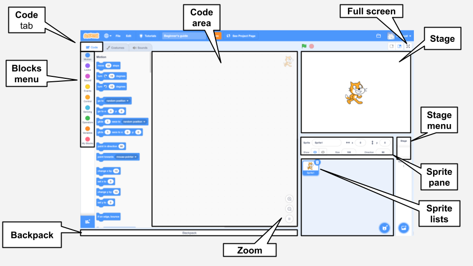

## The Scratch editor

The **Stage** is where the action takes place in your project. The Stage has one or more background images called **backdrops**.

**Sprites** are characters and objects that appear on the **Stage**. Sprites are given instructions using Scratch code blocks. This is called **programming**. 

Drag **code blocks** from the **Blocks menu** to the **Code area** to program your sprites and the Stage. Code blocks can make a sprite move around, change the way that it looks, and play sounds. 

Sprites can have multiple **costumes**. You can change the costume to change the appearance of a sprite. This can be used for effects such as giving the appearance of walking. 

A **script** is a series of blocks that are joined together to give instructions to the Stage or sprites. The Stage and sprites can each have many different scripts. 

