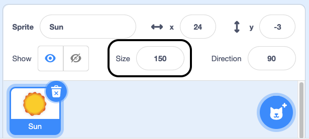
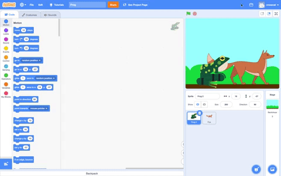

## Looks

Add code to your sprites to change the way that they look.

--- task ---

Set the size and/or effect for your sprites.

--- collapse ---
---
title: Set the size of your sprite
---

When you add a sprite to your project, its size is set to `100` percent. This may be too big or too small for your project. 

You can use code to set the size of a sprite. To do this, use a `set size to`{:class="block3looks"} block:

```blocks3
set size to (50) %
```

If you set the size of a sprite to `50` percent, it will be half as tall and half as wide. If you set the size of a sprite to `200` percent, it will be twice as tall and twice as wide. 

To set the size of a sprite when the project is started, place a `set size to`{:class="block3looks"} block under a `when green flag clicked`{:class="block3events"} block: 

```blocks3
when green flag clicked
set size to (50) %
```

You can also quickly set the size of a sprite in the **Size** box in the Sprite pane below the Stage:

{:width="400px"}

--- /collapse ---

--- collapse ---
---
title: Set graphic effects
---

**Rooster effects**: [See inside](https://scratch.mit.edu/projects/435730522/editor){:target="_blank"}

<div class="scratch-preview">
  <iframe allowtransparency="true" width="485" height="402" src="https://scratch.mit.edu/projects/embed/435730522/?autostart=false" frameborder="0"></iframe>
</div>

To set the graphic effect of a sprite when the project is started, place a `set graphic effect to`{:class="block3looks"} block under a `when green flag clicked`{:class="block3events"} block:

```blocks3
when green flag clicked
set [ghost v] effect to (25)
```

The `set color effect to`{:class="block3looks"} and `change color effect by`{:class="block3looks"} blocks both have drop-down menus where you can choose from a range of different graphic effects that can be used to change your sprite's appearance.

+ `color`{:class="block3looks"}: from `0` to `199` (bigger numbers will wrap around, so `200` is the same as `0`)
+ `fisheye`{:class="block3looks"}: `0` means no effect, bigger numbers cause a bigger 'bulge' effect
+ `whirl`{:class="block3looks"}: `0` means no effect, big numbers make a big whirl to the left, big negative numbers make a big whirl to the right
+ `pixelate`{:class="block3looks"}: `0` means no effect, bigger numbers create more pixels
+ `mosaic`{:class="block3looks"}: `0` means no effect, bigger numbers create more copies
+ `brightness`{:class="block3looks"}: `0` means no effect, numbers up to `100` make the sprite lighter, and negative numbers down to `-100` make the sprite darker 
+ `ghost`{:class="block3looks"}: `0` means no effect, numbers up to `100` make the sprite more transparent 

Try to `set`{:class="block3looks"} the different effect values to see what each one does. Explore how different effect changes make your sprite look.

```blocks3
set [whirl v] effect to (100)

set [pixelate v] effect to (50)
```

--- /collapse ---

--- /task ---

--- task ---
To create an animation effect with your sprites, you can change their graphic effects and/or use costumes.

--- collapse ---
---
title: Change looks to create an animation effect
---

**Beating heart**: [See inside](https://scratch.mit.edu/projects/435725413/editor){:target="_blank"}

<div class="scratch-preview">
  <iframe allowtransparency="true" width="485" height="402" src="https://scratch.mit.edu/projects/embed/435725413/?autostart=false" frameborder="0"></iframe>
</div>

You can use the `set size to`{:class="block3looks"} or `change size by`{:class="block3looks"} block to create a pulsing effect, such as a beating heart.

**Note:** The `set size to`{:class="block3looks"} block sets the size to a specific value, while the `change size by`{:class="block3looks"} block changes the value from what it was before, e.g. `change size by`{:class="block3looks"}`10` adds 10 to the value of the size.

```blocks3
when green flag clicked
set size to (160) %
forever
change size by (40)
wait (0.2) seconds
change size by (20)
wait (0.2) seconds
change size by (-20)
wait (0.2) seconds
change size by (-40)
wait (0.2) seconds
end
```

This code uses a series of `change size by`{:class="block3looks"} and `wait`{:class="block3control"} blocks to make the heart grow and shrink. Try to create your own pulsing sprite.

You could also use the `change graphic effect by`{:class="block3looks"} block to create a sprite that continues to change its appearance. 

```blocks3
when green flag clicked
change [ghost v] effect by (75)
wait (1) seconds
change [ghost v] effect by (-75)
```

**Note:** If you use code that changes a graphic effect and then changes it back again, remember to use a `wait`{:class="block3control"} block in between the `change graphic effect by`{:class="block3looks"} blocks, otherwise it will happen so fast that you won't see it!

You can use a `clear graphic effects`{:class="block3looks"} block at any time to reset the effects.

```blocks3
clear graphic effects
```

--- /collapse ---

--- collapse ---
---

title: Click to change and then change back

---

You can add actions that make a change to a sprite and then reverse them, such as growing, waiting, and then shrinking. 

**Squash ball when clicked**: [See inside](https://scratch.mit.edu/projects/435723273/editor){:target="_blank"}

<div class="scratch-preview">
  <iframe src="https://scratch.mit.edu/projects/435723273/embed" allowtransparency="true" width="485" height="402" frameborder="0" scrolling="no" allowfullscreen></iframe>
</div>

This code will grow a sprite and apply the `fisheye`{:class="block3looks"} effect for 0.5 seconds and then return the sprite to normal:

```blocks3
when this sprite clicked
set size to (110)
set [fisheye v] effect to (50)
wait (0.5) seconds
set [fisheye v] effect to (0)
set size to (100)
```

--- /collapse ---

--- collapse ---
---
title: Change costumes to make a simple animation
---

Some Scratch sprites have costumes that can be used to create a simple animation. 

**Avery walking**: [See inside](https://scratch.mit.edu/projects/436256679/editor){:target="_blank"}

<div class="scratch-preview">
  <iframe allowtransparency="true" width="485" height="402" src="https://scratch.mit.edu/projects/embed/436256679/?autostart=false" frameborder="0"></iframe>
</div>


Use a `next costume`{:class="block3looks"} block and a  `wait`{:class="block3control"} block inside a `forever`{:class="block3control"} loop to create an animation: 

```blocks3
when green flag clicked
forever
next costume
wait (0.3) seconds
```

One second is often too long to wait before changing to the next costume, so you need to use numbers smaller than `1` in the `wait`{:class="block3control"} block. A wait of `0.1` is one tenth of a second, and `0.5` is half a second. If you use a `wait`{:class="block3control"} block that is set to `0.2` seconds, then the sprite will change costumes five times every second.

When a sprite reaches its last costume, the `next costume`{:class="block3looks"} block goes back to the first costume, so the sprite continues to move. 

You can combine animation with movement to create sprites that walk or fly.

--- /collapse ---

--- collapse ---
---
title: Duplicate and edit a costume to use in an animation
---

Some Scratch sprites just have one costume, or have multiple costumes that don't work as an animation. If you choose one costume, then duplicate it (make a copy of it) and make a small change, it can create an animation effect.

**Robot animation**: [See inside](https://scratch.mit.edu/projects/436260207/editor){:target="_blank"}

<div class="scratch-preview">
  <iframe allowtransparency="true" width="485" height="402" src="https://scratch.mit.edu/projects/embed/436260207/?autostart=false" frameborder="0"></iframe>
</div>

Switch to the **Costumes** tab for your sprite. 

Choose the costume that you want to use, and delete the other costumes, because you will not need them for your animation. For example, the **Robot** sprite comes with costumes for three different robots, so you should choose one of the costumes and delete the other costumes.

Right-click on the costume (or on a tablet, tap and hold), and choose **duplicate**. 

Make small changes to the copy of the costume. For example, you can move, rotate, or change all or part of the costume. You can also add movement lines. 

If your costume uses vector graphics, then you can select parts of a costume and change each part separately.


You can duplicate the costume again and make more changes to add more frames to your animation.

You can now use your costumes in a simple sprite animation.

--- /collapse ---

--- /task ---

--- task ---

To change how your sprites appear in relation to each other, you can use layers.

--- collapse ---
---

title: Layer sprites

---
There are two ways to create layering.

**Option one:** On the Stage, click on the sprite that you want as the front layer. Drag it over the front of the other sprites. This layering will stay when you run the program next time.

{:width="300px"}


**Option two:** Select a `go to front layer`{:class="block3looks"} block for the relevant sprite and select `front`{:class="block3looks"} or `back`{:class="block3looks"} in the drop-down menu, then add the block to the setup under a `when green flag clicked`{:class="block3events"} block.

```blocks3
go to [front v] layer
```

--- /collapse ---

--- collapse ---
---
title: Use front and back layers to position your sprites
--- 

**Through the window**: [See inside](https://scratch.mit.edu/projects/451497627/editor){:target="_blank"}

<div class="scratch-preview">
  <iframe allowtransparency="true" width="485" height="402" src="https://scratch.mit.edu/projects/embed/451497627/?autostart=false" frameborder="0"></iframe>
</div>

In the example, the **Window frame** sprite appears at the front. The **Avery Walking** sprite appears at the back behind the **Window frame** sprite.

Select the sprite that you want at the front and click on its **Code** tab. Add a `go to front layer`{:class="block3looks"} block:

``` blocks3
when green flag clicked
go to [front v] layer
```

Select the sprite(s) that you want at the back and click on its **Code** tab. Add a `go to back layer`{:class="block3looks"} block:

``` blocks3
when green flag clicked
go to [back v] layer
```

--- /collapse ---

--- collapse ---
---
title: Number your layers to create layers for many sprites
---

**Through the window with tree**: [See inside](https://scratch.mit.edu/projects/454188775/editor){:target="_blank"}

<div class="scratch-preview">
  <iframe allowtransparency="true" width="485" height="402" src="https://scratch.mit.edu/projects/embed/454188775/?autostart=false" frameborder="0"></iframe>
</div>

In the example, the **Window frame** sprite appears at the front and the **Sun** sprite appears at the back. The **Avery Walking** and **Tree** sprites are each in their own layers between the **Window frame** sprite and the **Sun** sprite.

Use the `go backward`{:class="block3looks"}`1``layers`{:class="block3looks"} block to place a sprite one layer behind the sprite at the front:

``` blocks3
when green flag clicked
go to [front v] layer
+go [backward v] (1) layers
```

Change the value in the `go backward`{:class="block3looks"}`1``layers`{:class="block3looks"} block for each sprite depending on where you want it to be positioned in relation to other sprites:

``` blocks3
when green flag clicked
go to [front v] layer
+go [backward v] (2) layers
```

--- /collapse ---

--- /task ---
