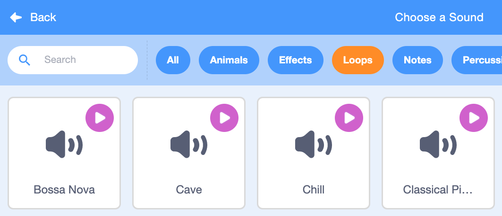

## Sound

You can add sound by using `Sound`{:class="block3sound"} blocks to your project. Create a continuous background soundtrack, or sounds that happen at regular intervals.

{:width="600px"}

--- task ---

First, select a sound from the Sound Library, or record your own sound.

--- collapse ---

---
title: Add a sound from the Sound Library
---

First, select the sprite that you want to have the new sound and select the **Sounds** tab. Each sprite starts with a default sound.


To get to the Scratch Sound Library, click the **Choose a Sound** button.


Hold your mouse cursor over the play symbol to hear a sound.


Click on any sound to add it to your sprite. You will be taken straight back to the **Sounds** tab and you will be able to see the sound that you just added.


If you switch to the **Code** tab and look at the `Sound`{:class="block3sound"} blocks menu, you will be able to select the new sound.
 


You can also add sounds to the **Stage**. 

--- /collapse ---
 
--- collapse ---
---
title: Record a sound
---

Select the sprite that you want to add recorded sound to. Click on its **Sounds** tab, go to the menu in the bottom left-hand corner, and select **Record**:
{:width="200px"}

To start recording, click the red circle button:
{:width="200px"}

To stop recording, click the red square button:
{:width="200px"}

You can now **Re-record**, **Play** the recording, and/or **Save** your sound.

Name your sound:
{:width="300px"}

--- /collapse ---

--- /task ---

--- task ---
Add code to run `Sound`{:class="block3sound"} blocks where you want sound in your project.
  
--- collapse ---

---
title: Add a long sound to create a continuous soundtrack
---
 
Click on the green flag to hear the sounds.

**Radio soundtrack**: [See inside](https://scratch.mit.edu/projects/444581851/editor){:target="_blank"}
 
<div class="scratch-preview">
 <iframe allowtransparency="true" width="485" height="402" src="https://scratch.mit.edu/projects/embed/444581851/?autostart=false" frameborder="0"></iframe>
</div>
 
To make a sound play continuously, use a `play sound until done`{:class="block3sound"} block inside a `forever`{:class="block3control"} loop. Once the sound has finished, the `forever`{:class="block3control"} loop makes the sound start again from the beginning.

This example uses a single long sound clip repeated as a soundtrack.
 
```blocks3
when green flag clicked
forever
play sound (Dance Snare Beat v) until done
end
```

**Note:** When you choose a new sound, if you select the **Loops** category, Scratch will only show you the sounds that are suitable for a single looping soundtrack.



--- /collapse ---
 
--- collapse ---

---
title: Add a sequence of short sounds to create a continuous soundtrack
---
  
Click on the green flag to hear the sounds. 

**Champ performance**: [See inside](https://scratch.mit.edu/projects/444673165/editor){:target="_blank"}
 
<div class="scratch-preview">
 <iframe allowtransparency="true" width="485" height="402" src="https://scratch.mit.edu/projects/embed/444673165/?autostart=false" frameborder="0"></iframe>
</div>

Select a `forever`{:class="block3control"} block to create a looped sound. Select some sounds that you like and/or experiment. You can either:
+ Create a series of short sounds in a sequence, or 
+ Use different instrument notes and effects to compose a soundtrack
 
```blocks3
when flag clicked
forever
play sound (Low Boing v) until done
play sound (Low Boing v) until done
play sound (Drum Buzz v) until done
play sound (Pop v) until done
play sound (Bird v) until done
play sound (Bark v) until done
play sound (Glug v) until done
End
```
  
--- /collapse ---
 
--- collapse ---

---
title: Add sounds that play at regular intervals
---
 
**Football sounds**: [See inside](https://scratch.mit.edu/projects/450870079/editor){:target="_blank"}
 
Click on the green flag to hear the sounds. 

<div class="scratch-preview">
 <iframe allowtransparency="true" width="485" height="402" src="https://scratch.mit.edu/projects/embed/450870079/?autostart=false" frameborder="0"></iframe>
</div>
 
 In this project, the **Stage** has code to play a sound at regular intervals:

 ```blocks3
 when flag clicked
 forever
 wait (3) seconds
 play sound (Cheer v) until done
 end
 ```

The **Whistle** sprite also plays a sound at regular intervals:

 ```blocks3
 when this sprite clicked
 forever
 play sound (referee whistle v) until done
 wait (4) seconds
 end
 ```

--- /collapse ---

--- collapse ---

---
title: Start multiple sounds to play at the same time
---

There are two `Sound`{:class="block3sound"} blocks with an important difference:

+ When you `play sound until done`{:class="block3sound"}, the sound will play all the way through. The next line of code in the script will not run until the sound has finished playing.

+ When you `start sound`{:class="block3sound"}, the sound will play but the next block will run immediately and will not wait for the sound to finish playing first.

This means that if you had a series of `start sound`{:class="block3sound"} blocks, the sounds would all play almost at the same time, layered on top of each other. The effect can be interesting and sometimes messy.

Have a play with it sometime!

```blocks3
when green flag clicked
start sound (meow v)
start sound (alien Creak2 v)
start sound (Boing v)
start sound (Boom Cloud v)
start sound (Baa v)
```

--- /collapse ---
 
--- /task ---

--- task ---

Once you have chosen your sounds, you may want to change the `volume`{:class="block3sound"}, `pitch`{:class="block3sound"}, or `pan`{:class="block3sound"} (so you hear the sound from the left or the right speakers).

--- collapse ---

---
title: Volume, pitch, and pan
---

Click on the green flag to hear the sounds. 

**Band practice**: [See inside](https://scratch.mit.edu/projects/451697380/editor){:target="_blank"}

<div class="scratch-preview">
 <iframe allowtransparency="true" width="485" height="402" src="https://scratch.mit.edu/projects/embed/451697380/?autostart=false" frameborder="0"></iframe>
</div>

The **Drums** sprite uses `volume`{:class="block3sound"} and `sound effects`{:class="block3sound"} to change the `sound`{:class="block3sound"}:

```blocks3
set volume to (80) %
set [pitch v] effect to (50) :: sound
set [pan left/right v] effect to (-100) :: sound
play sound (Drum Funky v) until done
```

+ You can `set volume to`{:class="block3sound"} a value from `0` (silent) to `100` (full volume). This is useful if you want some sounds to play louder than others, or if you want a sprite to appear further away.

+ The `pitch`{:class="block3sound"} effect controls how high or low a sound is. Setting the pitch to a higher value also makes a sound faster. You can `set pitch effect to`{:class="block3sound"} values between `-360` (very low) and `360` (very high).

+ The `pan left/right`{:class="block3sound"} effect allows you to control whether a sound comes out of a left- or right-hand speaker or headphone or both. You can `set pan left/right effect to`{:class="block3sound"} values from `-100` (all sound from the left) to `100` (all sound from the right).

--- /collapse ---

--- /task ---
