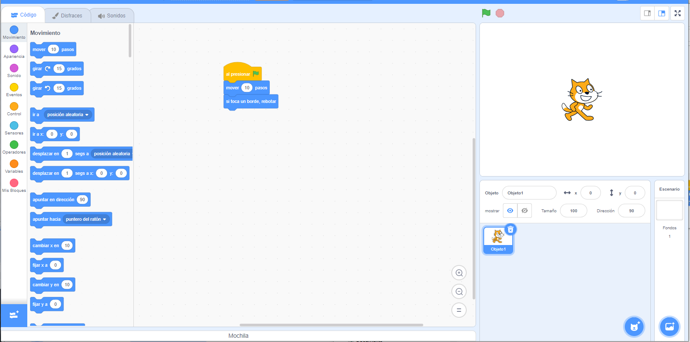

## ¿Qué es Scratch?
Scratch es un lenguaje de programación gráfico desarrollado por el grupo Lifelong Kindergarten en el MIT Media Lab. En Scratch, puedes arrastrar y combinar bloques de código para crear una variedad de programas, incluyendo animaciones, historias, instrumentos musicales y juegos. ¡Es un poco como el equivalente en programación de bloques de construcción!

Scratch se utiliza en muchas escuelas como parte del plan de estudios. Es gratis y los jóvenes pueden usarlo tanto en casa como en clubes.

Scratch permite a los jóvenes aprender conceptos de codificación y crear proyectos interactivos sin necesidad de aprender un lenguaje de programación basado en texto. No necesitarás escribir rápidamente o recordar un código complejo para usar Scratch.

### Cómo utilizar esta guía de referencia
If you have not used Scratch before, then this guide will help you to set up and create your first project.

Puedes volver a esta guía y usarla para buscar la información que necesites cuando estes haciendo tus propios proyectos en Scratch.

Al final de la guía, encontrarás enlaces a rutas de proyectos de Scratch, desde principiantes hasta avanzados, donde puedes aprender a codificar creando aplicaciones divertidas e interesantes, juegos, historias, animaciones, arte y música.

--- collapse ---
---
title: Lo que necesitarás
---
### Hardware

+ A computer or tablet capable of running Scratch 3

### Software

+ This guide will explain how to get started with Scratch 3 (either [online](https://scratch.mit.edu/){:target="_blank"} or [offline](https://scratch.mit.edu/download){:target="_blank"})

--- /collapse ---
