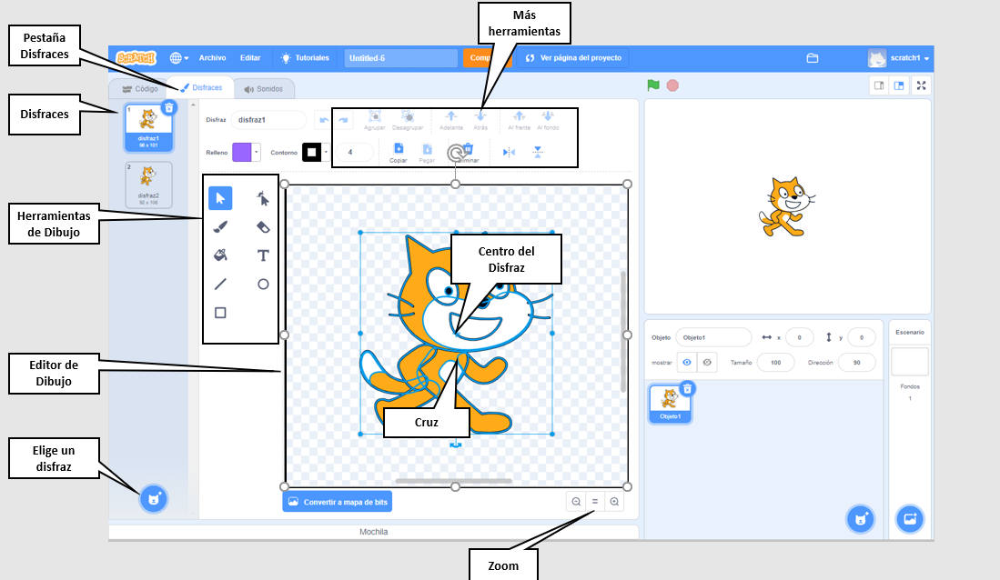
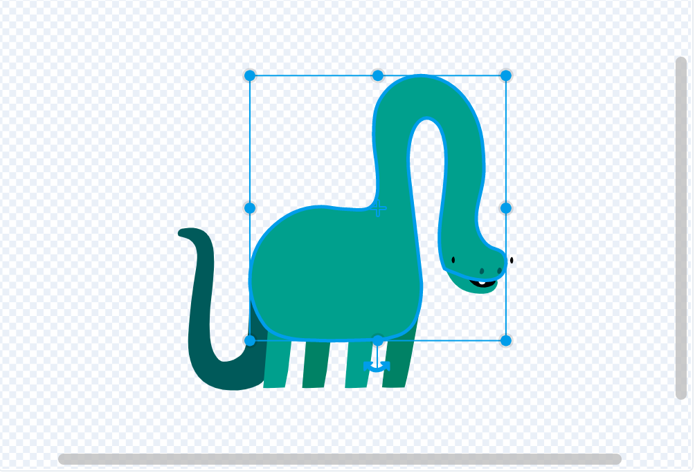
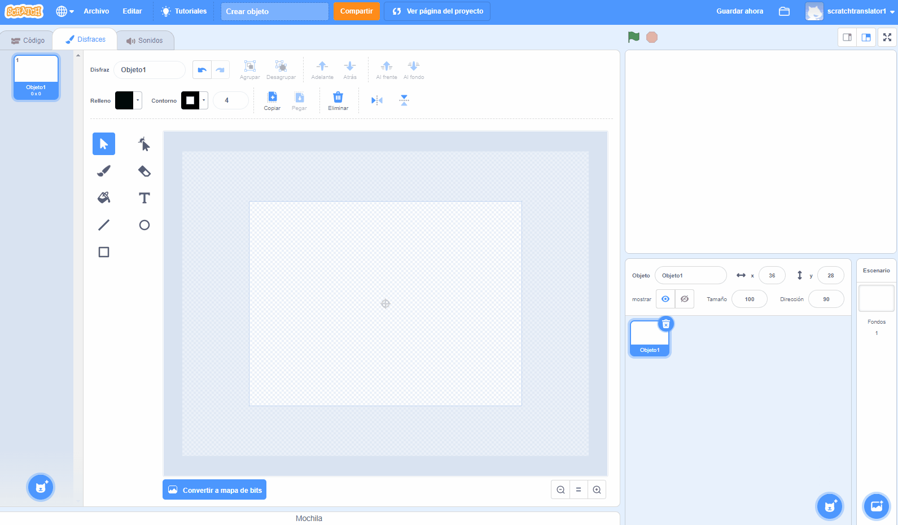

## Paint editor

Use the Paint editor to create your own backdrops and costumes, and to edit existing backdrops and costumes.

{:width="600px"}

[[[scratch3-paint-a-new-backdrop-extended]]]

[[[scratch3-backdrops-and-sprites-using-shapes]]]

[[[scratch3-use-text-tool]]]

[[[scratch3-add-costumes-to-a-sprite]]]

[[[scratch-crosshair]]]

[[[scratch3-copy-parts-between-sprite-costumes]]]

--- collapse ---
---
title: Duplicar y editar un disfraz para usarlo en una animación
---

Algunos objetos de Scratch solo tienen un disfraz o tienen varios disfraces que no funcionan como animación. If you choose one costume, then duplicate it (make a copy of it) and make a small change, it can create an animation effect.

**Robot animation**: [See inside](https://scratch.mit.edu/projects/436260207/editor){:target="_blank"}

  <iframe allowtransparency="true" width="485" height="402" src="https://scratch.mit.edu/projects/embed/436260207/?autostart=false" frameborder="0"></iframe>

Cambia a la pestaña **Disfraces** para tu objeto.

Elige el disfraz que deseas utilizar y elimina los otros disfraces, porque no los necesitarás para tu animación. Por ejemplo, el objeto **Robot** viene con disfraces para tres robots diferentes, por lo que debes elegir uno de los disfraces y eliminar los otros disfraces.

Haz clic con el botón derecho (o en una tableta, pulsa y mantén presionado) en el disfraz y elige **duplicar**.

Haz pequeños cambios en la copia del disfraz. Por ejemplo, puedes mover, rotar o cambiar todo o parte del disfraz. También puedes agregar líneas de movimiento.

Si tu disfraz usa gráficos vectoriales, entonces puedes seleccionar partes de un disfraz y cambiar cada parte por separado.

Puedes volver a duplicar el disfraz y hacer más cambios para agregar más fotogramas a tu animación.

Ahora puedes usar tus disfraces en una animación de objetos sencilla.

--- /collapse ---

--- collapse ---
---
title: Usar la herramienta Relleno para cambiar los colores de un disfraz
---

Puedes cambiar el color de tu objeto. Primero, selecciona tu objeto en la lista de Objetos debajo del Escenario y luego haz clic en la pestaña **Disfraces**.

Utiliza la herramienta **Seleccionar** (Flecha) para resaltar la parte del disfraz que deseas cambiar de color.

{:width="200px"}

{:width="300px"}

Go to the **Fill** colour chooser and select a colour. Automáticamente llenará la forma que has seleccionado.

{:width="300px"}

Repite los pasos anteriores para cualquier parte del disfraz que te haya quedado sin rellenar, o para cualquier otra parte del disfraz que quieras cambiar de color.

{:width="300px"}

{:width="300px"}

{:width="300px"}

--- /collapse ---

Use the tips below to help you to create your own designs for your sprites in the Paint editor.

--- collapse ---
---
title: Crear paisajes como objetos
---

**Hill as a sprite**: [See inside](https://scratch.mit.edu/projects/452582516/editor){:target="_blank"}

{:width="400px"}

To make your own **Hill** sprite, shown in the example above, you can use the **Circle** and **Rectangle** tools in the Paint editor:

+ Ve a **Elegir un Objeto** y selecciona **Pintar** para crear un nuevo objeto tipo disfraz.

{:width="400px"}

+ Choose a **Fill** colour. Haz clic en **Contorno** y desactívalo (para hacer esto, haz clic en el cuadro con la línea diagonal en la esquina inferior izquierda del menú). Ahora, usa la herramienta **Círculo** para dibujar un óvalo. Luego, selecciona la herramienta **Rectángulo** y dibuja un rectángulo debajo del óvalo.

+ Si usas diferentes colores para las formas, es posible que debas usar las herramientas **Adelante** y **Atrás** en el editor de Pintura para mover tus formas hacia adelante o hacia atrás para que estén colocadas correctamente dentro de tu fondo.

+ Puedes seleccionar todas las formas y **Agrupar** entre sí de modo que las puedas ajustar o moverlas como una forma única.

{:width="400px"}

Ahora, crea otros objetos para tu paisaje, si esto encaja con la idea de tu proyecto.

Remember to name your sprite(s).

--- /collapse ---

--- collapse ---
---
title: Usar la herramienta Línea para crear un triángulo
---

Puedes crear polígonos, como un triángulo, y utilizar estas formas para crear techos o montañas.

Ve a **Elegir un Objeto** y selecciona **Pintar** para crear un nuevo Objeto tipo disfraz. En este ejemplo, harás casas.

**House**: [See inside](https://scratch.mit.edu/projects/453595663/editor){:target="_blank"}

{:width="400px"}

Si sigues las siguientes instrucciones, puedes usar la herramienta **Línea** para crear cualquier forma:
+ Choose a **Fill** colour. Para elegir el color negro, disminuye el **Brillo** a cero (`0`).

{:width="150px"}

+ Selecciona **Sin contorno**.

{:width="200x"}

+ Utiliza la herramienta **Rectángulo** para dibujar un rectángulo.
+ Utiliza la herramienta **Línea** para dibujar un triángulo. Asegúrate de completar el triángulo, de lo contrario no se rellenará de color.
+ Mueve las dos formas juntas.
+ Selecciona la herramienta **Relleno** (Cubo) y rellena el triángulo con color.
+ Utiliza la herramienta **Rectángulo** para dibujar otro rectángulo para la chimenea.
+ Puedes usar las herramientas **Adelante** y **Atrás** en el editor de Pintura para mover tus formas hacia adelante o hacia atrás para que estén colocadas correctamente. En este ejemplo, no necesitarás hacer esto, porque las formas son negras para hacer una silueta.
+ Selecciona todas las formas y **Agrupar** entre sí de modo que las puedas ajustar o moverlas como una forma única.

Para crear formas duplicadas de su casa (por ejemplo, para hacer un horizonte), sigue los siguientes consejos contenidos en **Duplicar formas para crear un paisaje como disfraz**.

--- /collapse ---

--- collapse ---
---
title: Duplicar formas para crear un paisaje como disfraz
---

Es posible que quieras duplicar formas dentro de un disfraz para que tu paisaje parezca más ajetreado o abarrotado.

**Multiple clouds**: [See inside](https://scratch.mit.edu/projects/447278432/editor){:target="_blank"}

{:width="400px"}

El efecto de multiplicar formas se utiliza por los animadores profesionales para crear la impresión de patrones climáticos, como lluvia o nubes; un grupo de objetos, como edificios o una madera; o una multitud de personas en una escena.

--- no-print ---

--- /no-print ---

Para multiplicar cualquier tipo de forma:
+ Ve a **Elegir un Objeto** y selecciona, en este ejemplo, el objeto **Nube**
+ En la pestaña **Disfraces**, usa la herramienta **Seleccionar** para resaltar toda la forma
+ Utiliza las herramientas **Copiar** y **Pegar** para crear duplicados de la forma
+ Utiliza la herramienta **Seleccionar** para mover la forma dentro del editor de Pintura
+ Puedes modificar el tamaño de las formas para ayudar a crear una mayor sensación de efectos 3D, por ejemplo
+ You can select all the shapes and **Group** them together, so that you can adjust them or move them as one shape

--- /collapse ---

--- collapse ---
---
title: Usar Saturación y Brillo para crear profundidad
---

En el mundo real, los objetos que están más lejos aparecen de color más claro. Para lograr un escenario 3D más realista, puedes **disminuir** el color **Saturación** y/o **Brillo** de cada objeto para que aparezcan cada vez más lejos.

{:width="400px"}

--- /collapse ---

--- collapse ---
---
title: Crear un objeto con espacios por los que puedas ver
---

Puedes crear un objeto que tenga espacios por los que puedas ver. Si se coloca como la capa frontal y tiene el tamaño del Escenario, puede aparecer como una vista a través de las barras de una jaula o una ventana.

--- no-print ---

**Caged lion**: [See inside](https://scratch.mit.edu/projects/445680159/editor){:target="_blank"}

--- /no-print ---

Para crear un tipo de objeto de enmascaramiento:
+ Ve a **Elegir un Objeto** y selecciona **Pintar**
+ Elige un color **Relleno** sin **Contorno** y dibuja un rectángulo vertical
+ Utiliza las herramientas **Copiar** y **Pegar** para repetir esta forma
+ Utiliza la herramienta **Seleccionar** para mover las formas alrededor
+ Mientras colocas tus formas, asegúrate de que toquen el borde del Escenario para que encajen con la idea de tu proyecto

--- /collapse ---

**Consejo:** Si te resulta difícil administrar los objetos en tu Escenario, como tener un objeto grande que está cubriendo uno mucho más pequeño, puedes hacer clic en **Ocultar** para que no veas un objeto u objetos. Luego, cuando hayas terminado, haz clic en **Mostrar** nuevamente.

{:width="300px"}
