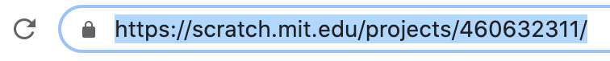

## Share and comment

--- task ---

Para permitir que otras personas accedan a tu proyecto, hazlo público. También puedes compartir la dirección web única de tu proyecto con otras personas.

[[[share-scratch]]]

--- collapse ---
---
title: Más sobre compartir la dirección web de tu proyecto
---

+ Tu proyecto siempre comenzará en la posición en la que lo guardaste por última vez, así que asegúrate de guardar tu proyecto en la posición de inicio correcta
+ When you click on **See Project Page**, the web address of your project will appear in the browser bar: {:width="400px"}
+ Copia la dirección web y pégala en un correo electrónico, o escribe en un papel la dirección web y entrégasela a la persona con la que deseas compartir el proyecto

**Consejo:** Puedes acceder a los proyectos de Scratch completados en una computadora o dispositivo móvil.

--- /collapse ---

--- collapse ---
---
title: Qué poner en Instrucciones y Notas y Créditos
---

En la Página del Proyecto, puedes rellenar en las Instrucciones para explicar cómo usar tu proyecto y completar las Notas y Créditos de tu proyecto.

En el recuadro **Instrucciones**, cuenta a la gente cómo usar tu proyecto:
+ Incluye todas las instrucciones que el usuario necesita para explorar tu proyecto completamente.
+ Asegúrate de que tus instrucciones se den paso a paso y sean sencillas. Las instrucciones son más fáciles de leer si las escribes en una lista.
+ Include all the user interaction, such as clicking on the green flag to start, and which sprites to click on.
+ Informa al usuario si el proyecto incluye sonido, ya que es posible que necesiten usar auriculares o subir el volumen de su dispositivo.

En el recuadro **Notas y Créditos**:
+ Agradece a las personas que crearon los proyectos que te inspiraron. Incluso podrías incluir las direcciones web de los proyectos.
+ ¿Incluiste imágenes o sonidos creados por otra persona? If so, credit the source(s) in this box.

--- /collapse ---

--- /task ---

--- task ---

Dar y recibir comentarios sobre proyectos.

[[[comments-feedback-scratch]]]

--- /task ---

