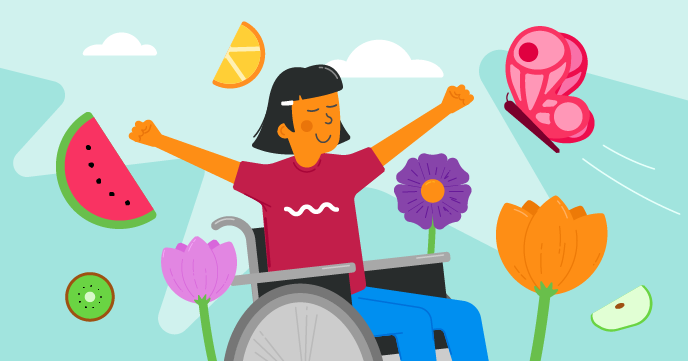

## Nuestros proyectos Scratch

Nuestras rutas de Scratch tienen seis proyectos cada una, para ayudarte a aprender diferentes habilidades en Scratch, con el fin de crear tus propios proyectos de forma independiente.

Puedes volver a esta guía de referencia, Introducción a Scratch, siempre que necesites recordar las habilidades que has aprendido.

Estos proyectos se pueden completar en cualquier computadora o tableta que ejecute Scratch 3.

### Proyectos para principiantes de Scratch

Si eres nuevo en Scratch, comienza con nuestras rutas para principiantes:

[Introducción a Scratch: objetos, scripts y ciclos(https://projects.raspberrypi.org/en/pathways/scratch-intro){:target="_blank"} 
En esta introducción para principiantes, aprenderás a agregar código, disfraces y sonidos a los objetos mientras creas animaciones, un juego, aplicaciones, y una historia.

[Cuídate](https://projects.raspberrypi.org/en/pathways/look-after-yourself){:target="_blank"} 
Aprende cómo cuidarte a ti mismo y a los demás con proyectos Scratch para hacerte reír, relajarte, controlar, crear, ejercitar, y concentrarte.

[Scratch Módulo 1](https://projects.raspberrypi.org/en/pathways/scratch-module-1){:target="_blank"}

 

### Más allá de los proyectos básicos de Scratch

Si ya conoces los objetos, disfraces, fondos, y los ciclos, prueba estos proyectos:

[Más Scratch: transmisión, decisiones y variables](https://projects.raspberrypi.org/en/pathways/more-scratch){:target="_blank"} 
Más Scratch va más allá de los conceptos básicos presentados en Introducción a Scratch. Realizarás aplicaciones, juegos y simulaciones usando la transmisión de mensajes, decisiones si...entonces y si...entonces...en otro caso, y variables.

[Scratch módulo 2](https://projects.raspberrypi.org/en/pathways/scratch-module-2){:target="_blank"} 

 

### Proyectos avanzados de Scratch

Si deseas aprender sobre listas, clones y crear tus propios bloques, prueba estos proyectos:

[Scratch adicional: clones, mis bloques y lógica booleana](https://projects.raspberrypi.org/en/pathways/further-scratch){:target="_blank"} 
Scratch adicional va más allá de las habilidades presentadas en Introducción a Scratch y Más Scratch. Crearás aplicaciones, juegos, arte generado por computadora y simulaciones usando lógica booleana, funciones, clones y más.

[Protege nuestro planeta](https://projects.raspberrypi.org/en/pathways/protect-our-planet){:target="_blank"} 
Usa Scratch para aprender sobre nuestro planeta y cómo proteger el medio ambiente para las generaciones futuras.

[Scratch para empresas sociales](https://projects.raspberrypi.org/en/coderdojo/scratch-for-social-enterprise){:target="_blank"} 

[Scratch módulo 3](https://projects.raspberrypi.org/en/pathways/scratch-module-3){:target="_blank"} 

 

### Proyectos Scratch de GPIO hardware para Raspberry Pi

Si tienes una computadora Raspberry Pi, entonces puedes probar también estos proyectos. Necesitarás componentes electrónicos adicionales.

 

[Physical computing with Scratch path](https://projects.raspberrypi.org/en/pathways/physical-computing-with-scratch-and-the-raspberry-pi){:target="_blank"}

 

[Physical computing with Scratch additional projects](https://projects.raspberrypi.org/en/projects?software%5B%5D=scratch&hardware%5B%5D=raspberry-pi){:target="_blank"}

 

¿Te gustó la guía de Scratch? ¿Has detectado un problema? ¡Por favor, haz clic en el botón **Enviar comentarios** de abajo y háznoslo saber!
